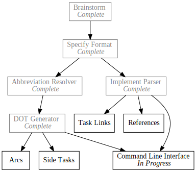

+++
title = "Day10 - Pando Command Line Interface"
description = "Pulling it all together into a useful tool"
date = 2019-02-16

[extra]
project = "pando"
+++

Today I will tackle the final task for the initial version of Pando. As shown in
the todo tree however, I have further plans for the project. I will tackle these
in future posts, but finishing the command line interface marks the project
ready for simple use.

## Command Line Argument Parsing

I opted for using [Clap](https://github.com/clap-rs/clap) just like I did for
[okeydokey](../day3-okeydokey-cont/). The yaml specification was similar, this
time requiring an input file path, and two options for outputting the
intermediate and final formats.


name: Pando
version: "0.1"
author: Keith Simmons
about: Todo Graph Renderer
args:
  - FILE:
      help: The todo file to render
      required: true
  - dot:
      short: d
      long: dot
      value_name: DOT
      help: Tells Pando to output the dot format to the given file
  - output:
      short: o
      long: output
      value_name: OUTPUT
      help: Tells Pando where to render the svg


Then parsing the arguments and storing the results is simple:


let yaml = load_yaml!("cli.yml");
let matches = App::from_yaml(yaml).get_matches();


## User Errors

Implementing a command line interface requires a good argument parser, and a
clean way to communicate failure back to the user. In Rust, the suggested method
for communicating errors to the user is to create a custom error type which
stores the information about what went wrong, or the results of a task, and then
write a wrapper for all of the logic which checks for the error case of a result
in order to print a useful message, or continue the calculation/recover etc.


fn main() {
    match do_something() {
        Ok(value) => ...,
        Err(error) => {
            match error {
                ParseError => ...,
                AbbreviationError => ...,
                ...
            }
        }
    }
}


My problem with this pattern is that any time a new error needs created, you
have to go to the location of the error type, add the value, and then add the
print statement for that particular error. Lots of effort for a quick tool. So
instead I decided to co-opt the `panic!` functionality.

Rust doesn't have error types in the way most programming languages do. In C# or
Java it is common to throw and catch custom exceptions anywhere in an
application. This functionality is often slow however since the runtime must
unwind the current state of the program and undo any work that is in progress.
Rust doesn't have much robust handling of those style of exceptions instead
opting for `Result` and `Option` as ways to communicate error, and as a last
result providing a less flexible `panic!` macro which will do unwinding similar
to above. The goal is that `panic!` would only be used when everything has gone
wrong, so it outputs data meant for a programmer to interpret.

Luckily there is a simple way to hook into the `panic!` functionality and
prevent the programming oriented information from being printed and instead just
printing the contained message to the user.


panic::set_hook(Box::new(|info| {
    match info.payload().downcast_ref::<String>() {
        Some(text) => println!("{}", text),
        None => println!("Unknown error")
    }
}));


`panic::set_hook` takes a boxed callback function taking a `PanicInfo` object.
This gives us access to the panic payload which is the dynamically typed object
passed to `panic!`. Until this function I had no idea that dynamic typing was
possible, but down_casting to a string was pretty simple, and for my purposes
good enough.

Now instead of having a centralized Error type I am able to throw an error with
`expect` on `Result` or `Option`, or `panic!` and the message will be passed to
the user directly.

WARNING: This is an exceedingly not recommended strategy. I've never seen this
recommended anywhere other than in the
[human-panic](https://crates.io/crates/human-panic) crate, but even there the
assumption is that the panic is only used when something really went wrong, not
when the user caused the error and needs feedback. Proceed with caution.

## Path Correction

With those parts out of the way, all that is left is to parse the input paths,
and do the compilation/rendering. [Clap](https://github.com/clap-rs/clap) is
great for verifying the numbers of arguments are correct, but it doesn't do any
data-type detection or correction. For Pando I don't need much, just a way to
resolve a path into an absolute path instead of a relative one. At first I
reached for the `io::canonicalize` function. Unfortunately it requires that the
file already exists. So instead I settled for concatenating the current working
directory with the relative path.


fn resolve_path(relative_path: &str) -> PathBuf {
    let mut absolute_path = std::env::current_dir().expect("Could not resolve current directory");
    absolute_path.push(relative_path);
    absolute_path
}


Then I provide default values for the options if the user doesn't provide them.


let todo_path = canonicalize(matches.value_of("FILE").expect("Need a todo file path")).expect("Todo file does not exist");
let dot_path = matches.value_of("dot").map(resolve_path).unwrap_or_else(|| {
    let mut temp_path = env::temp_dir();
    temp_path.push(todo_path.with_extension("dot").file_name().expect("Could not get temp path file name"));
    temp_path
});

let output_path = matches.value_of("output").map(resolve_path).unwrap_or_else(|| {
    todo_path.with_extension("svg")
});


The input file must be provided, and I can use `canonicalize` because the file
must exist. `expect` is used to provide an appropriate error message. For the
intermediate path, if the user doesn't provide one, I use a path in the temp
directory with the input file name as a basis. Similarly with the output path,
if the user doesn't provide one I default to the input file name with the
extension changed to svg.

## File Data Flow

Reading files in Rust is very clean. Resource management is identically to memory
management, so as long as a handle to the file is still held, the file will be
open, but the moment the handle goes out of scope, the lifetime management
functionality will kick in and drop the file access.

For Pando the general flow is: Input File -> Compile -> Dot Temp File ->
GraphViz -> Output File. The Dot file has to be written to the disk since I use
the GraphViz command line tool to compile it to the final image.


let mut todo_file = File::open(&todo_path).expect("Could not open todo file");
let mut todo_text = String::new();
todo_file.read_to_string(&mut todo_text).expect("Could not read todo file");

let dot_text = compile(&todo_text);
let mut dot_file = File::create(&dot_path).expect("Could not create dot file");
dot_file.write_all(dot_text.as_bytes()).expect("Could not write dot file");


Very simple read the input file to a string, compile it to the `dot_text`
variable, then write that string to the intermediate path. Next I call the `dot`
command installed by GraphViz using the `Command` api in the standard library.


let render_output = Command::new("dot")
    .arg(dot_path)
    .arg("-Tsvg")
    .output()
    .expect("Could not execute graphviz command");
let rendered_text = String::from_utf8(render_output.stdout).expect("Invalid graphviz output");


The result from executing the `dot` command is a binary array, so parsing as a
string is pretty simple. Lastly I check if GraphViz returned an error, right the
output to a file, and print success.


if rendered_text.starts_with("Error") {
    println!("Graphviz error: {}", rendered_text);
} else {
    let mut output_file = File::create(&output_path).expect("Could not create output file");
    output_file.write_all(rendered_text.as_bytes()).expect("Could not write output file");
    println!("Successfully output to {:?}", output_path);
}


Done! At this point Pando will take an input file in the pando file format
describing tasks and their dependencies and end to end render it to an svg
depicting the dependency graph. Took some doing, but I learned a lot about what
writing a parser and doing string manipulation looks like in Rust.

I haven't decided what to do next. I have a number of projects I'm interested in
introducing, as well as some progress planned for the [Script-8 Bomb Surival
Demake](../day7-bomb-survival-demake/). Fun things ahead!

Till tomorrow,  
Keith
