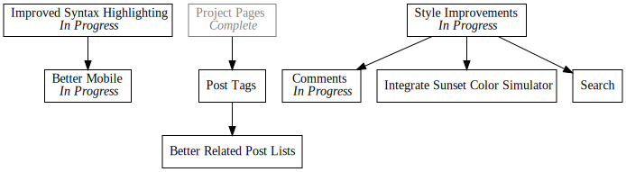

+++
title = "Day14 - Blog Style Updates"
description = "Improve Syntax Highlighting and Comments"
date = 2019-02-20

[extra]
project = "blog"
+++


Today was another random website improvements day, so its going to be a bit
light on actual blog content. I have had on my list for a while now, to rework
the syntax highlighting and improve the experience on mobile. As it turns out,
the two issues were related. Previously I had attempted to improve the mobile
site by adding the following to the base site template:


<meta name="viewport" content="width=device-width, user-scalable=false">


This made things somewhat better, but the content was still pushed to the left
side of the screen on some pages. After some fumbling about I eventually
discovered the reason for it was that long code lines were pushing the size of
the page to be wider than the main content width.

## Syntax Highlighting

Unfortunately the default syntax highlighting in
[Zola](https://www.getzola.org/) simply uses a `pre` tag with the code formatted
inside. This doesn't give me sufficient control over the styling and in general
leaves a bunch to be desired. So I decided to replace the default highlighting
with
[Prism](https://prismjs.com/download.html#themes=prism&languages=markup+css+clike+javascript).
This was pretty simple, and just required configuring the language list on the
download page (I checked all the things), picking a theme, and downloading both
the style sheet and the JavaScript file and referencing them in the base
template.


<head>
  <meta name="viewport" content="width=device-width, user-scalable=false">
  <link href="https://fonts.googleapis.com/css?family=Roboto" rel="stylesheet">
  <link rel="stylesheet" href="https://unpkg.com/basic-css-typography-reset@1.0.0/typography.min.css">
  <link rel="stylesheet" href="{{ get_url(path="/style.css") }}">
  <link rel="stylesheet" href="{{ get_url(path="/prism.css") }}">
  
  <title>02Credits </title>
</head>


Unfortunately I also needed to change the method of adding code tags. Instead of
using the normal markdown strategy:


``` Language
```


I needed to switch to a hand written "shortcode" which is a way of embedding
templates directly into the post markdown. To enable it I adding a `code.html`
file to the `templates/shortcodes/` folder in the site source with this content:


<pre>
  <code class="language-{{lang}}" class="language-text">{{ body }}</code>
</pre>


Then anywhere I needed to add some source I can use the shortcode like so:

<pre>
<code class="language-markdown">
console.log("Hello World!");

</code>
</pre>

This works great, however the code is left aligned on the screen. So I decided
to take the opportunity to make things a little more fancy as well with these
style changes:


pre {
    display: flex;
}

pre code {
    flex-grow: 100;
    text-align: left;
    max-width: 8.5in;
    margin-left: auto;
    margin-right: auto;
}


This causes the content of the highlighted code to line up with the main content
column, but cause the background to stretch to the edges of the screen as you
can see above. Much nicer, and works on mobile. Two in one!

## Comments

While I was working on the site format, I also decided to add a comment service
to the page. Recently I saw a link to [Commento](https://commento.io/) which
bills itself as a more privacy focused comment competitor for the popular
Disqus. As the site rightfully points out, with free products, you aren't the
customer. Instead you are the product. So I gladly dished out the $5
subscription fee (its actually pay what you want, but I picked $5) to add
comments to the blog!

Following the instructions on the site, I added this snippet to the page
template:


<div id="commento"></div>
<script src="https://cdn.commento.io/js/commento.js"></script>


And a few style fiddlings later and everything was working great!

## Image Size

Lastly I noticed that the todo list images tend to grow past the edge of the
content and screen, so I employed a trick to make sure the image is always
visible, but not too big.


img {
    max-width: 100vw;
}

@media (min-width: 8.5in) {
    img {
        max-width: 8.5in;
    }
}


The idea is to use the `@media` query to change the max-width rule when the size
is over the 8.5 inch max content size. This way over 8.5 inches, the image is
locked to 8.5 inches, but below the limit, the image maxes out to the screen
width. Pretty simple, but effective and really improves the feel of the site.

Hopefully these changes make the blog more readable and easy to use. I'm going
to give it a few days, but I think the blog is getting close to public facing! I
may start pushing it more to friends and family and posting on Show Hacker News.
We'll see.

Till tomorrow,  
Keith
