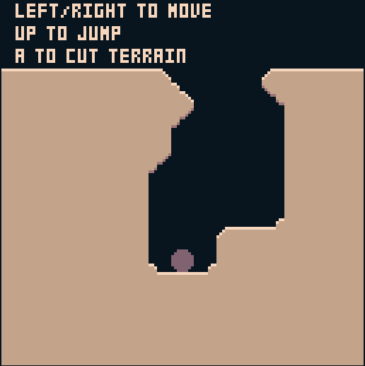

+++
title = "Day17 - 8Bomb Camera"
description = "Implement player following camera"
date = 2019-02-23

[extra]
project = "8bomb"
+++

Quick day today, so lets get to it. Today I added some simple camera logic to
8Bomb. In theory SCRIPT-8 supports a camera transform mechanism, but in practice
I found it to be somewhat buggy, so instead I added some camera manipulation
logic myself which is taken into account when drawing sprites to the screen. By
adding a moving camera, the game gets a sense of depth and progress which wasn't
possible before when the ball would just fall through the bottom of the screen.

## Drawing

The first step was to modify the drawing functions to take a camera position as
an arguments and subtract that position from the y value of any drawn
primitives. Easy enough:


function drawTile(cameraY, tx, ty, topLeft, topRight, bottomRight, bottomLeft) {
  let s = 0;
  if (topLeft) s += 1;
  if (topRight) s += 2;
  if (bottomRight) s += 4;
  if (bottomLeft) s += 8;
  
  let tileTop = -cameraY + ty * tileHeight;
  if (tileTop > -50 && tileTop < 150) { 
    sprite(tx * tileWidth, -cameraY + ty * tileHeight, s);
  }
}

function drawTerrain({ terrain, cameraY }) {
  for (let y = 0; y < terrain.length - 1; y++) {
    for (let x = 0; x < terrain[y].length - 1; x++) {
      drawTile(cameraY, x, y, terrain[y][x], terrain[y][x + 1], terrain[y + 1][x + 1], terrain[y + 1][x]);
    }
  }
}

function drawPlayer({ player, cameraY }) {
  sprite(player.position.x - player.radius, -cameraY + player.position.y - player.radius, 16);
}

function drawInstructions() { 
  print(5, 0, "left/right to move");
  print(5, 8, "up to jump");
  print(5, 16, "a to cut terrain");
}


In the process I also converted each of the functions to take a state object and
destructure it into the relevant data. This way any time a draw function needs
something new, I don't need to edit two places, just the edit the draw function
to destructure more variables.

Also of note, I added a check which will filter out sprite calls if the tile
isn't close to the screen. This allows large terrains to be drawn without much
overhead since only the tiles on the screen will be drawn.

## Camera Update

The camera position update code was a little more complicated. Since the physics
is updated based on pixel position, any movement of the camera has the potential
to bump a pixel in an undesired way. To counteract this I built a safe zone on
the screen within which the player ball can move freely without moving the
camera. Once the ball leaves the safe zone however, the camera moves, and uses
momentum with some friction to move farther than it necessarily has to.

This lets the camera stay still for as long as possible while still keeping the
player in view. In practice the camera tends to move in short bursts and stay
still afterward.


const cameraMomentum = 0.8;
function updateCamera(state) {
  if (state.previousCameraY) {
    let vy = state.cameraY - state.previousCameraY;
    state.previousCameraY = state.cameraY;
    state.cameraY += vy * cameraMomentum;
  }
  
  if (state.player.position.y > state.cameraY + 96) {
    var cameraDiff = state.player.position.y - (state.cameraY + 96);
    state.cameraY += cameraDiff * 0.2;
  }
  
  if (state.player.position.y < state.cameraY + 32) {
    var cameraDiff = state.player.position.y - (state.cameraY + 32);
    state.cameraY += cameraDiff * 0.2;
  }
  
  if (!state.previousCameraY) {
    state.previousCameraY = state.cameraY;
  }
}


The safe zone lies between one forth of the screen height, and three fourths of
the screen height. The camera moves in fractions of the distance from the
desired position and slows down by a constant friction percentage.

## Wrapping Up

The collision code is modified by a camera translation to fix things up.


let dy = Math.sin(r) * obj.radius;
if (getPixel(obj.position.x + dx, -cameraY + obj.position.y + dy) != 7) {
  if (dy > 3 && Math.abs(dx) <= 1) {


And finally the initialization code was modified to have a 300 tile tall terrain
storage.


function initTerrain() {
  let terrain = [];
  for (let y = 0; y < 300; y++) {
    let row = [];
    for (let x = 0; x < 17; x++) {
      if (y > 10) {
        row.push(1);
      } else {
        row.push(0);
      }
    }
    terrain.push(row);
  }
  return terrain;
}


Done. The camera now smoothly follows the player while not effecting the physics
too much. I will do some investigation shortly about why the built in camera
function causes problems, but for now this has unblocked me and will open the
way for the next tasks in 8Bomb.

The current version of the game can be played
[here](https://script-8.github.io/?id=2a24d4038406b2ea5f648c9ebb8d3a6b).

Till tomorrow,  
Keith
