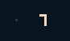
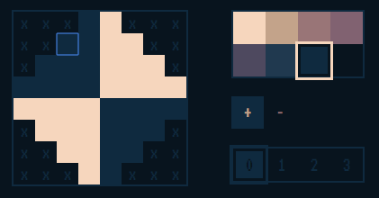
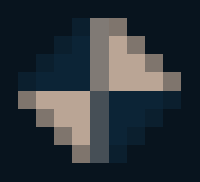

+++
title = "Day18 - 8Bomb Camera Fixes"
description = "SCRIPT-8 bug fixes to enable better 8Bomb physics"
date = 2019-02-24

[extra]
project = "8bomb"
+++

Another busy day today. I mostly made some bug fixes in SCRIPT-8 to clean up
yesterday's camera code. If you had tried the demo yesterday, you may have
noticed that the ball was a little bouncy whenever the camera moved. I tried to
hide some of this by using a stationary camera zone, but the effect was still
visible. This was mostly due to the fact that I had to work around the `getPixel`
and built in camera translation features in SCRIPT-8 since they had some bugs.
Today's daily will be about the bugs and how they made the 8Bomb physics better.

When attempting to use `camera` and `getPixel` together I ran into two problems: An
issue with GetPixel's coordinate space and anti aliasing problems in `camera`.

## GetPixel Bug

In the PICO-8 version I didn't bother with translating the graphics manually
because I could simply use the `camera` function to do the work for me. This
worked great because the `getPixel` and `setPixel` commands in PICO-8 were both in
camera coordinates.

Unfortunately when I added `getPixel` and `setPixel` to SCRIPT-8 I forgot to pay
attention to the `camera` translation. So `setPixel` worked fine, but `getPixel` was
in screen coordinates, so setting a pixel to some coordinates and reading from
those same coordinates would not give the same reading if the camera was
translated.

The first step was to write a test to see what was going on.


draw = () => {
  clear();
  camera(5, 0);
  setPixel(5, 5, 5);
  print(15, 3, getPixel(5, 5));
}


Initially when running this code, I expected the read value to be 5, as I just
set the pixel. In practice though the reported value was 7 which is the
background or default color.

The fix was pretty simple since the CanvasAPI already had variables representing
the `cameraX` and `cameraY` values.


getPixel(x, y) {
  return getPixel({
    x: Math.floor(x - _cameraX),
    y: Math.floor(y - _cameraY),
    ctx
  })
},


Rerunning my test yielded:

## Camera Bug

The camera bug was slightly more complicated. Initially I thought everything
worked fine since simple tests gave correct results. However when I tried using
`camera` in 8Bomb the screen would flicker and the ball would fall through the
screen. Very frustrating.

To diagnose I created a small demo which moved a target graphic back and forth
across the screen in a simple smooth animation.


let x = 0;
let targetX = 0;
let t = 0;

let frequency = 150;

draw = () => {
  clear();
  camera();
  print(0, 0, "x: " + x);
  print(0, 8, "t: " + t);
  
  if (t % frequency == 0) {
    targetX = ((t / frequency) + 1) % 2 * 100;
  }
  
  x += (targetX - x) * 0.1;
  camera(-x, 1);
  sprite(0, 50, 0);
  
  t += 1;
}


The sprite I used looked like:

The exact calculation isn't important, but basically the target position is
changed every 150 frames to bounce back and forth between 0 and 100. Luckily
this animation captures the problem. When the camera position is between integer
multiples, the canvas will draw the image partially in one position in partially
in another as a form of anti aliasing.

When caught between frames the tile looks somewhat transparent.

This would cause `getPixel` to report the default value since it didn't exist in
the pallet, which would cause the ball to fall through the floor in 8Bomb. The
fix was to floor the values passed to camera so that they are always a whole
number which would prevent any anti-aliasing from happening.


camera(x = 0, y = 0) {
  _cameraX = Math.floor(x)
  _cameraY = Math.floor(y)
  ctx.setTransform(1, 0, 0, 1, 0, 0)
  ctx.translate(-_cameraX, -_cameraY)
},


This fixed the problem leaving everything nice and crisp.

## Pull Requests

I made two pull requests with these fixes which got merged an hour or two ago.
With the fixes in place, I updated 8Bomb to take out the `cameraY` translation I
built yesterday and to set the camera position in the draw function.


draw = state => {
  clear();
  camera(0, state.cameraY);
  drawTerrain(state);
  handleTerrainCollisions(state.player);
  drawPlayer(state);
  camera();
  drawInstructions(state);
}


With those changes in place, the physics no longer jumps on camera move. I like
the camera changes made yesterday, so I left them in, but it feels much better
to know that the physics is actually correct. The current version of the game
can be played
[here](https://script-8.github.io/?id=2a24d4038406b2ea5f648c9ebb8d3a6b).

Till tomorrow,  
Kaylee
