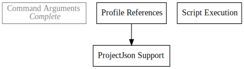

+++
title = "Day19 - Automating Blogging"
description = "Using Okeydokey to make blogging more efficient"
date = 2019-02-25

[extra]
project = "okeydokey"
+++

Today I did some process automation for my blogging. Every day I have had to
create a particular folder structure with some minor modifications to create a
new blog post. In each folder I would create an index.md file with a special
header containing the title, description and date, and copy the pando todo tree
files so that I could render the tree in the post. Each of these steps was
somewhat error prone, and took a while to setup.

XKCD built this handy dandy chart for calculating how much time you should feel
comfortable spending when automating a task if you think you will do said task
for 5 years. In my case, each time I created a new blog post it took me around
30 seconds to get everything right (not including mistakes). So since I am doing
this task every day for the foreseeable future, I can feel good about automating
the task if I can finish the automation work within 12 hours. Plus since I'm
making a blog post out of it I can think of it as free.

To automate this task, I would like to use
[Okeydokey](../../projects/okeydokey/) to hold the scripts and keep them at arms
reach. Unfortunately Okeydokey doesn't support command arguments. Since adding
them has been on the project todo list for a while, I figured it would be a good
first step.

## Okeydokey Command Arguments

The architecture I eventually landed on was to extend the concept of string
"holes" I used for the prefix and suffix commands to the main command itself.
Since I wanted the ability to reorder the arguments as they are inserted from
how they are provided, I decided to number the holes instead of leaving them
blank. I also wanted to allow for slop in the argument counts for both how many
holes are in the command format, and how many commands were passed to okeydokey.
If more holes are present in the command, I replace them with empty strings, and
if there are more arguments than holes, I append them to the end with spaces.

I first wrote some utilities for formatting the hole string for a given number
and counting the number of holes in a given string.


fn hole(n: usize) -> String {
    format!("{{{}}}", n)
}

fn count_holes(command: &String) -> usize {
    fn rec(command: &String, n: usize) -> usize {
        match command.contains(&hole(n)[..]) {
            true => rec(command, n + 1),
            false => n
        }
    }

    rec(command, 0)
}


Then the actual code for filling in the command holes just loops over each of
the holes, replacing the associated text with the argument, and then appending
any remaining arguments to the end of the command.


fn fill_in_arguments(perforated_command: String, args: Vec<&str>) -> String {
    let number_of_holes = count_holes(&perferated_command);
    let mut args_iterator = args.iter();
    let mut command = perforated_command;

    for hole_number in 0..number_of_holes {
        let hole_string = hole(hole_number);
        command = match args_iterator.next() {
            Some(arg) => command.replace(&hole_string[..], arg),
            None => command.replace(&hole_string[..], "")
        };
    }

    for arg in args_iterator {
        command = command + " " + arg;
    }

    command
}


I then modified the clap yaml file to add a new commandline argument list. I
made sure to set the multiple flag to tell clap that there is a possibility of
more than one argument parameter.


name: Okeydokey
version: "0.2"
author: Keith Simmons
about: .ok file manager
args:
  - COMMAND:
      help: The command in the profile to run
  - prefix:
      short: p
      long: prefix
      value_name: PREFIX
      help: Prepends argument to the returned command replacing {} with the full path to the found .ok file.
  - suffix:
      short: s
      long: suffix
      value_name: SUFFIX
      help: Appends argument to the returned command replacing {} with the full path to the found .ok file.
  - args:
      short: a
      long: arguments
      value_name: ARGUMENTS
      multiple: true
      help: Fills {n} in the matched command with the nth arguments in this list. If less than n arguments provided, empty string is substituted instead. If more than the total holes in the command are provided, then the arguments are appended to the command separated by spaces.


Finally I retrieved the arguments from the parsed commands, and gave a default
value of an empty list if no arguments were passed.


match matches.value_of("COMMAND") {
    Some(command) => query(
        profile,
        command,
        matches.value_of("prefix"),
        matches.value_of("suffix"),
        matches.values_of("args").map_or(Vec::new(), |args| args.collect())),
    None => list(profile)
}


Those steps out of the way, I needed to update my powershell profile to support the new syntax.


function ok
{
  if ($args.Count -eq 0) {
    okeydokey | Write-Host -ForegroundColor 'Blue'
  } else {
    if ($args.Count -gt 1) {
      $script = okeydokey $args[0] -p "pushd {};" -s "; popd" -a ($args | select -skip 1)
    } else {
      $script = okeydokey $args[0] -p "pushd {};" -s "; popd"
    }

    if ($script -ne $null) {
      iex $script
    }
  }
}


With Okeydokey supporting command arguments, automating my new post structure
was pretty simple. I created a c# script which calculated the next day number,
and did some basic string manipulation to write out all of the boilerplate. The
script I wrote was pretty messy, so I wont write it out here, but everything
works well. Hopefully I've earned back my 12 hours of time and will do something
more useful with them than file manipulation! Even if the exercise doesn't make
sense from a time perspective, my blog posts will be more consistent now, and I
got a new Okeydokey feature out of it.

Till tomorrow,  
Keith
