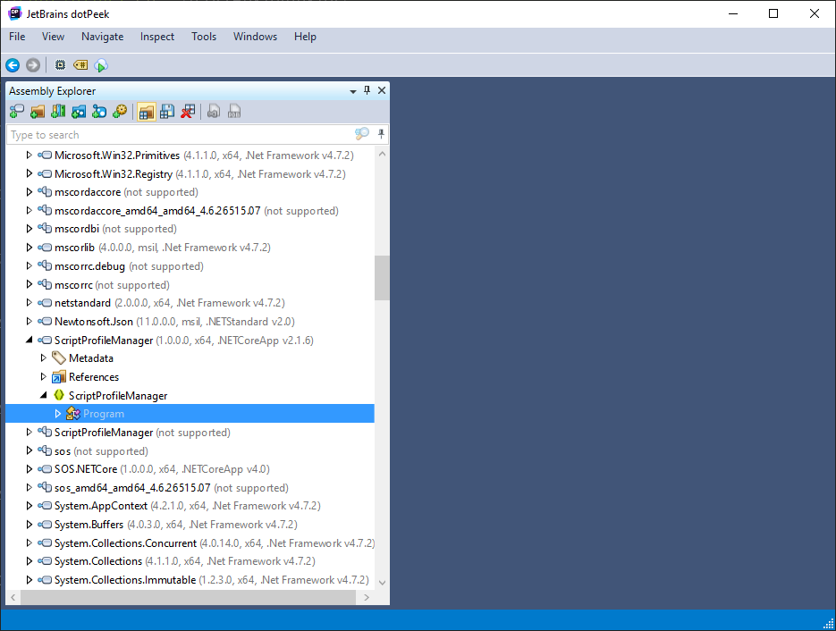
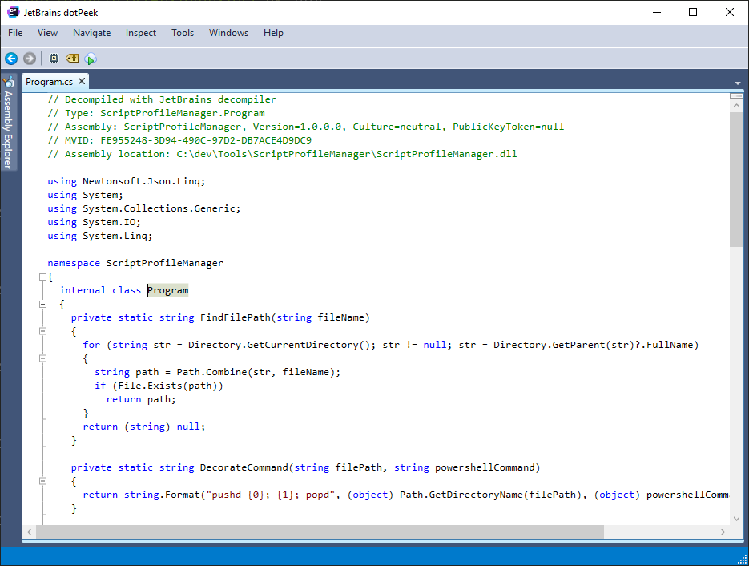

+++
title = "Day2 - Okeydokey"
description = "Decompiling .NET Apps"
date = 2019-02-08

[extra]
project = "okeydokey"
+++
About a year ago I was forwarded a link to
[.ok](http://www.secretgeek.net/ok) introducing the concept of .ok directory
profiles. The basic idea is to define a new `.ok` file format containing
frequently used scripts which can be added to projects for easy access so you
don't have to remember the exact syntax for a given task. After reading the
description of SecretGeek's version I decided to build it myself with a couple
of modifications.

The original description of the tool describes a simple file with a script per
line and a utility which will either output the file with numbers before each
line to the console if no parameters were passed to it, or run the script
associate associated with the passed in number. SecretGeek also provides
implementations of this specification as bash and powershell scripts.

## My Changes

My version was similar but contained two main modifications. First, instead of a
bare bones file with scripts per line, I decided to do a bit of preprocessing.
Each line in my version was made up of a name, a colon separator, and the script
associated with that name. Then when querying the file for what scripts can be
run, instead of just writing the file with line numbers, my version simply
outputs the list of names. A script could then be run by passing the utility a
name. Second, my version would walk up the directory tree searching for the .ok
file, and run the script in that location. This lets me treat the profile as
project wide and frees me up from worrying about where my current working
directory is. Lastly I wrote the bulk of the code in c# instead of in
powershell, allowing me to take advantage of nuget packages and a non-crappy
programming environment.

## The Task

I built this version in my spare time at work and used it for the better part of
3 months. Around then my I went on a break at which time my machines changed and
I lost the source code for my version of the directory profiles. So my task
today is split into two parts: Learn how to decompile C# source, and rebuild the
tool with backwards compatibility so that I can continue to iterate on the
project. To make it even more interesting I think I will write my
reimplementation in Rust to improve my comfort and proficiency in that language
as well as take advantage of the single binary compilation that Rust provides
for free. The original utility was compiled using DotNet Core 2.0 which did
allow me to write all of the dependencies to the local directory, but didn't go
the extra step of compiling them into the executable. So to use the tool I had
to cart around a giant directory full of random DLLs. Rust will fix this issue.
Also its cool.

As an added complication, the code is currently split across the .net core app
and a simple powershell wrapper script. I don't see a way around having at least
a minimal wrapping script in whatever shell language, but there is currently an
assumption in the c# code that the shell is Windows-ish since it wraps the
output command in pushd and popd calls. I hope to introduce some command line
arguments in this version of the tool to make that portion paramaterized. 

Lastly, the original version of the tool included the feature of parsing
project.json files to find the scripts in those files and add them to the list.
I think this is an added complexity I don't need right now, and I only used it
once anyway, so for now I am ommiting it for simplicity.

# dotPeek

I'll be using the free and wonderful
[dotPeek](https://www.jetbrains.com/decompiler/) from
[JetBrains](https://www.jetbrains.com/) to decompile my binary and recover a
version of the source code used to create the tool. Decompiling was as simple as
pointing dotPeek at the folder containing my compiled tool, expanding the entry
with the name of my tool, and double clicking on Program.cs.

After a brief moment, this code popped up in an eerily visual studios like editor:

The decompiled source in its entirety can be found
[here](https://gist.github.com/Kethku/ee982b01ef4ef022da3522b28e3997ad). I would
say the decompiler does an... alright job. It does some strange things to
variable names given that it can't recover them from the binary, and all
formatting is lost. It does however preserve method names which is a blessing,
so we will take what we can get. With that out of the way we can move on to
building a bigger and better version. An oxidized version if you will.

At this point, its 1:30 am in the morning, so I'll have to leave the rest of the
porting for next time. I suspect I will get better as I go along. I've finished
much of the Rust code stumbling behind the scenes, so tomorrow I should be able
to finish it up and do a quick write up describing the difficulties I ran into
along the way.

Till tomorrow,  
Keith
