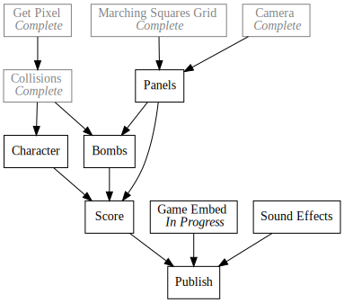

+++
title = "Day20 - SCRIPT-8 Crisis"
description = "Reimplementing SCRIPT-8 in a github pages site."
date = 2019-02-26

[extra]
project = "8bomb"
+++

Today's project got sidetracked by a crisis inside SCRIPT-8. While I was working
on improving 8Bomb to add better terrain rendering, simulated bombs, and better
input (I will write about these changes, but it will have to wait until another
day), a programmer who goes by the username icarito wrote a SCRIPT-8 script
titled Virus which escaped the iframe which the game code runs on and locates
the variable containing the GitHub access token. It then prints the token to the
screen. The code for the script can be found
[here](https://gist.github.com/icarito/9de45c2cb7fa54cc9c688d177b2e4944)

This discovery scared Gabriel (as it should), so he took down the site and
revoked the access tokens for all of the users of SCRIPT-8. Meanwhile I had been
working along on 8Bomb when suddenly I couldn't save the script. Some chatting
on discord later, I came to the conclusion that this wasn't going to be a quick
fix, so I decided take a different tact.

Much of SCRIPT-8 is in the UI and saving/sharing experience. The rendering and
game portion of the code is actually extremely simple, and often done in a
fairly brute force way. So instead of waiting for Gabriel to fix the bug, I
decided to re-implement the subset of the SCRIPT-8 API that 8Bomb actually uses
in my own website. This way I can keep working on the game even when the website
is down. This has the added benefit of letting me embed the game into my blog!

  <iframe src="https://kethku.github.io/8Bomb/"></iframe>

The source code for the minimal SCRIPT-8 implementation can be found
[here](https://github.com/Kethku/8Bomb).

## Getting Started

These days, my dev tool of choice is [Parcel](https://parceljs.org/). For small
projects like this one, its perfect and really smoothed over a lot of the
difficulties of using modern JavaScript. I started by following
[these](https://pages.github.com/) instructions to get a GitHub pages site up
and running. I made a slight modification by moving the index.html into it's own
src directory, just to allow parcel to output the compiled assets to the base of
the GitHub pages site. I then navigated to the cloned repository, and ran
`parcel src/index.html` to get the dev server up and running. Then in my editor I
started typing.


<html>

  <head>
    
  </head>

  <body>
    <canvas id="game" width=128 height=128></canvas>

    
  </body>

</html>


This was basic boilerplate to create a canvas element, position it in the center
of the screen, and enable pixel perfect drawing. Then the `index.js` is run.

## Basic Structure

I decided to split the code into the main engine, and the actual game logic
which should be very similar to the code that actually gets run in SCRIPT-8. To
get this as close as possible, I decided to simulate the (insecure) eval logic
in the actual SCRIPT-8 engine. Luckily Parcel allows for including assets as
strings via the `readFileSync` function. Any file which imports `readFileSync`
from the `fs` module will get a specialized version injected which provides the
contents of the read file instead of actually reading anything. This way the content gets bundled but the code reads just like it would in Node.js.


import {readFileSync} from 'fs';

let gameCode = readFileSync(__dirname + "/game.js", 'utf-8');

let canvas = document.getElementById('game');
let ctx = canvas.getContext('2d');

window.initialState = "";
window.draw = () => {};
window.update = () => {};
window.sprites = {};

eval(gameCode);


## Canvas API

Of course executing the eval-ed draw or update functions threw errors because
the actual API functions didn't yet exist. Luckily 8Bomb only used a small
portion of the API so things went pretty smoothly. I went error by error pulling
in code from the
[`CanvasApi`](https://github.com/script-8/script-8.github.io/tree/6232864f4be4ecb4ef4de84b226121070504de42/src/iframe/src/canvasAPI)
in SCRIPT-8 until I finally got something to draw on the screen. As an example, this is the clear function I pulled from SCRIPT-8:


function clear(c) {
  ctx.save();
  ctx.setTransform(1, 0, 0, 1, 0, 0);
  if (!isNil(c)) {
    ctx.fillStyle = colors.rgb(c);
    ctx.fillRect(0, 0, 128, 128);
  } else {
    ctx.clearRect(0, 0, 128, 128);
  }
  ctx.restore();
}


What follows are the interesting stumbling blocks I ran into.

First: Parcel requires variables that are globally scoped to be accessed via the
window object. Much of SCRIPT-8 is written assuming that properties on the
window object are actually global, but Parcel requires access to be explicit.

Second: SCRIPT-8 draws most of its objects via single pixel wide and single
pixel tall rectangles. This includes the sprites, the text in print calls, and
many of the other primitives. This strikes me as an area for performance
improvement!


function sprite(x, y, spriteIndex, darken = 0, flipH = false, flipV = false) {
  if (window.sprites[spriteIndex]) {
    window.sprites[spriteIndex].slice(0, 8).forEach((cells, rowIndex) => {
      cells.split('').forEach((color, colIndex) => {
        if (color !== ' ') {
          const clamped = clamp(+color - darken, 0, 7);
          ctx.fillStyle = colors.rgb(clamped);
          ctx.fillRect(
            Math.floor(x) + (flipH ? 7 - colIndex : colIndex),
            Math.floor(y) + (flipV ? 7 - rowIndex : rowIndex),
            1,
            1
          );
        }
      });
    });
  }
}


Third: Chrome implements a global function `print`. If this function is run, it
will try to print a screen shot of the current page. This was very confusing
until I realized that the print API function wasn't implemented yet.

Forth: Sprites in SCRIPT-8 are encoded as lists of strings of characters. To get
them working I pulled the sprite list in the Gist for my game out and appended
it to the end of my game file.


sprites = {
  "0": [
    "  3333  ",
    " 333333 ",
    "33333333",
    "33333333",
    "33333333",
    "33333333",
    " 333333 ",
    "  3333  "
  ],
  "1": [
    "5       ",
    "65      ",
    "465     ",
    "3465    ",
    "3465    ",
    "465     ",
    "65      ",
    "5       "
  ],
  "2": [
    "  6666  ",
    " 664466 ",
    "66644666",
    "66644666",
    "66644666",
    "66666666",
    " 664466 ",
    "  6666  "
  ],
  "3": [
    "  4444  ",
    " 442244 ",
    "44422444",
    "44422444",
    "44422444",
    "44444444",
    " 442244 ",
    "  4444  "
  ]
};


## Loop

After working through these minor issues, much of the API went pretty smoothly.
Getting the actual game to run was as simple as creating a loop function, and
calling the game functions within it, threading the state through. 


function loop() {
  let state = window.initialState;

  window.update(state, {});
  window.draw(state);
  requestAnimationFrame(loop);
}
requestAnimationFrame(loop);


And there we have it! A running game from SCRIPT-8 outside of SCRIPT-8. I plan
on doing much of my SCRIPT-8 development in this way simply because the tooling
is better, I don't have to worry about the infinite loop problem where scripts
are unrecoverable when an infinite loop is created. That and the fact that I can
embed the game wherever I want make this solution very appealing.

At this point it is very late, so I will wrap it up here. I'm hopeful that
Gabriel will be able to figure out a solution to the security issues found
tonight soon, but until then I will continue on with 8Bomb without him.

Till Tomorrow,  
Keith
