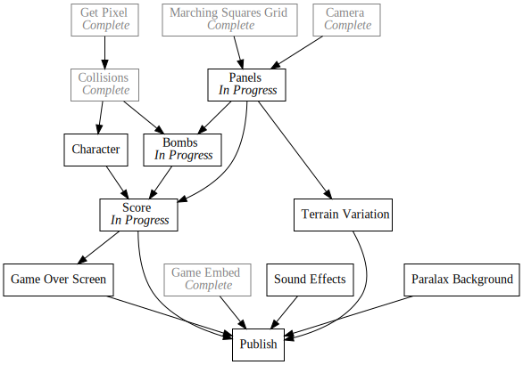

+++
title = "Day21 - 8Bomb Version 0.1"
description = "8Bomb is now playable!"
date = 2019-02-27

[extra]
project = "8bomb"
+++

Today I finished a first playable version of 8Bomb! I built upon the self hosted
SCRIPT-8 engine from yesterday by adding some performance improvements to the
canvas API calls (which I will try to push upstream after SCRIPT-8 is back and
running). I also added keyboard input support also based on the code from the
original repository. With those out of the way, I was able to get back to making
progress. These changes were much of the same as yesterday, so I decided not to
document much.

I made a number of changes to the game code:

 1. I changed the terrain rendering to be completely pixel based, tearing out
    the marching squares
 2. I added a concept of panels so the terrain can be extended automatically
 3. I added a score counter
 4. I added bombs which flicker and explode after a short while causing the game
    to restart if the player is too close.

  <iframe src="https://kethku.github.io/8Bomb/"></iframe>

## Terrain Improvements

After digging through the rendering code in SCRIPT-8 I found out that sprites
are rendered square by square similar to how the `setPixel` and `fillRectangle`
functions work. Since everything was run in JavaScript, I figured that doing
that rendering by hand would be just as efficient as letting SCRIPT-8 do it for
me.

So I modified the terrain data structure to have 300 by 128 entries:


function initTerrain() {
  let terrain = [];
  for (let y = 0; y < 300; y++) {
    let row = [];
    for (let x = 0; x < 128; x++) {
      if (y > 90) {
        row.push(1);
      } else {
        row.push(0);
      }
    }
    terrain.push(row);
  }
  return terrain;
}


And updated the `drawTerrain` function to `setPixels` and pick the color based on
whether there is an open pixel above or below the current pixel:


function drawTerrain({ terrain, cameraY }) {
  let top = Math.max(0, Math.floor(cameraY));
  let bottom = Math.min(Math.floor(cameraY + 128), terrain.length); 
  for (let y = top; y < bottom; y++) {
    for (let x = 0; x < terrain[y].length - 1; x++) {
      if (terrainAt(x, y, terrain)) {
        if (!terrainAt(x, y - 1, terrain)) {
          setPixel(x, y, 0);
        } else if (!terrainAt(x, y + 1, terrain)) {
          setPixel(x, y, 2);
        } else {
          setPixel(x, y, 1);
        }
      }
    }
  }
}


This adds a little bit of depth to the terrain which goes a long way.

I then refactored further to allow for automatic extension of the terrain. I
could have just went with adding pixel rows to the terrain array, but I decided
to go with a panel based approach which will allow me to add more information
such as style etc to the panels later on. I moved the terrain init code to a
`createPanel` function, and added an `updateTerrain` function which will
automatically append panels to a terrain map each time the camera moves far
enough.


function createPanel() {
  let panel = [];
  for (let y = 0; y < 100; y++) {
    let row = [];
    for (let x = 0; x < 128; x++) {
      row.push(true);
    }
    panel.push(row);
  }
  return panel;
}

export function updateTerrain(cameraY) {
  let panelTop = Math.floor(cameraY / panelHeight) - 1;
  let panelBottom = panelTop + 5;

  for (let i = panelTop; i < panelBottom; i++) {
    if (!terrain[i]) {
      terrain[i] = createPanel();
      if (lowestPanel < i) lowestPanel = i;
    }
  }
}


The `terrainAt`, and `cutTerrain` functions were similarly modified to first
index into the terrain map, and then index into the correct entry in the
associated panel. I also added a `setTerrainAt` function which handles settings
a terrain boolean if it is contained in the terrain map.


export function terrainAt(x, y) {
  if (y < terrainStart) return false;
  let panelNumber = Math.floor(y / panelHeight);
  let panel = terrain[panelNumber];
  let panelY = y - (panelNumber * panelHeight);
  if (panel && panelNumber != lowestPanel) {
    return panel[panelY][x];
  }
  return false;
}

export function setTerrainAt(x, y, value) {
  let panelNumber = Math.floor(y / panelHeight);
  let panel = terrain[panelNumber];

  if (panel) {
    let panelY = y - (panelNumber * panelHeight);
    let row = panel[panelY];
    if (x >= 0 && x < row.length) {
      row[x] = value;
    }
  }
}

export function cutTerrain(x, y, r) {
  for (let cx = Math.floor(x - r); cx <= x + r; cx++) {
    for (let cy = Math.floor(y - r); cy <= y + r; cy++) {
      let dx = cx - x;
      let dy = cy - y;
      let cr = Math.floor(Math.sqrt(dx * dx + dy * dy));

      if (cr > r) continue;
      setTerrainAt(cx, cy, false);
    }
  }
}


Luckily since `drawTerrain` already used the `terrainAt` abstraction, it did not
need modified. These changes made the terrain much smoother, and actually
improved performance since only the pixels on the screen were drawn.

## Bombs

The bombs were pretty simple. I split the functionality into three sections:
Spawning, Timer Updates, and Explosions.

Spawning was pretty simple. Every frame I generate a random number between 0 and
100 and check if that number is less than the current score divided by 400 plus
0.5. This means that at the start of the game, there is a 0.5% chance that a
bomb will spawn, and as the player moves down the screen, that chance will
increase at a linear rate.


export function spawnBombs({ player,  bombs, score }) {
  if (Math.random() * 100 <= score / 400 + 0.5) {
    bombs.push(createPhysicsObject(Math.random() * 112 + 8, player.position.y - 300, 2));
  }
}


Then each frame I also update the fuzes on each bomb.


// Update Bomb Timers
for (const bomb of state.bombs) {
  if (bomb.timeLeft != undefined) {
    // Reset Bomb Sprite
    bomb.sprite = 2;
    // Decrement timer
    bomb.timeLeft -= 1;
    if (bomb.timeLeft <= 0) {
      // Halve next timer length
      bomb.fuze = bomb.fuze * 0.75;
      if (bomb.fuze < 1 && bomb.grounded) {
        // Fuze finished. Explode
        bombsToExplode.push(bomb);
        continue;
      } else {
        // Not enough iterations yet. Flicker again
        bomb.timeLeft = bomb.fuze;
        bomb.sprite = 3;
      }
    }
  } else if (bomb.grounded) {
    // Start fuze since the bomb has hit the ground
    bomb.timeLeft = fuzeTime;
    bomb.fuze = fuzeTime;
  }

  // Preserve this bomb
  remainingBombs.push(bomb);
}
// Preserve all remaining bombs
state.bombs = remainingBombs;


The basic idea with the fuze is two fold: First, flicker the bomb at a steadily
increasing speed so that the player can tell when a bomb is about to blow and
second, only start the fuze (or blow up the bomb) if the bomb is touching the
ground.

I achieve the first by keeping track of two timers, the fuze and the `timeLeft`.
The fuze is used to keep track of how long until the next flash, and the
`timeLeft` is used to keep track of when to actually flash. Each iteration, the
fuze is shrunk by 0.75 and when the fuze hits less than 1, the bomb is queued
for explosion.


// Blog up bombs
let physicsObjects = getPhysicsObjects(state);
for (const bomb of bombsToExplode) {
  cutTerrain(bomb.position.x, bomb.position.y, bombRadius, state.terrain);
  for (const object of physicsObjects) {
    // Find the distance to the object
    let dx = object.position.x - bomb.position.x;
    let dy = object.position.y - bomb.position.y;
    let length = Math.sqrt(dx * dx + dy * dy);

    // If the object is the player, and the length is less than 3/4 of the
    // bomb radius, the player has lost.
    if (object == state.player && length < bombRadius * 0.75) location.reload();

    // Otherwise knockback the object by the distance * knockBack / length^2;
    let lengthSquared = length * length;
    object.position.x += dx * knockBack / lengthSquared;
    object.position.y += dy * knockBack / lengthSquared;
  }
}


The comments make things pretty self explanatory, but the gist is to loop over
every physics object and add some velocity away from the exploding bomb
depending on how far the object is from the explosion. To wrap things up, I
check if the player is too close to the explosion, and restart the game as a
losing condition.

## Score

As shown in the above screen cap, I also added a simple score number at the
bottom of the screen which indicates how far the player got.


export function drawScore({ cameraY, score }) {
  camera();
  let scoreText = Math.max(score - 68, 0).toString();
  if (scoreText.length > 5) scoreText = scoreText.substring(0, 5);
  print(5, 120, scoreText, 6);
}


Pretty easy, but works well. I take the `substring` to truncate the extra decimal
points. Eventually I will need to make this smarter, but it works for now.

The game is very playable at this point and if I don't say so myself, pretty
fun! There is still a lot of polishing to do though! I haven't decided what all
I will implement next, but I think I might do some final polish steps on this
simplified version so that I can have a truly SCRIPT-8 game, and then pull out
into my own engine to loosen the constraints on color and libraries. Who knows,
maybe I'll build a multiplayer version :P

Till tomorrow,  
Keith
