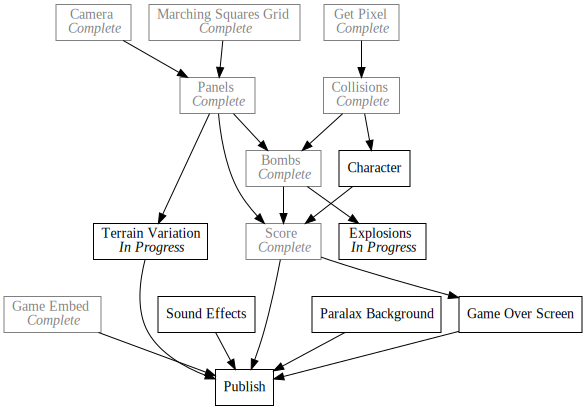
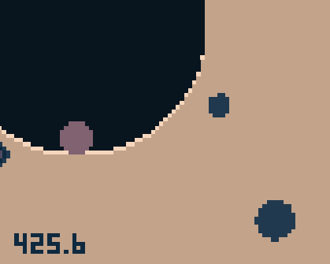
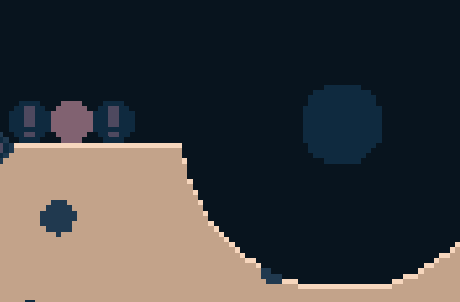

+++
title = "Day23 - Rocks and Explosions"
description = "Adding graphical touches to 8bomb"
date = 2019-03-01

[extra]
project = "8bomb"
+++

Today I added graphical rocks and bomb explosions to 8bomb. These don't effect
gameplay at all, but do a good job of making the game more visualy impactful and
interesting. I'll jump right in.

  <iframe src="https://kethku.github.io/8Bomb/"></iframe>

## Rocks

The basic idea here is to add visual rocks to the terrain panels. These won't
effect gameplay in any, but give a sense of motion that can be missing if the
terrain is all one color. 

First step was to randomly place stones in each panel. I give each panel 10
chances, each with 40% chance to spawn a stone. Then each stone is given a
random x and y value within the panel and a random radius from 0 to 5. Lastly
they are each given a color which is random from 4 to 7;


function createPanel() {
  let panel = [];
  let stones = [];
  for (let y = 0; y < 100; y++) {
    let row = [];
    for (let x = 0; x < 128; x++) {
      row.push(true);
    }
    panel.push(row);
  }

  for (let i = 0; i < 10; i++) {
    if (Math.random() * 100 < 40) {
      stones.push({
        x: Math.random() * 128,
        y: Math.random() * panelHeight,
        r: Math.random() * 5,
        c: Math.floor(Math.random() * 3) + 4
      });
    }
  }
  panel.stones = stones;
  return panel;
}


Note that since javascript objects are dynamic, I can add a stones property to
the panel even though it is nominally an array. This is a little weird, but
works well for my purposes so I'm leaving it.

I draw the stones by pulling the color calculation functionality out of the
`drawTerrain` function and into a centralized `colorAt(x, y)` function which
checks if a rock is near enough and returns a random rock color instead of the
expected ground color.


export function colorAt(x, y) {
  let panelNumber = Math.floor(y / panelHeight);
  let panel = terrain[panelNumber];
  let panelY = y - (panelNumber * panelHeight);

  if (!panel) return 7;

  for (let stone of panel.stones) {
    let dx = stone.x - x;
    let dy = stone.y - panelY;
    let distance = Math.sqrt(dx * dx + dy * dy);

    if (distance < stone.r) {
      return stone.c;
    }
  }

  let color = 1;
  if (!terrainAt(x, y - 1)) {
    color -= 1;
  } else if (!terrainAt(x, y + 1)) {
    color += 1;
  }
  return color;
}


Since the stones can be at any floating point from 0 to the panel width and 0 to
the panel height, the rocks tend to have slightly irregular shapes which
improves the effect.

## Explosions

The explosions were pretty simple as well. I created `newExplosion` function
which takes an x and y and creates a new explosion object which contains the x
and y passed in as well as a standard explosion radius r, color c initialized at
0 and a delay initialized to the animation speed. The new explosion gets added
to a list managing the active explosions.


const startingRadius = 30;
const animationSpeed = 3;

let explosions = [];

export function newExplosion(x, y) {
  explosions.push({
    x,
    y,
    r: startingRadius,
    c: 0,
    delay: animationSpeed
  });
}


Then each frame I run a new `updateExplosions` function which loops over every
active explosion, decriments the delay if it is greater than zero, or resets the
delay and increments the color.


export function updateExplosions() {
  let remainingExplosions = [];

  for (let explosion of explosions) {
    if (explosion.delay > 0) {
      explosion.delay--;
      remainingExplosions.push(explosion)
    } else {
      if (explosion.c == 7) continue;
      remainingExplosions.push(explosion);
      explosion.c += 1;
      explosion.r *= 0.8;
      explosion.delay = animationSpeed;
    }
  }

  explosions = remainingExplosions;
}


If the color is equal to 7, the explosion is dropped. Otherwise the remaining
explosions become the active explosions.

Finally drawing the explosions is as simple as setting the pixels that are
within `r` distance from the explosion center to the color `c`.


export function drawExplosions() {
  for (let explosion of explosions) {
    for (let x = explosion.x - explosion.r; x < explosion.x + explosion.r; x++) {
      for (let y = explosion.y - explosion.r; y < explosion.y + explosion.r; y++) {
        let dx = x - explosion.x;
        let dy = y - explosion.y;
        let dist = Math.sqrt(dx * dx + dy * dy);

        if (dist <= explosion.r) {
          setPixel(x, y, explosion.c);
        }
      }
    }
  }
}


And thats it!

These are very simple effects, but go a long way towards improving the feel of
the game. Next up I will look into implementing a game over screen.

Till tomorrow,
Keith
