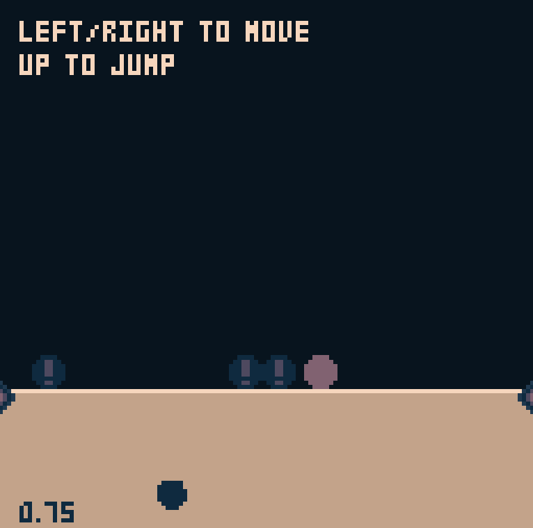

+++
title = "Day25 - Game Over Screen"
description = "Add game over screen to 8Bomb"
date = 2019-03-03

[extra]
project = "8bomb"
+++

Today I implemented the game over screen in 8Bomb. I'll jump right in.

## Game Over

For the game over screen I built a simple screen clear effect which animates in
when the player dies, and animates out when the game is reset. The effect is
made up of many colored circles which get added one by one and which grow to a
random size. The results are then printed to the screen. If the player presses
the jump button then the circles shrink till they disappear revealing a new
game.


function drawGameOverScreen() {
  let emptyPixels = drawCircles();

  if (player.dead) {
    growCircles();
    addAdditionalCircles(emptyPixels);
    printResults();
  } else {
    shrinkCircles();
  }
}


## Animating In

`DrawCircles` loops over each of the pixels on the screen and checks to see if a
clear Circle is close enough to draw a pixel. The pixel coordinates that are not
currently close enough to any pixel are added to a list of empty pixels for
later use.


function drawCircles() {
  let emptyPixels = [];

  for (let x = 0; x < 128; x++) {
    for (let y = 0; y < 128; y++) {
      let pixel = new Vector(x, y);

      let pixelDrawn = false;
      for (let circle of clearCircles) {
        if (pixel.subtract(circle.center).length < circle.radius) {
          setPixel(pixel.x, pixel.y, circle.color);
          pixelDrawn = true;
          break;
        }
      }

      if (!pixelDrawn) {
        emptyPixels.push(pixel);
      }
    }
  }

  return emptyPixels;
}


If the player is dead, then existing circles are grown until they have reached
their target radius, and more circles are added to the empty pixels until no
room remains.


function growCircles()  {
  for (let circle of clearCircles) {
    if (circle.radius < circle.targetRadius) {
      let dr = circle.targetRadius - circle.radius;
      circle.radius += dr * 0.2;
    }
  }
}


Here I used a simple trick to animate the circles smoothly into their target
radius. By computing the distance between the current radius and the target, I
can add some small percentage of that distance to the current radius each frame.
This has the effect of smoothly animating into the current size, slowing down as
it approaches. A similar but opposite effect can be done by multiplying the
current radius by some number slightly greater than one. This would cause the
radius to grow slowly and then speed up until it reaches the desired size.


let timeTillMoreCircles = 0;
function addAdditionalCircles(emptyPixels) {
  if (emptyPixels.length != 0) {
    let center = emptyPixels[Math.floor(Math.random() * emptyPixels.length)];
    let targetRadius = Math.random() * 15 + 5;
    let radius = 1;
    let color = Math.floor(Math.random() * 3) + 4;
    clearCircles.push({ center, radius, color, targetRadius });
  }
}


To finish up the incoming animation, I add circles every frame in a random
location with a random radius until no pixels remain uncovered. The finished
animation looks like this:

## Animating Out

The outgoing animation uses much of the same machinery as the incoming one but
with two main changes. Instead of circles growing one at a time, the circles all
shrink at the exact time and much faster. The goal is to animate the circles out
but have them leave quickly so that the player can get playing again right away.


function shrinkCircles() {
  let remainingCircles = [];
  for (let circle of clearCircles) {
    circle.radius *= 0.8;
    if (circle.radius > 1) remainingCircles.push(circle);
  }
  clearCircles = remainingCircles;
}


The other important part is to actually reset the game! Since the game over
animation depends on the player dead flag, I just modified the player input
logic to reset all of the state with a Reset event, and moved all of the game
initialization logic to subscriptions of said event. This way at any point in
time, I can trigger a reset and the entire game will restart from scratch.


Update.Subscribe((input) => {
  if (player.dead) {
    if (input.upPressed || input.wPressed) Reset.Publish();
  } else {
    let speed = player.grounded ? runSpeed : airSpeed;
    if (input.left || input.a) {
      player.position.x -= speed;
    }
    if (input.right || input.d) {
      player.position.x += speed;
    }

    if (player.grounded) {
      player.jumpReady = true;
    }

    if ((input.upPressed || input.wPressed) && player.jumpReady) {
      player.previous.y += jumpSpeed;
      player.jumpReady = false;
    }
  }
});


As an example of a Reset subscription, I declare the variables outside of
the subscription, but do any initialization inside of the Reset callback.


let previousCameraPosition, cameraPosition, shake;
export let cameraX, cameraY;

Reset.Subscribe(() => {
  previousCameraPosition = 0;
  cameraPosition = 0;
  shake = 0;

  cameraY = 0;
  cameraX = 0;
});


That's all for the outgoing animation. It looks like:

Its very fast and most people probably wouldn't notice it, but I think it adds
some much needed polish.

I'm getting very close to the final initial version of 8Bomb! The only remaining
tasks are to add some sound effects, and a better character animation. Then I
will port the game back to SCRIPT-8 with my changes and call it a day!

Till tomorrow,  
Keith
