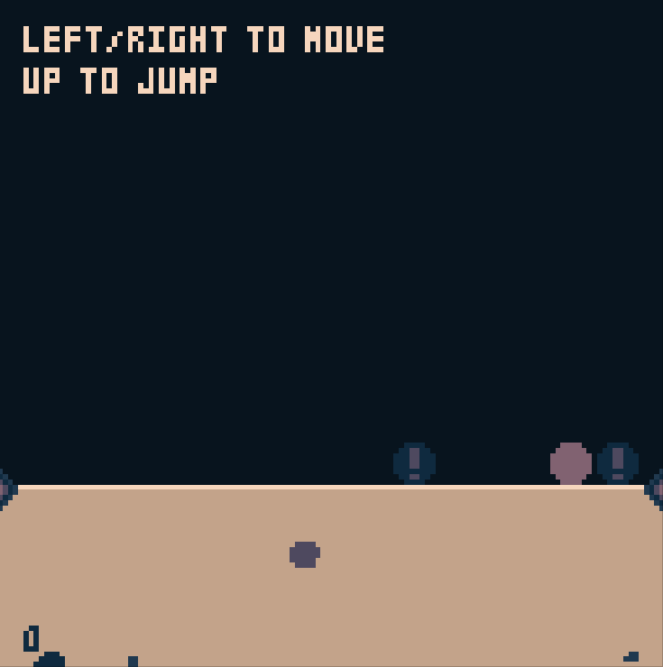
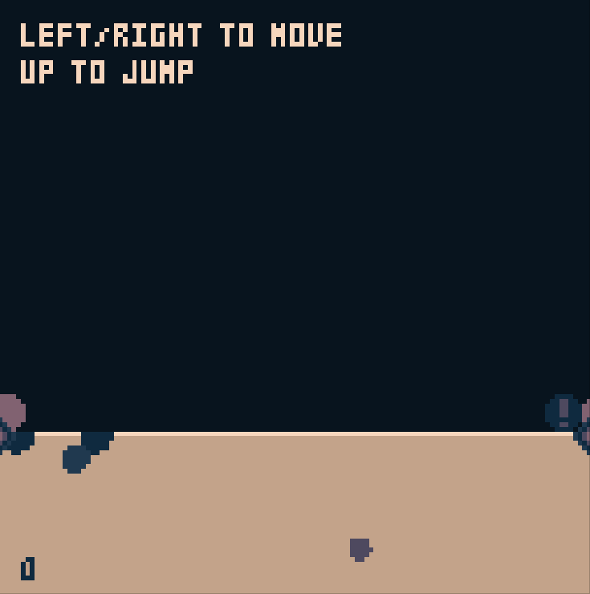

+++
title = "Day27 - 8Bomb Performance and Cleanup"
description = "Faster game over animation and general bug fixes"
date = 2019-03-05

[extra]
project = "8bomb"
+++

Today since Gabriel was working on some things related to the IFrame code in
SCRIPT-8, I decided to tie up some loose threads in 8Bomb that have been bugging
me: I wanted to redo some of the game over animation code to use the faster
circle function I built yesterday, and I wanted to fix some remaining bugs
related to the screen wrap feature.

## Game Over Take 2

Although the game over screen looked very close to what I wanted, the code was
very slow. Drawing circles by checking the distance of each pixel to the center
every frame is a very expensive operation. Luckily since I now have a faster
method of circle drawing from the `CanvasAPI`, I can use it instead and only
calculate which pixels are covered once.

As a recap, the end screen animation is achieved by drawing circles which grow
each frame in random locations of the screen until every pixel is covered by at
least one circle.

The way I did this previous was every frame, loop over every pixel on the
screen, checking each circle to see if it overlaps, and recording the pixel as
uncovered if not. Then I would pick a random uncovered pixel and add a new pixel
to that location.

My new algorithm is similar but has a couple differences. Instead of creating a
list of uncovered pixels every frame, a master list is maintained for the whole
animation.


let clearCircles = [];
let uncoveredPixels;

Reset.Subscribe(() => {
  uncoveredPixels = new Set();
  for (let y = 0; y < 128; y++) {
    for (let x = 0; x < 128; x++) {
      uncoveredPixels.add(y * 128 + x);
    }
  }
});


This master list contains the `Set` of every pixel *index* which is not
currently covered by a clear circle. The animation logic is then changed like
so:


function drawGameOverScreen() {
  drawCircles();

  if (player.dead) {
    growCircles();
    addAdditionalCircles();
    printResults();
  } else {
    shrinkCircles();
  }
}


I will describe each function in turn highlighting the changes.


function drawCircles() {
  for (let { center: { x, y }, radius, color } of clearCircles) {
    circFill(x, y, radius, color);
  }
}


The `drawCircles` function has been greatly simplified. Instead of the loop over
every pixel, I loop over every circle calling the `CanvasAPI` `circFill`
function to efficiently set the pixels inside of each circle.


function growCircles()  {
  for (let circle of clearCircles) {
    if (circle.radius < circle.targetRadius) {
      let dr = circle.targetRadius - circle.radius;
      circle.radius += dr * circleGrowthSpeed;
    }
  }
}


`growCircles` remains fairly unchanged. The only difference is that I pulled the
growth speed out into a constant.


function addAdditionalCircles(emptyPixels) {
  if (uncoveredPixels.size > 0) {
    let centerIndex = randomUncoveredPixel();
    let center = new Vector(centerIndex % 128, Math.floor(centerIndex / 128));
    let targetRadius = Math.random() * 15 + 5;
    markCoveredPixels(center, targetRadius);
    let radius = 1;
    let color = Math.floor(Math.random() * 3) + 4;
    clearCircles.push({ center, radius, color, targetRadius });
  }
}

function markCoveredPixels(center, targetRadius) {
  let radiusVector = new Vector(targetRadius * circleUnderCoverage, targetRadius * circleUnderCoverage);
  for (let pixel of Vector.InRectangle(center.subtract(radiusVector).floor(), center.add(radiusVector).ceil())) {
    if (pixel.subtract(center).length > targetRadius * circleUnderCoverage) continue;
    if (pixel.x < 0 || pixel.x >= 128 || pixel.y < 0 || pixel.y >= 128) continue;

    let index = pixel.y * 128 + pixel.x;
    uncoveredPixels.delete(index);
  }
}

function randomUncoveredPixel() {
  let elementsRemaining = Math.floor(Math.random() * uncoveredPixels.size);
  for (let index of uncoveredPixels) {
    if (elementsRemaining == 0) {
      return index;
    }
    elementsRemaining --;
  }
}


The bulk of the algorithm is done in `addAdditionalCircles`. I first check if
there are any uncovered pixels left. Assuming there are, I then pick a random
pixel index using `randomUncoveredPixel` which picks a random index value and
iterates over the set until it reaches that index number.

Then `addAdditionalCircles` constructs the `center` `Vector` and random `radius`
and passes them to `markCoveredPixels` which loops over every pixel within
`radius` units of `center` and removes it from the `uncoveredPixels` set if it
is closer than `radius` times `circleUnderCoverage` units away.

I introduced the `circleUnderCoverage` constant because it allows me to control
how many circles show up on the screen. Due to reasons I don't fully understand,
without the under estimation of covered pixels, some pixels never get covered by
the algorithm, so this is a bit of a hack to fix that.

Finally the circle is constructed and added to the `clearCircles` array. The
remaining `printResults` and `shrinkCircles` functions are unchanged. With these
performance optimizations in place, the end screen moved from running at 30fps
to well over 60fps. This doesn't really make a visible difference, but is good
practice to save battery life and such on machines running the game.

## Screen Wrap Take 2

There was a subtle bug in the screen wrap feature that I missed when I first
implemented it. Although I added drawing of the physics objects twice across the
wrap boundary, I did not update the physics calculations to simulate two objects
over the boundary.

Most of the time this was not an issue, but every once in a while if an object
bumped into another one over the boundary, it would rocket away once both go
over since the objects would then rapidly correct for the intersection. The
solution was pretty simple and involved doing the intersection check 3 times
every frame. Once for the object translated left 128 pixels, once for the object
not translated at all, and lastly once for the object translated right 128
pixels.


const wrappedOffsets = [
  new Vector(0, 0),
  new Vector(128, 0),
  new Vector(-128, 0)
];


To simplify the logic, I created an array containing the offset vectors. I then
added a loop to the `physicsObject` intersection code, and the explosion
calculations to do them once for each offset.


function resolveObjectCollisions(physicsObjects) {
  for (const first of physicsObjects) {
    for (const second of physicsObjects) {
      if (first == second) continue;
      for (let wrappedOffset of wrappedOffsets) {
        let wrappedFirstPosition = first.position.add(wrappedOffset);
        let offset = wrappedFirstPosition.subtract(second.position);
        let distance = offset.length;

        if (distance < first.radius + second.radius) {
          if (offset.y > 0) second.grounded = true;
          let amount = first.radius + second.radius - distance;
          let direction = offset.divide(distance);
          let correction = direction.multiply(amount / 2);

          first.position = first.position.add(correction);
          second.position = second.position.subtract(correction);
        }
      }
    }
  }
}


Instead of using the position directly, I use the wrapped position which is
modified by each offset. I then did a similar change to the bomb explosion code.


// Blow up bombs
let physicsObjects = getPhysicsObjects();
for (const bomb of bombsToExplode) {
  cutTerrain(bomb.position.x, bomb.position.y, bombRadius);
  newExplosion(bomb.position.x, bomb.position.y);

  for (const object of physicsObjects) {
    for (let wrappedOffset of wrappedOffsets) {
      let wrappedPosition = bomb.position.add(wrappedOffset);
      // Find the distance to the object
      let offset = object.position.subtract(wrappedPosition);
      let length = offset.length;

      // If the object is the player, and the length is less than 3/4 of the
      // bomb radius, the player has lost.
      if (object == player && length < bombRadius * 0.75) player.dead = true;

      // Otherwise knockback the object by the distance * knockBack / length^2;
      let lengthSquared = length * length;
      object.position = object.position.add(offset.multiply(knockBack/lengthSquared));
    }
  }
}


Since the bomb explosion logic is in charge of adding an explosion impulse, and
killing the player if they are too close, both are fixed with this change.

As shown in this gif, both the player is killed, and the nearby bomb is pushed
to the right away from the screen wrap like it should.

Thats it for today, hopefully tomorrow I will work up the effort to actually
make a pull request to SCRIPT-8 with the performance improvements which should
let me do the finishing touches on 8Bomb and finish version 1.0.

Till Tomorrow,  
Kaylee
