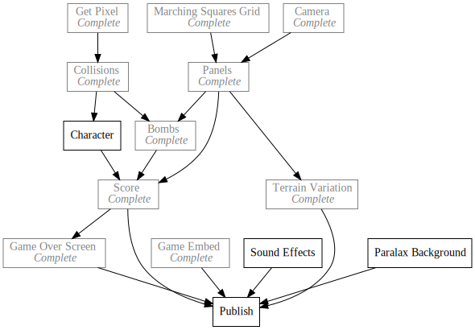

+++
title = "Day31 - 8Bomb State Management"
description = "Modified 8Bomb to use SCRIPT-8's state features with mixed results"
date = 2019-03-09

[extra]
project = "8bomb"
+++

Today I spent more time testing things in SCRIPT-8 :P SCRIPT-8 currently has a
feature that enables time travel within the editor if state is stored in the
objects passed to `update` and `draw`. If you pause the game in the editor, then
a scroll bar pops up which allows the developer to scrub backwards in time. Then
while paused, the game can be edited and the position of actors on the screen
updates in real time. I love the premise of this feature which Gabriel claims is
inspired by Bret Victor's [Inventing on Principle](https://vimeo.com/36579366)
but in practice I have run into some weirdness.

## JSON.parse(Json.stringify())

The first issue that bit me was that the objects stored on the state are
stringified and parsed removing any methods and non serializable data from the
properties. This wasn't surprising since it is well documented in the help page,
but was frustrating none the less because it meant that I had to get rid of my
Vector class and replace it with methods.

The change wasn't difficult, I just needed to go through every line and remove
the vector method calls in favor of the more confusing syntax.

This:


export function cutTerrain(x, y, r) {
  let center = new Vector(x, y);
  let radius = new Vector(r, r);
  let topLeft = center.subtract(radius).floor();
  let bottomRight = center.add(radius).floor();

  for (let pixel of Vector.InRectangle(topLeft, bottomRight)) {
    let offset = center.subtract(pixel);
    if (offset.length > r) continue;
    setTerrainAt(pixel.x, pixel.y, false);
  }
}


Turned into:


function cutTerrain(state, x, y, r) {
  let center = { x, y };
  let radius = { x: r, y: r };
  let topLeft = floor(subtract(center, radius));
  let bottomRight = floor(add(center, radius));

  for (let pixel of InRectangle(topLeft, bottomRight)) {
    let offset = subtract(center, pixel);
    if (length(offset) > r) continue;
    setTerrainAt(state, pixel.x, pixel.y, false);
  }
}


## Slooooow

The second problem I noticed was that the game ran much slower when state was
stored in the state objects. After some mild profiling I figured out what the
issue was. Turns out to store the history of the state after each frame,
SCRIPT-8 copies the data every frame. So if the state object is very large at
all, this becomes a bigger fraction of the alotted time.

This wasn't an issue early in the game, but as the player digs deaper into the
ground, each panel adds a significant amount of data causing the game to slow
noticibly.

The solution was to remove panels as the player dug in a certain distance above.
Its very unlikely that the player will ever see the terrain far above them, so
it is fine to delete those panels.

I achieved this by simply looping over the existing panels and deleting them if
they are far enough above.


for (let i = highestPanel; i < panelMin; i++) {
  if (terrain[i]) {
    state.highestPanel = i;
    delete terrain[i];
  }
}


## Time Travel

After implementing these changes I noticed that the time travel feature in
SCRIPT-8 was too slow to be usable. After chatting with Gabriel, we came to the
conclusion that the issue was that every frame the game draws draws every actor
30 times for the 30 frames of recorded data. This causes significant slow down
and makes the editor pretty unusable.

I never found a fix for this issue, but 8Bomb served its purpose of stress
testing the engine. I am hopeful that this information and investigation will be
useful for Gabriel.

## Error Location

Pretty quick day today as much of my time was spent refactoring and fiddling
with 8Bomb in the editor. I wasted a fair amount of time tracking down confusing
errors since the error message never tells where the error was thrown. My
solution was to instrument the error logger in my local clone to print the
actual stack trace to the console log. Then I would look up which line in the
evaled source caused the problem and search through the commited GitHub Gist to
find the offending code. This was pretty slow and frustrating but after a bunch
of investigation I couldn't find a cross platform way of surfacing the
information.

It turns out that the stack trace is only shown as a non browser consistent
string and not some data structure that could be navigated. There are
[some](https://github.com/stacktracejs/stacktrace.js/) tools for parsing the
string, but none of them that I could find allowed me to get out the evaled
location. I suspect if I want this feature I will have to build a parser myself,
but I wasn't up for it at the moment.

That about covers the progress today!

Till tomorrow,  
Keith

