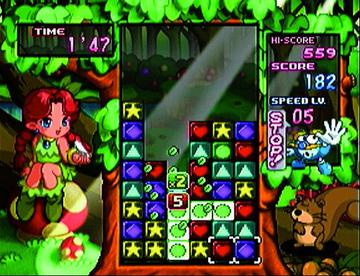

+++
title = "Day32 - Tetris Attack Clone"
description = "I started a Tetris Attack Clone!"
date = 2019-03-10

[extra]
project = "ta"
+++

Today I got started on a new project! My favorite game of all time has got to be
Tetris Attack for the Super Nintendo. Strangely enough Tetris Attack has nothing
to do with actual Tetris. Instead it is the American name for a popular Super
Famicom game in Japan called Panel de Pon.

The basic premise is that blocks move up from the bottom of the screen steadily
over time. You are given the ability to swap blocks horizontally to make
matches. You lose when the blocks hit the top of the screen.

Where this game gets really interesting is when you play the VS mode. Two
players play on either half of the screen, and when one player makes a large
enough match, a block is piled on top of the opponents screen.

My Dad and I have played untold hours of this game and have always bemoaned the
fact that we don't have a modern version. Until recently I haven't felt up to
the task, but I feel ready now. So today I spent the day getting a bunch of
boilerplate out of the way. I don't have it cleaned up in a presentable fashion
yet, so I won't describe it today, but I will leave you with this gif:

This image shows that I have a relatively performant sprite renderer which
supports drawing images with pixel perfect "nearest neighbor" sampling and
allowing overlapping.

The core of the engine was pulled from a failed project I worked on a year ago,
and implements sprite graphics from scratch in WebGL.

I have pulled out the graphics engine, and implemented an "immediate" mode api
so that I can call a centralized image function whenever I have an image to
draw. I found this pattern extremely productive in SCRIPT-8 and have decided to
emulate it, but with some shader magic to make it actually fast enough to use.

For graphics, I pulled the original graphics from Tetris Attack directly as
development art. I plan on bugging my buddy for graphics once the game gets
farther along, but for now this is more than sufficient.

I have big plans for the interface and for multiplayer over the network. I have
high hopes for this project! Today I just got the core bits out of the way, but
I plan on building an actual Pando tree and giving further background soon.

Till tomorrow!  
Keith
