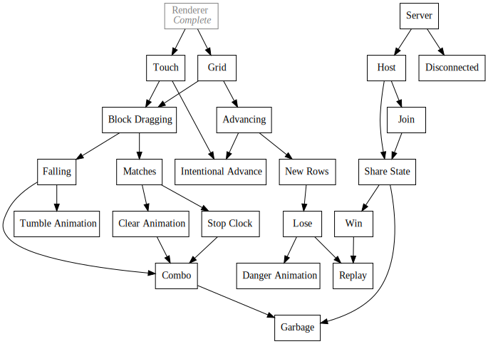

+++
title = "Day33 - Tetris Attack Planning"
description = "Set out todo items for Tetris Attack"
date = 2019-03-11

[extra]
project = "ta"
+++

Today I spent some time laying out the tasks that will need done for a playable
version of Tetris Attack. I've already finished the first step of getting a
workable engine up and running and will probably write a post about it shortly.
I also setup a project page for the Tetris Attack game as well as a [Github
Repo](https://github.com/Kethku/TetrisAttackClone) and associated
[Website](https://kethku.github.io/TetrisAttackClone/) containing the current
running version of the game.

In my mind, I have 3 main arcs of development: Single Player, Multi Player, and Polish.

## Arc 1: Single Player

The first will be once I have a playable single player version of the game. This
will include block rendering, touch controls, block animations, and a working
stop clock. This is a crucial stage as it will tell me if the benefits of touch
controls for this game are worth the effort. I will do an initial pass over
animations during this time to test out architectures here.

## Arc 2: Multiplayer

Multiplayer will require coding up a simple server and setting up a match making
system. My plan here is to make the server dumb and only forward events for the
clients. This strategy is completely unsafe and allows for all sorts of
cheating, but I only plan on playing this with my friends so this shouldn't be a
huge issue.

Matching Making will be done by giving a random room id to a player when they
first trigger a multiplayer session. Then said user can share the link to the
room via messaging or other means. Once two people are in the room, the game
will start. Since the server will be dumb and only share events, this system
works well because we can assume users will only connect if they own or want to
join a room.

If I finish all 3 of the current arcs, then I may think about modifying this
system to work with a more general purpose online compatible multiplayer. I
would love to play the game against random people online, but I need a working
game before that is remotely a possibility :)

## Arc 3: Polish

This arc is much less thought out. The idea here is that after the initial
gameplay is finished, I should spend some time iterating on the animations and
graphics. Initial tests of my renderer indicate tons of room for particles and
juicy effects, so I would like to use this game as a learning exercise for
adding fun animations to a game.

## Goals

My goal for this project are to build a simple but very polished experience. I
don't expect this game to be the next bejeweled, but I do expect it to be easier
to approach and play than the original game. The hardest part of playing should
be thinking of the steps to do, not executing them. Frequently in the original
game, I am able to think of what I want to do, but there is a frustrating
execution barrier of simply getting the swapper over the correct position and
dragging the block where I want it to go. I hope that a touch interface will
make this cleaner and prevent some of these problems.

I think this is a big project, but I've wanted to do it for a long time. Wish me
luck! I leave you with a wacky gif from fiddling with the renderer:

Till tomorrow,  
Keith
