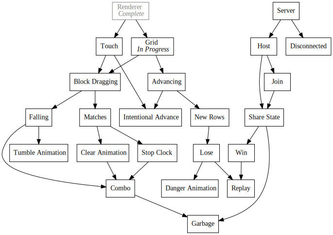
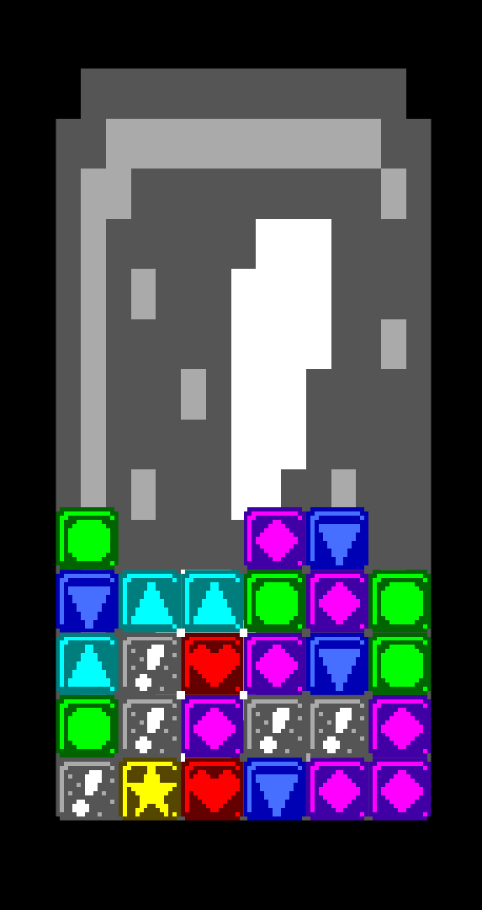

+++
title = "Day35 - Implement Block Grid"
description = "Built the initial grid and block modules for Tetris Attack"
date = 2019-03-13

[extra]
project = "ta"
+++

Today I built the initial version of the block grid for my Tetris Attack remake.
I did somethings a little weird in order to simplify what I think I will need
later on.

## Size

I would like my game to run on as many devices as possible. To that end I have
decided to make everything to the best of my ability size independent. This
means the graphics should look good at really low resolution, and really high
resolution and at any aspect ration. The first step to this goal is to
paramaterize the grid rendering with the required grid width and height.

I calculate the grid size by picking a percentage margin and multiplying that
percentage by both the height and width and taking the larger.


function calculateGridPosition() {
  let margin = Math.max(width * startingMargin, height * startingMargin);
  let maxWidth = width - margin;
  let maxHeight = height - margin;


I then try both axes to see which orientation the grid will fit in. Obviously I
could do this a smarter way, but trial and error with two options is very
reasonable and to be honest I'm too tired to do better.


  // Try Horizontal
  let gridWidth = maxWidth;
  let gridHeight = gridWidth * 2;

  if (gridHeight > maxHeight) {
    // Fallback to vertical
    gridHeight = maxHeight;
    gridWidth = gridHeight / 2;
  }


Once I arrive at the correct dimensions, I calculate some useful positioning
values and return them as an object.


  let gridLeft = (width - gridWidth) / 2;
  let gridTop = (height - gridHeight) / 2 + gridHeight;

  let blockWidth = gridHeight / gridBlockHeight;

  return { gridWidth, gridHeight, gridLeft, gridTop, blockWidth };
}


Then I subscribe to the Draw event and render a bang block as a test to
visualize the positioning.


Draw.Subscribe(() => {
  let { gridWidth, gridHeight, gridLeft, gridTop, blockWidth } = calculateGridPosition();
  image(bang, gridLeft + gridWidth / 2, gridTop - gridHeight / 2, gridWidth, gridHeight);
});


Testing out the positioning by resizing the window over a variety of sizes
verified that the sizing is good and fits the grid in the correct location.

The goal is for the game to render for any aspect ratio, but I optimize for the
vertical phone form factor. Since the grid takes up most of the space for the
case of a tall and skinny window, I declared success.

## Blocks

Moving onto the block module, I kept things simple. First step was to defined
the block types in an Enum-like object and build a function for picking a random
block.


const types = {
  CIRCLE: "Circle",
  TRIANGLE_UP: "TriangleUp",
  TRIANGLE_DOWN: "TriangleDown",
  DIAMOND: "Diamond",
  STAR: "Star",
  HEART: "Heart",
  BANG: "Bang"
};

function randomType() {
  let keys = Object.keys(types);
  return types[keys[Math.floor(Math.random() * keys.length)]];
}


I then created a simple `Block` class which assigns a random block type and
stores the position for rendering. One weird bit I did was to invert the Y-axis
for block positioning. My reasoning was that since blocks will get added from
below, adding new blocks would require updating the y position numbers as more
get pushed in. By numbering top to bottom, new blocks get increasing Y positions
without needing any updates.


export class Block {
  constructor(gridX, gridY) {
    this.type = randomType();
    this.blockLeft = gridX;
    this.blockTop = gridY;
  }

  render(gridLeft, blocksTop, gridWidth) {
    let blockWidth = gridWidth / gridBlockWidth;
    let centerX = gridLeft + blockWidth * this.blockLeft + blockWidth / 2;
    let centerY = blocksTop - blockWidth * this.blockTop + blockWidth / 2;
    image(blockImages[this.type], centerX, centerY, blockWidth, blockWidth);
  }
}


Then back on the grid side of things, I initialized the blocks in a simple
starting pattern which stacks them column by column. I store them in an array to
start since no block lookups are needed yet, but I suspect I will store them in
a two dimensional array or map in the future.


let blocks = [];

let maxStackHeight = 5;
for (let x = 0; x < gridBlockWidth; x++) {
  let stackHeight = Math.floor(Math.random() * 4) + maxStackHeight - 3;
  for (let y = 0; y < stackHeight; y++) {
    blocks.push(new Block(x, maxStackHeight - y));
  }
}


Finally back in the draw event I calculate the top position of the block grid
and render each block!


Draw.Subscribe(() => {
  let { gridWidth, gridHeight, gridLeft, gridTop, blockWidth } = calculateGridPosition();
  let blocksTop = gridTop - gridHeight + maxStackHeight * blockWidth;

  image(bang, gridLeft + gridWidth / 2, gridTop - gridHeight / 2, gridWidth, gridHeight);

  for (let block of blocks) {
    block.render(gridLeft, blocksTop, gridWidth);
  }
});


Which yields this image:

This work lays the foundation for the actual game mechanics. Shouldn't be too
long till I start moving blocks around!

Till tomorrow,  
Keith
