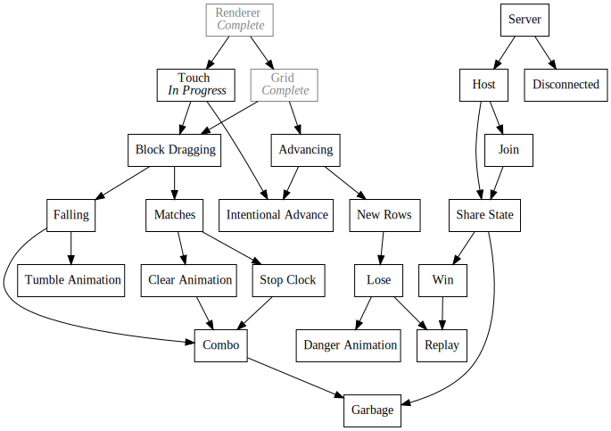
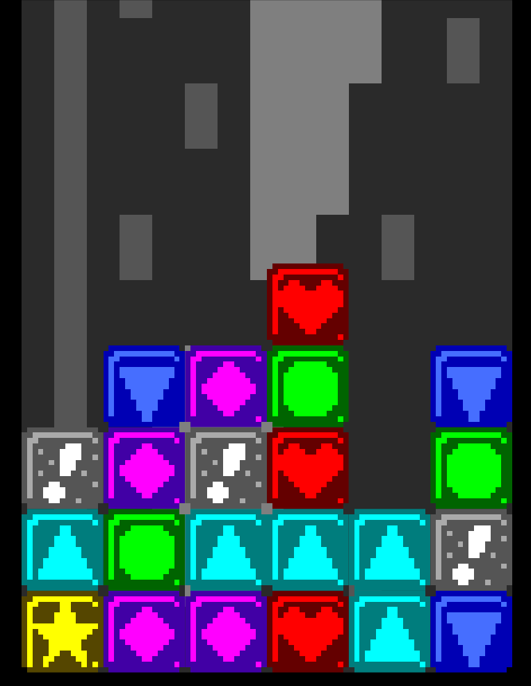

+++
title = "Day36 - TA Utilities and Touch"
description = "Added utility classes and touch support to Tetris Attack"
date = 2019-03-14

[extra]
project = "ta"
+++

Today I ported the `Vector` class from 8Bomb, extended it to 3 dimensions, added a
`Color` class, and built initial touch support into my engine.

## Vector

I decided to spend some time rewriting the code from yesterday to use the
`Vector` type I developed for 8Bomb and to use a new `Color` type for tinting
sprite colors. This meant converting the graphics code (still not described here
because its still gross... I'll try to clean it up soon and talk about it) to
use the new types and add support for z positioning and tinting.

The `Vector` class implementation didn't change much besides adding some aliases
for various combinations of the components and a number of constant values.


export class Vector {
  constructor(x, y, z = 0) {
    this.x = x;
    this.y = y;
    this.z = z;
  }

  get length() {
    return Math.sqrt(this.x * this.x + this.y * this.y + this.z * this.z);
  }

  get xy() {
    return new Vector(this.x, this.y, 0);
  }

  get yz() {
    return new Vector(0, this.y, this.z);
  }

  get xz() {
    return new Vector(this.x, 0, this.z);
  }

  get width() {
    return this.x;
  }

  get height() {
    return this.y;
  }

  distance(other) {
    return this.subtract(other).length;
  }

  add(other) {
    return new Vector(this.x + other.x, this.y + other.y, this.z + other.z);
  }

  subtract(other) {
    return new Vector(this.x - other.x, this.y - other.y, this.z - other.z);
  }

  multiply(scalar) {
    return new Vector(this.x * scalar, this.y * scalar, this.z * scalar);
  }

  multiplyParts(other) {
    return new Vector(this.x * other.x, this.y * other.y, this.z * other.z);
  }

  divide(scalar) {
    return new Vector(this.x / scalar, this.y / scalar, this.z / scalar);
  }

  normalize() {
    return this.divide(this.length);
  }

  floor() {
    return new Vector(Math.floor(this.x), Math.floor(this.y), Math.floor(this.z));
  }

  ceil() {
    return new Vector(Math.ceil(this.x), Math.ceil(this.y), Math.ceil(this.z));
  }
}

Vector.zero = new Vector(0, 0, 0);
Vector.one = new Vector(1, 1, 1);
Vector.half = new Vector(0.5, 0.5, 0.5);
Vector.topLeft = new Vector(0, 1);
Vector.topRight = new Vector(1, 1);
Vector.bottomRight = new Vector(1, 0);
Vector.bottomLeft = Vector.zero;

Vector.down = new Vector(0, -1);
Vector.up = new Vector(0, 1);
Vector.right = new Vector(1, 0);
Vector.left = new Vector(-1, 0);


Of note is `multiplyParts` which is like scalar multiply except multiplying by
another `Vector`. I'm not super happy with the name, but for now it will do. The
`Color` class is very simple:


export class Color {
  constructor(r, g, b, a = 1) {
    this.r = r;
    this.g = g;
    this.b = b;
    this.a = a;
  }
}

Color.white = new Color(1, 1, 1, 1);
Color.black = new Color(0, 0, 0, 1);
Color.clear = new Color(0, 0, 0, 0);


After adding the utility classes, I rewrote the math from yesterday to use the
vector operators. It was pretty straightforward, so I will just provide an
example:


function calculateGridPosition() {
  let gridCenter = screenSize.divide(2);

  let margin = Math.max(screenSize.width * startingMargin, screenSize.height * startingMargin);
  let maxWidth = screenSize.width - margin;
  let maxHeight = screenSize.height - margin;

  // Try Horizontal
  let gridDimensions = new Vector(maxWidth, maxWidth * 2);

  if (gridDimensions.y > maxHeight) {
    // Fallback to vertical
    gridDimensions = new Vector(maxHeight / 2, maxHeight);
  }

  return { gridCenter, gridDimensions };
}


Similarly to the benefits in 8Bomb, the code is not really smaller, but to my
eyes it is much easier to verify that I haven't made any particular errors.

## Touch

To add touch support I decided to use the Javascript PointerEvents which unify
the various input modes into one API which will respond to pen, touch, and mouse
in the same way. Unfortunately all of the browsers except Safari support the
events, so I had to use a [polyfill](https://github.com/jquery/PEP) to use them.

This was as simple as adding a script tag to the index.html file.


<html>
  <head>
    
    
  </head>
  <body>
    
  </body>
</html>


I then subscribed to the `touchdown`, `touchup`, and `touchmove` events on the canvas
element and stored the extracted data into module variables.


import { Vector } from "./math";
import { Update } from "./events";
import { canvas, screenSize } from "./graphics";

export let touchPosition = Vector.zero;

export let touchDown = false;
export let touchStarted = false;
export let touchReleased = false;

function handlePointerEvent(e) {
  touchPosition = new Vector(e.clientX, screenSize.height - e.clientY);
  touchDown = e.pressure > 0.1;
}

let previousDown = false;
Update.Subscribe(() => {
  touchStarted = touchDown && !previousDown;
  touchReleased = !touchDown && previousDown;
  previousDown = touchDown;
});

canvas.addEventListener("pointerdown", handlePointerEvent);
canvas.addEventListener("pointerup", handlePointerEvent);
canvas.addEventListener("pointermove", handlePointerEvent);


Then using the extracted information was pretty easy. I added an update function
to the block class which checks if the pointer is down inside it's bounds and
picks a random new block type.


calculateLocation(gridCenter, gridDimensions, blockWidth, blocksAdvancement) {
  let blocksTopLeft = new Vector(
    gridCenter.x - gridDimensions.width / 2,
    gridCenter.y - gridDimensions.height / 2 + blocksAdvancement);

  // To get the actual position of a block, add the block position times the
  // block width with the y axis reversed.
  let topLeft = blocksTopLeft.add(this.blockPosition.multiply(blockWidth).multiplyParts(new Vector(1, -1)));
  let dimensions = new Vector(blockWidth, blockWidth);

  return { topLeft, dimensions };
}

update(gridCenter, gridDimensions, blockWidth, blocksAdvancement) {
  let { topLeft, dimensions } = this.calculateLocation(gridCenter, gridDimensions, blockWidth, blocksAdvancement);

  if (touchDown) {
    if (touchPosition.x >= topLeft.x && touchPosition.x <= topLeft.x + dimensions.width &&
        touchPosition.y <= topLeft.y && touchPosition.y >= topLeft.y - dimensions.height) {
      this.type = randomType();
    }
  }
}


And thats that! I plan on pulling the grid positioning variables out of
arguments and into module level variables which get updated upon window resize
instead of recalculated every frame, but for now the proof of concept for touch
is complete.

Till tomorrow,  
Keith
