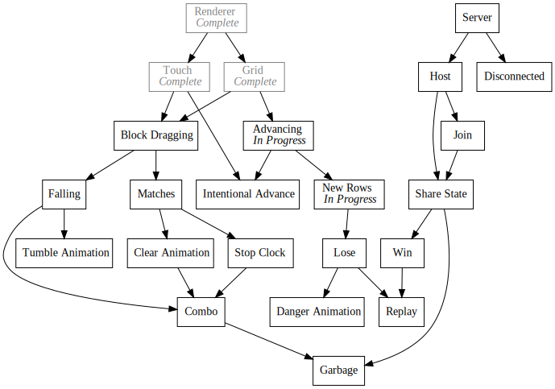
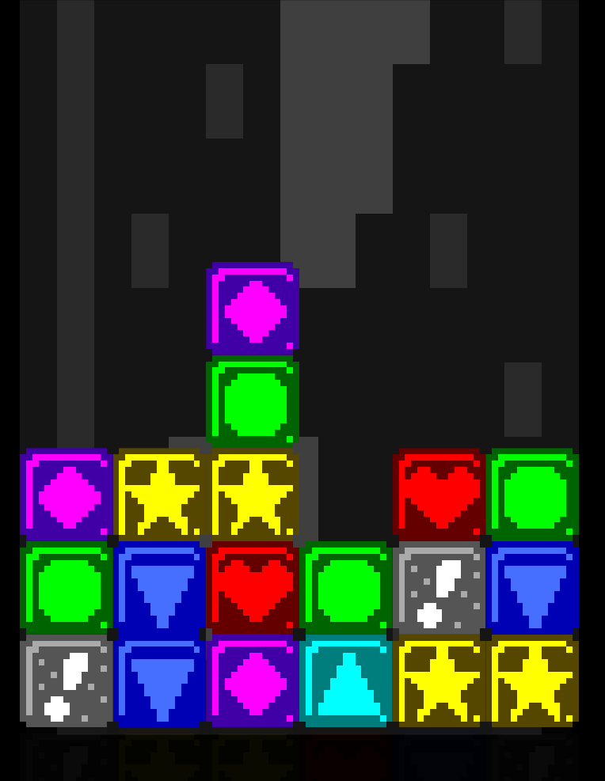

+++
title = "Day37 - Advancing Rows and Minor Cleanup"
description = "Refactored state management and added block spawning"
date = 2019-03-15

[extra]
project = "ta"
+++

Today I worked on adding block scrolling and a new block fade. Along the way I
refactored the state management to clean up the existing math.

## Refactors

Yesterday I mentioned wanting to move the grid size calculations out of the draw
and update loops and into a subscription to the resize event. This would prevent
the unnecessary calculations but more importantly simplify the Update and Draw
calls so that they don't need to pass the state through method arguments.


/////////////////////
// Handle Resizing //
/////////////////////
export let gridCenter = Vector.zero;
export let gridDimensions = Vector.one;
export let blockWidth = 0;
export let blockPixelAdvancement = 0;

function calculateGridSizes() {
  gridCenter = screenSize.divide(2);

  let margin = Math.max(screenSize.width * startingMargin, screenSize.height * startingMargin);
  let maxWidth = screenSize.width - margin;
  let maxHeight = screenSize.height - margin;

  // Try Horizontal
  gridDimensions = new Vector(maxWidth, maxWidth * 2);

  if (gridDimensions.y > maxHeight) {
    // Fallback to vertical
    gridDimensions = new Vector(maxHeight / 2, maxHeight);
  }

  blockWidth = gridDimensions.x / gridBlockDimensions.x;
}
Resized.Subscribe(calculateGridSizes);
calculateGridSizes();


Although technically global state, I find this pattern of storing module level
variables and accessing them directly simplifying and freeing. In practice this
allows any other part of the codebase to access anything it requires easily.

My only rule is that a module should be in charge of setting any of the state it
owns. No other module accessing the state should modify it; only reading should
be allowed. This cleans up race conditions and makes things slightly more
manageable.

## Scrolling

To implement the scrolling I split the `blockAdvancement` variable out into
`blockAdvancement` and `blockPixelAdvancement`. This is only a difference in
units so that the `blockAdvancement` is in terms of blocks. I also track the
last filled row so that I can determine when I should add new blocks to the
grid.


///////////////////////
// Initialize Blocks //
///////////////////////
let blocks = [];
let blockAdvancement = maxInitialStackHeight + 1;
let previousFilledY = maxInitialStackHeight;
let advanceSpeed = 0.001;
for (let x = 0; x < gridBlockDimensions.x; x++) {
  let stackHeight = Math.floor(Math.random() * 4) + maxInitialStackHeight - 3;
  for (let y = 0; y < stackHeight; y++) {
    blocks.push(new Block(new Vector(x, maxInitialStackHeight - y)));
  }
}


Then in the update function I advance the grid and check if the block
advancement is far enough along to warrant a new row of blocks.


Update.Subscribe(() => {
  for (let block of blocks) {
    block.update();
  }
  blockAdvancement += advanceSpeed;
  if (blockAdvancement - 1 > previousFilledY) {
    previousFilledY++;
    for (let x = 0; x < gridBlockDimensions.x; x++) {
      blocks.push(new Block(new Vector(x, previousFilledY)));
    }
  }

  blockPixelAdvancement = blockAdvancement * blockWidth;
});


Lastly I updated the block code to fade in if the block is below the bottom of
the grid. I also track whether the block is ready to be swapped by setting a
flag when the block is fully opaque.


calculateOpacity(blockTop) {
  let gridBottom = gridCenter.y - gridDimensions.height / 2;
  let amountBelow = (blockTop - blockWidth) - gridBottom;

  if (amountBelow >= 0) {
    this.enabled = true;
    return 1;
  }
  if (amountBelow < -blockWidth) return 0;
  return (amountBelow + blockWidth) / (blockWidth * 2);
}


The blocks start at fully transparent, and move linearly toward half opacity
over the course of moving up toward the bottom of the grid. Then once past the
bottom, the block becomes fully opaque and I set the enabled flag to true.


// Blocks are positioned in a sliding grid up from the bottom starting at the
// bottom of the grid position. The y value of the blockPosition is actually
// reversed to prevent needing to increment all block positions as they move
// up the screen.
render() {
  let { topLeft, dimensions } = this.calculateLocation();

  let opacity = this.calculateOpacity(topLeft.y);
  let tint = new Color(1, 1, 1, opacity);
  image(blockImages[this.type], topLeft, dimensions, 0, tint, Vector.topLeft);
}


Using the above code is as simple as applying the opacity to the tint. The combination of the advancement code above and this tinting animation makes the following gif:

Till tomorrow,  
Kaylee
