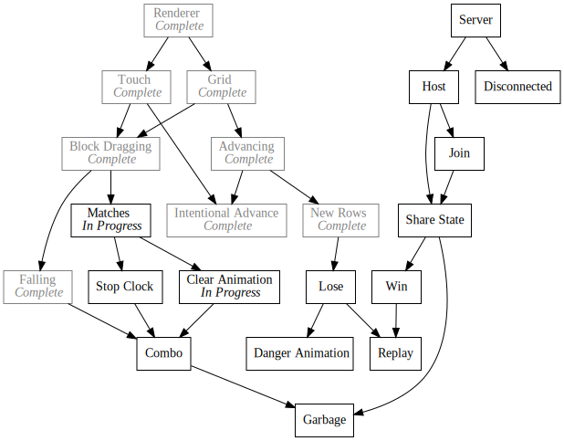
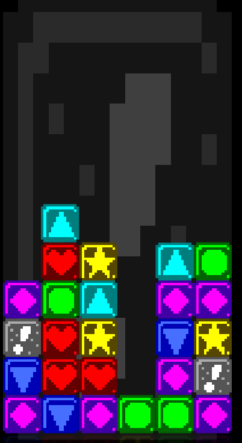

+++
title = "Day39 - Block Matches"
description = "Implement block matching and clear animation"
date = 2019-03-17

[extra]
project = "ta"
+++

Today I finished the match recognition code I started yesterday and built the
clear animation for completed matches. Along the way I fixed some minor bugs and
added a rudimentary stop clock which would pause advancing of the grid while a
match is clearing. To counteract this I also caused the grid to speed up over
time.

## Match Recognition

To start off I built a pretty naive recognition algorithm which makes a number
of assumptions and was the first thing I came up with. In practice though I
don't expect the recognition to become much more complicated since the grid is
only 6 by 12 blocks. At these sizes, it almost doesn't matter what I do because
the "n" in my O(n) will never be large enough to matter.

The main assumption I make is that any blocks in a line of 3 or more, will be
grouped together in a single frame. This means if a player makes a match at the
exact same instant as a match is caused by a falling block or blocks spawning
in, that those blocks will be considered a part of the same match and the player
will be rewarded for the larger size match even if they didn't actually pull it
off.

In some ways I actually like this assumption because it opens the door for some
high level shenanigans, but is hard enough that it wont happen in normal play.

The basic idea behind my algorithm is to consider each axis separately. I loop
over every block row by row, checking if there are repeated blocks. Each
repeated block is added to a list, and once a non-matching block is found, the
length of the list is checked and it is added to the match if it has more than 3
blocks. Then the same thing is repeated column by column. Since the rows and
columns have the same basic algorithm I split the repeat checker into its own
local function to prevent repeating myself.


function findNewMatches() {
  let matchBlocks = new Set();
  let currentMatch = [];
  let currentBlockType = null;

  function breakMatch(nextBlock) {
    if (currentMatch.length >= 3) {
      for (let block of currentMatch) {
        matchBlocks.add(block);
      }
    }
    if (nextBlock) {
      currentMatch = [nextBlock];
      currentBlockType = nextBlock.type;
    } else {
      currentMatch = [];
      currentBlockType = null;
    }
  }

  function processBlock(block) {
    if (block && (block.state !== state.WAITING && block.state !== state.DRAGGING)) {
      breakMatch();
      return;
    }

    if (currentBlockType == null && block) {
      currentBlockType = block.type;
      currentMatch.push(block);
      return;
    }

    if (!block) {
      breakMatch();
      return;
    }

    if (block.type !== currentBlockType) {
      breakMatch(block);
    } else {
      currentMatch.push(block);
    }
  }

  for (let y = 1; y <= previousFilledY; y++) {
    let row = blocks[y];
    if (!row) continue;
    for (let x = 0; x < gridBlockDimensions.x; x++) {
      processBlock(row[x]);
    }
    breakMatch();
  }

  for (let x = 0; x < gridBlockDimensions.x; x++) {
    for (let y = 1; y <= previousFilledY; y++) {
      let row = blocks[y];
      if (!row) continue;
      processBlock(row[x]);
    }
    breakMatch();
  }

  if (matchBlocks.size != 0) {
    matches.add(new Match(matchBlocks));
  }
}


Since a block may be a part of a row match and a column match, I use a
JavaScript `Set` to prevent repeats in the resulting list. After looping over
both axis, I construct a `Match` object containing the blocks.


class Match {
  constructor(matchBlocks) {
    this.blocks = matchBlocks;
    this.timer = 0;

    for (let block of this.blocks) {
      block.state = state.MATCHED;
      dropBlock(block);
    }
  }

  update() {
    if (this.timer < clearDelay) {
      this.timer++;
    } else {
      let anyClearing = false;
      for (let block of this.blocks) {
        if (block.state === state.MATCHED) {
          block.state = state.CLEARING;
          anyClearing = true;
          break;
        } else if (block.state === state.CLEARING) {
          anyClearing = true;
          if (block.clearTimer > continueClearTime) {
            continue;
          }
          break;
        }
      }

      if (!anyClearing) {
        for (let block of this.blocks) {
          deleteBlock(block);
        }
        return true;
      }
    }

    return false;
  }
}


The match object is in charge of tracking when to start clearing blocks.
Immediately after being formed, each block must be marked as `Matched` and
dropped if held in order to prevent them being simulated further. Then each
frame a timer is incremented until it passes a certain threshold at which point
each block is set to the `Clearing` state in order until no `Clearing` blocks
remain at which point the blocks are deleted and the match reports completion by
returning true.

Combining the `findMatches` and `Match` class in the `Update` event subscription
completes the core changes.


Update.Subscribe(() => {
  findNewMatches();

  let finishedMatches = [];
  for (let match of matches) {
    if (match.update()) {
      finishedMatches.push(match);
    }
  }

  for (let finishedMatch of finishedMatches) {
    matches.delete(finishedMatch);
  }
});


## Animations

On the block side I modified the `calculateColor` and `animateBlockSize`
functions to reflect the new block states. I also added a `handleClearAnimation`
method which keeps track of the animation frames and moves the block state to
`Cleared` once the animation has finished.


handleClearAnimation() {
  if (this.state === state.CLEARING) {
    if (!this.clearTimer) this.clearTimer = 0;
    this.clearTimer++;

    let percentDone = this.clearTimer / clearingTime;
    if (this.clearTimer >= clearingTime) {
      this.state = state.CLEARED;
    }
  }
}


Before today, I used a `calculateOpacity` method to animate the opacity in while
spawning. Now instead I changed it to a `calculateColor` method so that matched
blocks may be brightened when `Matched`. When `Clearing` the opacity fades out
linearly from 1 to 0 as the `clearTimer` moves toward completion. Finally if the
state is `Cleared`, then a tint of clear is returned.


calculateColor(centerY) {
  if (this.state === state.MATCHED) {
    return new Color(1.5, 1.5, 1.5, 1);
  } else if (this.state === state.CLEARING) {
    let percentageDone = this.clearTimer / clearingTime;
    return new Color(1, 1, 1, 1 - percentageDone);
  } else if (this.state === state.CLEARED) {
    return Color.clear;
  } else if (this.state === state.SPAWNING) {
    let gridBottom = gridCenter.y - gridDimensions.height / 2;
    let blockBottom = centerY - blockWidth / 2;
    let distanceFromBottom = blockBottom - gridBottom;

    if (distanceFromBottom >= 0) {
      if (this.state === state.SPAWNING) {
        this.state = state.WAITING;
      }
      return 1;
    }
    if (distanceFromBottom < -blockWidth) return 0;

    return new Color(1, 1, 1, (distanceFromBottom + blockWidth) / (blockWidth * 2));
  } else {
    return Color.white;
  }
}


On the block size side, I just added a new branch if the state is `Clearing`
which increases the scale by a set amount each frame.


animateBlockSize() {
  if (this.state === state.CLEARING) {
    this.scale += 0.01;
  } else if (this.state === state.DRAGGING) {
    if (this.scale < pickedUpScale) {
      this.scale += scaleVelocity;
    } else {
      this.scale = pickedUpScale;
    }
  } else {
    if (this.scale > 1) {
      this.scale -= scaleVelocity;
    } else {
      this.scale = 1;
    }
  }
}


The resulting animation looks like this:

## Misc Fixes

During the clear animation, the block advancement should stop giving the player
a further incentive to clear larger matches. Doing was pretty simple and only
required changing the grid update handler to check the matches list size when
advancing. While I was in the area, I also modified the advancement speed to
increase over time to ramp up difficulty.


if (matches.size == 0) {
  blockAdvancement += advanceSpeed;
  advanceSpeed += advanceAcceleration;
}


A slightly more difficult problem to fix was the fact that the player could swap
clearing blocks. The fix was to modify the drag handling code to check the
surrounding blocks and reset the block position back to the slot position if the
block had been dragged into a non `Waiting` block. Unfortunately I didn't come
up with a clean way to write this, so it ended up as two largely repeated
checks. I'm tired. Sue me.


// Handle Boundaries
if (this.gridSlot.x > 0) {
  let leftBlock = blocks[this.gridSlot.y][this.gridSlot.x - 1];
  if (leftBlock && leftBlock.state !== state.WAITING) {
    if (this.gridPosition.x < this.gridSlot.x) {
      this.gridPosition.x = this.gridSlot.x;
    }
  }
}

if (this.gridSlot.x < 5) {
  let rightBlock = blocks[this.gridSlot.y][this.gridSlot.x + 1];
  if (rightBlock && rightBlock.state !== state.WAITING) {
    if (this.gridPosition.x > this.gridSlot.x) {
      this.gridPosition.x = this.gridSlot.x;
    }
  }
}


And that was it! At this point I believe the core gameplay is done. Blocks are
manipulatable, and matches clear in a fairly smooth way. Feature wise, combos,
stop watch, and multiplayer are left, none of which I suspect will be too
difficult. After that I will need to do a ton of polish and cleanup. I am very
pleased with the progress so far.

Till tomorrow,  
Kaylee
