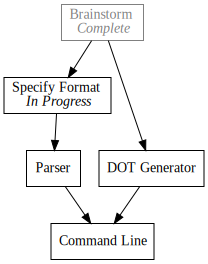

+++
title = "Day4 - Pando"
description = "Tree Based Task Tracking"
date = 2019-02-10

[extra]
project = "pando"
+++

Another day another project. I have plans to build larger projects, but I want
to get my sea legs with some simpler more bite sized tools. Today I hope to
build a simple file format for describing a task tree and a parser which will
draw a diagram of the entire structure. The idea is that with larger projects
planning what task to do next and talking about why a certain task is being done
can be hard to visualize. It would be cool to have a clean way to draw a tree of
all of the planned tasks, what each task needs done before it can be started,
and what has already been done.

The key insight is that this structure is a graph where each node is a task in
the list and they are connected to each other by directed edges. The classic
tool for drawing such things in programming circles is
[GraphViz](https://www.graphviz.org/). GraphViz is an incredibly powerful tool
for drawing graphs with many graphical features. GraphViz consumes files in a
specification format written in a grammar called DOT. I could just write the
todo structure in the DOT language to start and manipulate it directly, however
I find the format to be clunky and it supports many more features than I need.
To that end I plan on describing a simple format specifically suited for todo
list trees, and a "compiler" which will convert that format into the DOT
language. Then producing the final image should be as simple as piping the DOT
file to graphviz.

I've decided to call the project
[Pando](https://en.wikipedia.org/wiki/Pando_(tree)) after what is thought to be
the largest tree structure on the planet, a clonal colony of aspen in Utah.

## Requirements

The format for building the todo tree has a number of requirements.

1. It should be usable as a todo tracker.

Ideally each of my projects on this site should have a todo list stored in a
central location. As I plan out tasks that need done for each project, I would
like to store them in this central list.

2. Should be able to mark a single task as in progress.

When I render the graph, I would like to be able to indicate that a given node
is in progress either with a color change or a subheader.

3. Task dependencies as a list

Each task should have an optional list of dependencies by name.

4. Tasks should be able to be marked done.

Pretty self explanatory. The file format should have a simple way to mark a
given task as done.

## Format

I'm probably going to change this format as we go however I suspect this will
be a good start. Simplicity is key here.

Each task requires a status indicator, and a dependency list as established
above. 

For the initial version there are 3 states of a task: Waiting, In
Progress, and Done. I plan on using different list bullets for each '-',
'>', and 'x' respectively.


x Brainstorm
> Specify Format
- Implement Parser
- DOT generator
- Command Line


The dependencies should exist as a simple list of names. At least to start I
will write them in a comma delimited array with square brackets surrounding.


x Brainstorm
> Specify Format [ Brainstorm ]
- Implement Parser [ Specify Format ]
- DOT Generator [ Brainstorm ]
- Command Line [ Implement Parser, DOT Generator ]


Lastly a quality of life improvement. The dependency list involves rewriting the
entire task name. The dependency should just contain enough information to
differentiate which task is intended. We should be able to get away with
abbreviated prefixes. For most tasks, a prefix will be enough, but for multi word
tasks we should allow the user to give CamelCase prefixes for each word. This is
clearly less readable, but for most cases the dependencies will be written once
and not modified after the fact. So being write only is fine since it cleans up
the format.


x Brainstorm
> Specify Format [ B ]
- Implement Parser [ SF ]
- DOT Generator [ B ]
- Command Line [ IP, DG ]


There is an added complication here that DOT is all caps, but we use the
capitalization as a hint for the abbreviation matcher. As a hack we will assume
that for the abbreviations each word is in proper camel case. So to differentiate
the tasks `DOT Application` and `DOJ Appointment` we would use `DotA` and
`DojA`.

## Output

At the start of this post I embedded an image of the todo graph for Pando. I
built this image by manually writing the DOT file I expected as output for the
above pando file.


digraph {
  node [shape=record, splines="curve"];
  a[label=<Brainstorm   <i>Complete</i>>, color="gray"];
  b[label=<Specify Format   <i>In Progress</i>>];
  c[label=<DOT Generator>];
  d[label=<Parser>];
  e[label=<Command Line>];

  a -> { b c };
  b -> { d };
  d -> { e };
  c -> { e };
}


I then rendered it to an svg using this command: `dot .\todo.dot -Tsvg >
output.svg`. The `-Tsvg` argument specifies the output format which I pipe to
`output.svg`. 

There are two pieces of note. First, although our format stores the dependencies
of a task next to the task that needs them, the DOT version specifies the
connections the other way around. This shouldn't be hard to write out with a
hashmap, but it needs to be kept in mind. The other issue is that of formatting.
Names of nodes in DOT must be one word, so we are forced to describe the formatting
using labels. Also to get more complicated output such as the *Completed* and
*In Progress* tags, we must output the label in a pseudo HTML format. Not hard, but
somewhat complicated.

That about wraps up the plan. As shown by the todo graph, next is to write the
parser for the todo format and write a DOT file generator from the parsed
representation.

Till tomorrow,  
Keith
