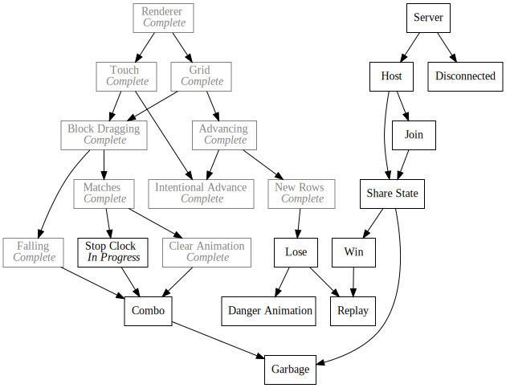

+++
title = "Day41 - Stop-Clock and Combo Struggles"
description = "Spent the whole day fighting the combo tracker with little success"
date = 2019-03-19

[extra]
project = "ta"
+++

Today I spent most of my free time trying to figure out how to write a combo
tracker. So given that I was unable to figure out a proper algorithm, I will
instead describe the small full feature I added even though it doesn't really
constitute a full post :(

## Stop Clock

In Tetris Attack, the Stop Clock is the mechanism by which the player is
rewarded for making matches with more than the minimum 3 blocks. The basic idea
is that the grid will stop progressing upward for a short period whos length is
proportional to the number of blocks cleared and the size of the combo created.

To implement this feature I created a new module with a single variable for
storing the number of frames left on the Stop Clock. I then subscribed to the
Update event in order to decriment the clock every frame if it is not already 0
and subscribed to a new MatchCompleted event to add to the stop clock after each
Match.


export let stopClock = 0;

const framesPerBlock = 10;

Update.Subscribe(() => {
  if (stopClock > 0) {
    stopClock--;
  }
});

MatchCompleted.Subscribe(blocks => {
  stopClock += blocks.length * framesPerBlock;
});


Then in the grid progression code I added a check for the stop clock value to
decide when to advance the grid:


if (matches.size == 0 && stopClock == 0) {
  blockAdvancement += advanceSpeed;
  advanceSpeed += advanceAcceleration;

  fillNewRows();
}


## Bugs

Interestingly this strategy didn't work at first. Turns out I had a bug in the
intentional advance code that only showed up when I advanced the grid without
also advancing in the main update loop. This caused problems because a block
would get set to a non-existent row. My fix was to disable access to the blocks
object directly and instead create get and set block functions which manage the
edge case checks and setting for you.


///////////////
// Utilities //
///////////////
export function getBlock(gridSlot) {
  let row = blocks[gridSlot.y];
  if (row) {
    return row[gridSlot.x];
  }
  return undefined;
}

export function setBlock(arg) {
  if (arg.type) {
    addBlock(arg);
  }
  else {
    blocks[arg.y][arg.x] = null;
  }
}


Even still this function caused errors because the `addBlock` function used the
`gridPosition` instead of the `gridSlot` to pick the index. After fixing everything
went smoothly.

Hopefully tomorrow I will have some better luck attempting the combo code. If
not I will step back and spend some time cleaning up and refactoring the code to
get a better grasp for things.

Till tomorrow,  
Kaylee
