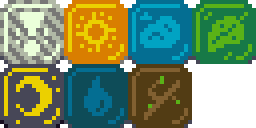

+++
title = "Day43 - New Block Art"
description = "Made replacement art for the tetris attack textures"
date = 2019-03-21

[extra]
project = "ta"
+++

Today I worked on replacement art for the tetris attack textures I stole as
temperary assets. I'm not 100% happy with my replacements yet but they will do
for now until I figure out how to tweek them into shape.

## Colors

Instead of picking colors from scratch, I took the advice of step 1
[here](https://lunarlabs.pt/blog/post/from_doodle_to_asset) of using a pre built
palette to simplify color choices. The list of palettes on
[this](https://lospec.com/palette-list) site is incredibly extensive and diverse
and gave lots of options to choose from. After mulling them all over I eventually landed on 
one called [20P DX Palette](https://lospec.com/palette-list/20p-dx).

I decided to mirror Tetris Attack by allowing two colors for each block and
depicting a simple graphic inside each. I tried to stray from the geometric
shapes that Tetris Attack favors and moved toward more recognizable objects in
nature such as a cloud, leaf or stick.

Below is what I landed on for now:

Unfortunately the cloud and rain drop blocks are too close in color, but for the
most part I am very pleased with how the rest turned out. Because I'm so bad at
this stuff it took all afternoon to finish (and its already late), so I will
leave you with this gif of me playing with the new blocks:

Till tomorrow,  
Keith
