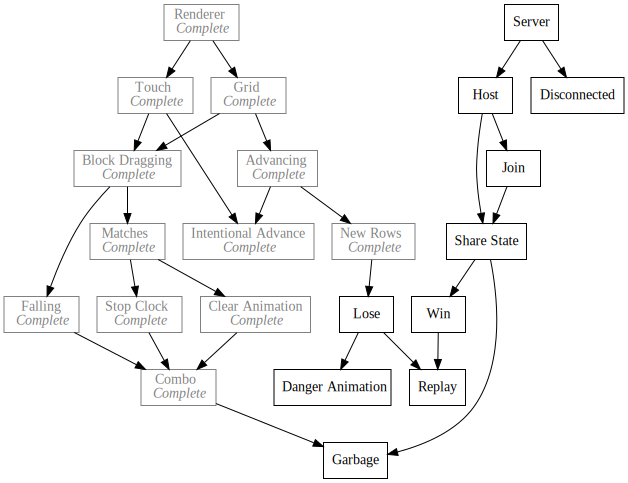

+++
title = "Day45 - Switch to WebPack"
description = "I switch to webpack from parcel"
date = 2019-03-23

[extra]
project = "ta"
+++

Today I swapped the build system for my Tetris Attack Remake to Webpack from
Parcel. In general I love Parcel for quick tests and experiments, but the moment
a project moves past basic loading files and bundling, Parcel's warts begin to
show.

The straw that broke the camel's back for the Tetris Attack project was hot
reloading. For the life of me I can't figure out how to force the reload system
to refresh the page instead of hot swapping modules. The recommended strategy is
to write your app in such a way that a given module can be swapped without
confusing state or references. Unfortunately given my current preferred style for
making games in JavaScript by using module exports for state management, thats
not really an option. I initially tried forcing a refresh on the module reload
event, but this causes the browser to freeze at times and in some cases not work
at all.

Parcel gives a really clean way to get up and running, but Webpack gives the
flexibility to make the build system do whatever I want. Instead of being
pre-configured, Webpack requires you to specify each file loader manually and
describe the input and output explicitly. Similarly, the dev server is not built
in, but is it's own npm commandline tool with it's own configuration. This all
means that the learning curve is steeper, but nearly any configuration is
possible once you get the hang of it.

## webpack.config.js

Webpack is configured using a `webpack.config.js` file at the root of the
project which lists the loaders which will be used to transform and bundle
files, the output configuration for telling Webpack how to treat URL's and where
to put things, and some other misc settings. As such, the one I built for the
Tetris Attack project can be understood in two parts: The output configuration,
and the module list.

Note: the `webpack.config.js` is just a `nodejs` module which exports an object
of a certain format. This has the added benefit of exposing all of the `nodejs`
standard library. In the case of my config, I just import the path module to
deal with file paths.


const path = require('path');

module.exports = {
  mode: 'development',
  entry: { main: './src/index.js' },
  output: {
    filename: 'bundle.js',
    path: path.resolve(__dirname, 'dist/'),
    publicPath: "/dist/"
  },
  devtool: 'source-map',
  devServer: {
      contentBase: '.'
  },


I will discuss each property in turn.

### mode


  mode: 'development',


As a part of Webpack's recent trend towards auto configuration similar to
Parcel, the Webpack team has introduced the concept of a build mode. The theory
is that Webpack should have differing defaults for it's configuration for
development and production. If the user specifies how they are using the
builder, then less configuration would be needed from the user since the builder
can have intelligent defaults depending on the context. In my case I pick
'development' because I want builds to be fast. However in the future if I
release the game to a wider audience. I could replace the mode property with
Production to improve build size and similar production level characteristics.

### entry


entry: { main: './src/index.js' },


The entry property simply describes the starting point for the build. One nice
thing that modern bundler's do is called Tree Shaking which just means the
bundler will only output code that is actually referenced. To be effective
though, the user must specify the starting point from which all the other parts
of the app are referenced and used. In the case of Tetris Attack I have a
single index.js file which starts everything off, so I just use that as the
entry.

### output


output: {
  filename: 'bundle.js',
  path: path.resolve(__dirname, 'dist/'),
  publicPath: "/dist/"
},


The output property tells Webpack what to name the combined bundle file, where
to put it, and how the URLs in the code should be rewritten. This is important
if an app references files outside of the bundle. In the case of Tetris Attack,
I bundle the files to the `/dist/` folder and configure the html page to refer
to the same location.

If configured incorrectly, things may still work, but the dev server (described
below) won't respond updates properly.

### devtool


devtool: 'source-map',


The devtool property tells Webpack how to deal with exceptions and source maps.
This is important since the final bundled file will be a single JavaScript file
while the code written is split across many files. This can make debugging
difficult, so modern browsers will use source maps to recreate the local state and line by line debugging in the original files while running the combined one.

I'm not fully sure why Webpack has a number of various options for handling this
problem. In practice I just look at each one and try them until I get something
that fits my needs. For this project I landed on `source-map`.

### devServer


devServer: {
    contentBase: '.'
},


Lastly devServer contains the configuration for the dev server tool. Unlike
Parcel where a simple dev server is built in, the webpack-dev-server is a
separate commandline tool which builds and hosts the bundle changes from memory
speeding things up and instrumenting the app to handle reloading on changes.

I found that specifying the `contentBase` was necessary to ensure the changes get picked up when files are modified, but your millage may vary.

## Webpack Rules

The second half of the Webpack config tells Webpack what npm packages should be
used to transform each file that isn't just plane javascript. In my case I have
some typescript, and some glsl files which should be transpiled and included as
strings respectively. Luckily there are off the shelf tools for each in the form
of the ts and raw loaders.


resolve: {
  extensions: [".ts", ".js", ".glsl"]
},
module: {
  rules: [
    {
      test: /\.ts$/,
      exclude: /node_modules/,
      use: {
        loader: "ts-loader"
      }
    },
    {
      test: /\.glsl$/,
      use: {
        loader: 'raw-loader'
      }
    }
  ]
}


### resolve


resolve: {
  extensions: [".ts", ".js", ".glsl"]
},


Webpack requires a list of extensions to parse so that it can effectively filter
out code from other files. The `resolve` property holds this list as well as
some other configuration information for picking which files are needed. In my
case I just list typescript javascript and shader files.

### module


  module: {
    rules: [
      {
        test: /\.ts$/,
        exclude: /node_modules/,
        use: {
          loader: "ts-loader"
        }
      },
      {
        test: /\.glsl$/,
        use: {
          loader: 'raw-loader'
        }
      }
    ]
  }


The `module` property has undergone a number of changes since I first started
using Webpack. Unfortunately this means that instructions and tutorials for
using the `module` property can be somewhat inconsistent and or downright
wrong.As of today, I think the basic structure is to have a list of rule objects
which describe what files to process via a regex, what files to ignore with
another regex, and what library to use in the use property.

Since the JavaScript processing is built in, I only specified the ts and raw loaders for typescript and glsl files respectively.

## Code Changes

Unfortunately just writing a config file and swapping out my build commands was
insufficient to get things converted over. The first step was to remove my
reload hack code from each file. Deleting code good! The second step was to
fiddle with Webpack's dynamic require functionality to automatically import the
image files form the images directory. After fumbling about for a while I
eventually landed on creating a centralized list of asset names to asset paths. New hand written code Bad...


export const blockImages = {
  "Bang": "./images/Bang.png",
  "Stick": "./images/Stick.png",
  "Sun": "./images/Sun.png",
  "Cloud": "./images/Cloud.png",
  "Leaf": "./images/Leaf.png",
  "Moon": "./images/Moon.png",
  "Rain": "./images/Rain.png"
};


This is less automatic, but more obviously correct since at a glance I can be
sure that the names match up and the paths are correct. Unfortunately this meant
some minor drudgery to convert the image imports to the new style, but I think
in the end I got there. As a side effect, the images are no longer bundled with
the bundler as they were with Parcel. I think this removes an aspect of magic
that existed before which makes me happy.

## Dev Server

After the above changes I can run a dev server using `webpack-dev-server` in the
root of the project which will compile and start a server on a local port. Then
opening the page in a browser and modifying a file will cause the change to
upload live. Took some doing, but now I have the full support of the Webpack
ecosystem and user base should my build system need to change further. Not a big
change from the end game perspective, but this should let me play around with
Typescript more effectively and have faster turn around time while debugging the
game.

Till tomorrow,  
Kaylee
