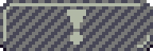
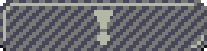
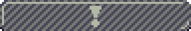
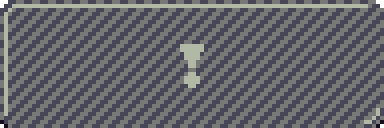
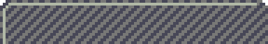
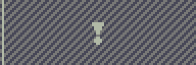
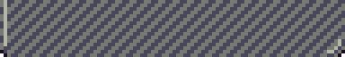
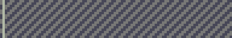
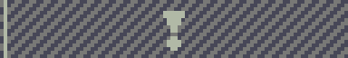

+++
title = "Day46 - Tetris Attack Garbage Art"
description = "I made more Tetris Attack art"
date = 2019-03-24

[extra]
project = "ta"
+++

Today I worked on the art side for the Tetris Attack Garbage blocks. In
principle this wasn't a super complicated task, but there was one interesting
bit.

Garbage blocks in Tetris Attack come in a couple of different varieties. They
can be 3, 4, or 6 blocks wide, or full line with multiple blocks tall. For the
one block tall versions, I basically just created a sprite for each one.

The multi line tall garbage blocks however are a little more complicated. For
the double line block, I had to create a block by hand since the exclamation
point has to be in the middle of the block. For blocks larger in size however I
didn't want to create a texture for every single one, so instead I created a top
block, middle block, double middle block, and bottom block which can be combined
depending on the number and parity (even or odd) of lines the block covers.

Simple double line looks like this:

But anything larger must be combined parts of other block types. For example a 4 tall block would be made of a top block, an even middle block and a bottom block like so:

  

  

Similarly a 5 block tall garbage would be built from a top block, middle block
without an exclamation point, middle block with an exclamation point, middle
block without an exclamation point, and a bottom block:

  

  

  

  

Repeating middle blocks can allow for any size garbage block, and drawing them
this way with the exclamation point in the very center preserves the "OH CRAP
HOW BIG IS THAT" mystery from the original game which I like.

No coding today because I'm suuuuper slow at making pixel art, but this got a
big chunk of the hard bit out of the way so that I can focus on the algorithms
next time.

Till tomorrow!  
Keith
