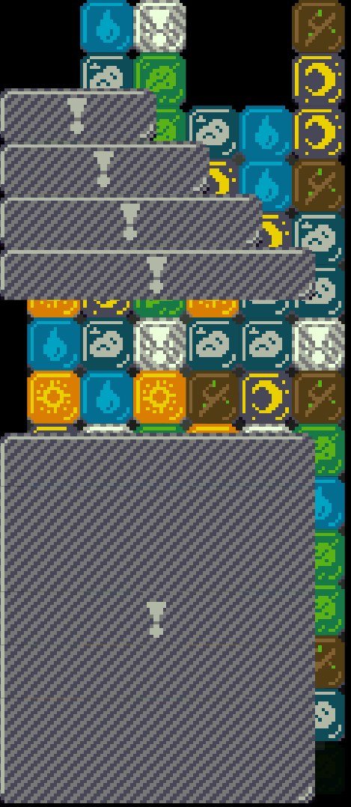

+++
title = "Day47 - Garbage Rendering"
description = "Draw code for rendering garbage blocks"
date = 2019-03-25

[extra]
project = "ta"
+++

Today I wrote the renderer portion for the garbage blocks. In particular I
worked out the functions for picking the correct images and drawing them to the
screen line by line. Not a huge accomplishment, but hey I'm tired.

## Image Selection

First step was to load the images and put them in an object which maps the image
name to URLs.


export const garbageImages = {
  "ThreeWide": "./images/garbage/ThreeWideGarbage.png",
  "FourWide": "./images/garbage/FourWideGarbage.png",
  "FiveWide": "./images/garbage/FiveWideGarbage.png",
  "SingleLine": "./images/garbage/SingleLineGarbage.png",
  "TwoLine": "./images/garbage/TwoLineGarbage.png",

  "TopLine": "./images/garbage/TopLineGarbage.png",
  "MiddleLine": "./images/garbage/MiddleLineGarbage.png",
  "EvenMiddleLine": "./images/garbage/EvenMiddleLineGarbage.png",
  "MiddleLineNoExclamationPoint": "./images/garbage/MiddleLineGarbageNoExclamationPoint.png",
  "BottomLine": "./images/garbage/BottomLineGarbage.png",
};


Then I consolidated the image urls into a single array constant for loading on
startup.


export const imageURLs = Object.values(blockImages).concat(Object.values(garbageImages));


From there, I wrote two functions for picking the garbage block textures. The
first takes a width value from 3 to 6 and returns the correct image to draw a
single row tall garbage block. This was just an over glorified switch statement.


function singleRowGarbage(width) {
  switch (width) {
    case 3:
      return garbageImages.ThreeWide;
    case 4:
      return garbageImages.FourWide;
    case 5:
      return garbageImages.FiveWide;
    case 6:
      return garbageImages.SingleLine;
    default:
      throw "Invalid single high block.";
  }
}


The second was a function to pick the multi line tall images. For multi line
tall blocks, it is possible for more than one image to be required. So unlike
the single line tall function, this one returns an array.


function* multiRowGarbage(height) {
  if (height == 1) yield garbageImages.SingleLine;
  else if (height == 2) yield garbageImages.TwoLine;
  else {
    let middleBlockHeight = 2 - (height % 2);
    let remainingMiddles = height - 2 - middleBlockHeight;
    yield garbageImages.TopLine;
    for (let i = 0; i < remainingMiddles / 2; i++) {
      yield garbageImages.MiddleLineNoExclamationPoint;
    }
    yield height % 2 == 0
      ? garbageImages.EvenMiddleLine
      : garbageImages.MiddleLine;
    for (let i = 0; i < remainingMiddles / 2; i++) {
      yield garbageImages.MiddleLineNoExclamationPoint;
    }
    yield garbageImages.BottomLine;
  }
}


For single and double rows there is a single texture to return. For any blocks
taller, the textures picked depends on whether the height is even or odd. In
either case a top and bottom image are returned at the beginning and end
respectively. Similarly in the middle a texture is picked depending on whether
the block is even rows tall or odd.

Lastly the filler rows are counted as the height minus 2 for each of the top and
bottom, minus the height of the middle block which is 2 tall if even and 1 if
odd. Half of the middle blocks are drawn before the middle line and half after.

## Drawing

To test this all out I made a for loop to draw all of the single row tall
blocks:


Draw.Subscribe(() => {
  let gridTop = gridCenter.y + gridDimensions.height / 2;
  for (let i = 3; i <= 6; i++) {
    let texture = singleRowGarbage(i);
    let dimensions = new Vector(i * blockWidth, blockWidth);
    let position = new Vector(dimensions.x / 2, gridTop - (i - 3) * blockWidth);
    image(texture, position, dimensions);
  }


And a for loop to draw a randomly heighted garbage block.


  let y = gridCenter.y;
  for (let row of rows) {
    let dimensions = new Vector(6 * blockWidth, blockWidth);

    if (row === garbageImages.EvenMiddleLine ||
        row === garbageImages.TwoLine) {
      dimensions = new Vector(6 * blockWidth, blockWidth * 2);
      y -= blockWidth * 2;
    } else {
      y -= blockWidth;
    }
    let position = new Vector(Math.floor(dimensions.x / 2) - gridDimensions.width / 2, Math.floor(y));

    image(row, position, dimensions, 0, Color.White, Vector.zero);
  }
});


Next time I will try to integrate this renderer into the actual block grid. I've
decided to take this portion a little slow because I've been feeling a bit
unmotivated. Luckily if I make some small progress each day I'll get there eventually.

Till tomorrow,  
Keith
