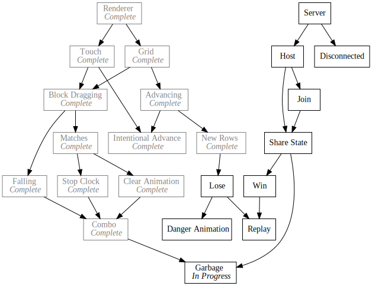

+++
title = "Day48 - Garbage Grid Rendering"
description = "Draw function for garbage blocks in terms of blocks"
date = 2019-03-26

[extra]
project = "ta"
+++

Today I made a `drawGarbage` function which takes a position and dimensions in terms of blocks and renders the block in the correct grid location.

## Dimensions

Building upon the texture list from yesterday, I wrote `garbageRenderInfo` which
takes `blockDimensions` and returns a list of objects containing the texture to
draw and what size to draw it at. 

A garbage block may be either more than one block tall, or less than a full row
wide, but not both.


function garbageRenderInfo(blockDimensions) {
  if (blockDimensions.y != 1 && blockDimensions.x != 6) {
    throw "Invalid Garbage Size";
  }


If a garbage block is only a single block tall, then the I return a list with a
single element for the one texture to draw.


  if (blockDimensions.y == 1) {
    return [
      {
        texture: singleRowGarbageTexture(blockDimensions.width),
        dimensions: new Vector(blockDimensions.width * blockWidth, blockWidth)
      }
    ];
  }


Last but not least, if a block is more than one block tall, then I return the
list of textures to draw the multi line garbage block with associated
dimensions.


  let textures = multiRowGarbageTexture(blockDimensions.height);
  return Array.from(textures).map(texture => {
    return {
      texture,
      dimensions: new Vector(6 * blockWidth, garbageTextureHeight(texture))
    };
  });
}


Importantly since some textures may be more than one block tall I wrote `garbageTextureHeight` which returns the correct height.


function garbageTextureHeight(texture) {
  if (texture === garbageImages.EvenMiddleLine ||
      texture === garbageImages.TwoLine) {
    return blockWidth * 2;
  } else {
    return blockWidth;
  }
}


## Draw Garbage

Pulling these together I wrote a `drawGarbage` function which takes the desired
grid position and block dimensions and renders the garbage block. This code is
very similar to the block drawing code, but instead loops over each texture and draws them one by one down the screen.


function drawGarbage(position, blockDimensions) {
  let blocksTopLeft = new Vector(
    gridCenter.x - gridDimensions.width / 2,
    gridCenter.y - gridDimensions.height / 2 + blockPixelAdvancement);

  let renderInfos = garbageRenderInfo(blockDimensions);
  let topLeft = blocksTopLeft.add(position.multiply(blockWidth).multiplyParts(new Vector(1, -1))).withZ(2);

  for (let renderInfo of renderInfos) {
    image(renderInfo.texture, topLeft, renderInfo.dimensions, 0, Color.White, Vector.topLeft);
    topLeft = topLeft.add(new Vector(0, -renderInfo.dimensions.height));
  }
}


Last but not least I modified the draw subscription to call the new simplified
garbage block drawer function with a test dimensions of (6, 4) or a full row and
two blocks high as well as a block with dimensions (3, 1) or 3 blocks wide.


Draw.Subscribe(() => {
  drawGarbage(new Vector(0, 3), new Vector(6, 4));
  drawGarbage(new Vector(2, 8), new Vector(3, 1));
});


Thats it for today. Another small day cause I had a bunch of stuff going on.
Making steady progress though! Next up will be integrating these blocks in the
actual grid and block manipulation code.

Till tomorrow!  
Kaylee

