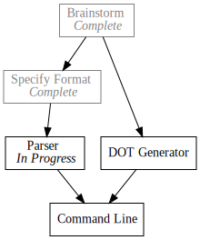

+++
title = "Day5 - Pando Parser"
description = "Parsing the Pando todo file format"
date = 2019-02-11

[extra]
project = "pando"
+++

Lets get to coding. Today I'd like to get started with the todo format parser.
In contrast to Okeydokey where the file format is simple enough to parse and
manipulate, the format for Pando is information dense. Since we will be
compiling it to the DOT format, it would be a good idea to use a more principled
approach. To that end I have decided to use [nom](https://github.com/Geal/nom)
which is a parser combinator library.

I'm no expert in parsers, but my understanding is that parser combinators are a
different branch in the taxonomy of parser libraries from Lex and Yacc. Where
Lex and Yacc describe the desired format in a domain specific language for
grammars, parser combinator libraries are built up with combinator functions
which are composed to consume a data stream.

In the case of nom, a large library of macros are provided for producing new
combinator function out old ones. So the complicated job of parsing an entire
file format turns into a collection of the simpler tasks of parsing portions of
the file format.

For example, in the Pando specification (see yesterday's post on
[Pando](../day4-pando/) for more details) there are 3 parts of a todo item: the
status bullet, the identifier, and the dependencies list. We will implement
parsers for each. We will then combine the combinators in a future post.

## Status


- Command Line [ IP, DG ]
^


The status bullet determines whether the described task is Completed, In
Progress, or Waiting.


#[derive(Debug, PartialEq)]
enum TaskStatus {
    Completed,
    InProgress,
    Waiting
}

named!(parse_status<CompleteStr, TaskStatus>,
    alt!(map!(tag!("x"), |_| TaskStatus::Completed) |
         map!(tag!(">"), |_| TaskStatus::InProgress) |
         map!(tag!("-"), |_| TaskStatus::Waiting)));


This code reads pretty much as you might expect. Each `tag!` macro takes a
string indicating what to match. The `map!` macro takes the result of a
successful match and runs it through the past in lambda, in this case we use the
lambda to return the enum version of the token. `alt!` tries each of it's
arguments in sequence proceeding to the next one when a given argument fails to
parse the input. Lastly, `named!` wraps the passed in combinators in a function
threading the input type (in this case CompleteStr, more on this type later. For
now, think of CompleteStr as a small wrapper over &str) through each combinator.
The type parameters specify the expected input and output types.

Calling the combinator we just made is pretty self explanatory.


#[test]
fn parse_status_works() {
    assert_eq!(parse_status(CompleteStr("x")), Ok((CompleteStr(""), TaskStatus::Completed)));
    assert_eq!(parse_status(CompleteStr(">")), Ok((CompleteStr(""), TaskStatus::InProgress)));
    assert_eq!(parse_status(CompleteStr("-")), Ok((CompleteStr(""), TaskStatus::Waiting)));
}


Every combinator returns a `Result<(I, O), E>` where `I` is the remaining input
to be parsed, `O` is the output of the combinator, and `E` is the nom error
type. So in the case of the test we expect an empty string remaining, and the
enum value.

## Identifier


- Command Line [ IP, DG ]
  ^^^^^^^^^^^^


The identifier is used in the output format and as the basis for the dependency abbreviations


named!(parse_identifier<CompleteStr, &str>, map!(is_not!("[\n"), |id| id.trim()));


The identifier parser is simpler. Moving from the inside out, `is_not!` matches
the longest stream of characters which do not contain any of the characters in
the input stream. In our case, since the dependencies of a task are optional, we
want to match any character that is not the start of a dependency list or the
end of a line. Moving outward, `map!` is used this time to trim the white-space
around the string. Note: technically the string being parsed and produced is a
`CompleteStr` however since `CompleteStr` impls `Deref` to `&str` we still have
access to the `trim` function. Finally `named!` wraps the combinators in a
function.

## Dependencies


- Command Line [ IP, DG ]
               ^^^^^^^^^^


The dependencies list is used to describe what tasks must finish before this
one. 


named!(parse_dependencies<CompleteStr, Vec<&str> >,
    map!(opt!(complete!(delimited!(
        char!('['),
        separated_list!(char!(','), map!(is_not!(",]"), |dep| dep.trim())),
        char!(']')))),
    |deps| deps.unwrap_or(Vec::new())));


The dependency parser was the most difficult to get right. I will describe the
operators and then give my theory for why they were required. I feel strongly
that this section could be done simpler... but this is as good as I could figure
out.

Moving from the inside out again, `map!(is_not!(",]"), |dep| dep.trim())` parses
any dependency abbreviation. We know that an abbreviation must either be
followed by a `,` or a `]` since the abbreviations are in the list structure. So
we can play the same trick as we did with the identifier, and match everything
including white space, but then trim the result.


// fn dependency(input: CompleteStr) -> &str
map!(is_not!(",]"), |dep| dep.trim())


`separated_list!` takes a separator parser, and an item parser. In our case, the
separator is the single character `,` so we use the `char!(',')` parser to match
it. This returns a list of the results we produced in the dependency item
parser.


// fn dependencies(input: CompleteStr) -> Vec<&str>
separated_list!(char!(','), map!(is_not!(",]"), |dep| dep.trim()))


`delimited!` takes 3 arguments, a leading delimiter parser, a body parser, and a
trailing delimiter parser. Conveniently the only result is the body so we don't
have to do a further map here. 


// fn dependency_list(input: CompleteStr) -> Vec<&str>
delimited!(
    char!('['),
    separated_list!(char!(','), map!(is_not!(",]"), |dep| dep.trim())),
    char!(']')),


`opt!` modifies a parser to return an `Option` and succeed if the the parser
fails, but return `None` instead. Here we need to play a trick however and use
the `complete!` combinator to tell nom that the input passed into the
`dependency_list` block is all of the values, so fail instead of returning the
`Incomplete` error. Nom was written originally for parsing data streams, not
necessarily text. In that domain frequently parsing an incomplete data source
may result in incorrect data, so Nom has many guards in place to try to ensure
failure on incomplete results whenever possible. For our task however this is
only a distraction which we solve with the `CompleteStr` input type and
`complete!` combinator.


opt!(complete!(delimited!(
    char!('['),
    separated_list!(char!(','), map!(is_not!(",]"), |dep| dep.trim())),
    char!(']'))))


Finally since the resulting type is now incorrect, we must correct it to return
an empty list of dependencies when no dependency list is specified. This is
handled simply with `map!`. `unwrap_or` is used to provide a default value if
the parser would have returned None.


// fn optional_dependency_list(input: CompleteStr) -> Option<Vec<&str>>
map!(opt!(complete!(delimited!(
    char!('['),
    separated_list!(char!(','), map!(is_not!(",]"), |dep| dep.trim())),
    char!(']')))),
|deps| deps.unwrap_or(Vec::new())));


Today was a long one. And again, its 1:55am my time, so I will wrap it up here.
Next time I will finish up the parser and possibly look into the DOT generator.

Till tomorrow,  
Kaylee
