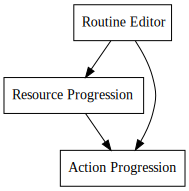

+++
title = "Day50 - Robot Game"
description = "Start working on a new mobile game"
date = 2019-03-28

[extra]
project = "robot"
+++

Today I built the todo tree and did some basic planning for a new game I
mentioned a couple of days ago. The basic premise is to build an automation game
where progression is centered around unlocking instructions to be used in simple
programs for automating tasks. The hope is to build a simple routine editor and
visual language which can be unlocked over time as the user walks there way
through a tech tree.

Influences for this game include Factorio, Modded Minecraft (systems parts less
so other pieces), human resources, and dwarf fortress, but mostly the goal is to
make a game I would enjoy optimizing and fiddling with in my spare time. 

## Why Now

I have been chatting about this game idea with a friend of mine for a couple
years now, and over that time we have refined and chipped away at it little by
little. Initial incarnations of the concept were grand and way over scoped to
the point where we would never be able to execute on it. Recently though we have
been paring down the concept to a more manageable size and I think the idea is
only more interesting because of it.

A month ago my buddy sent me a link to [this GDC
talk](https://www.youtube.com/watch?v=stxVBJem3Rs) given by a guy named Jeff
Vogal who built a company called Spiderweb Software which builds niche RPG
games. I highly recommend watching the talk, but the bit I found interesting was
Jeff's advocacy for getting your game out there and iterating. 

Jeff talk's about building his first game and how the game sucked, but it was
out there and had something interesting to say. He describes a method for
converting that initial success into a long term business strategy by
maintaining a culture of constant improvement with a focus on releasing
regularly.

I am really interested in exploring how well that strategy can integrate with my
recent push for daily progress. The past 1.75 months have been some of my most
productive and prolific I have experienced yet. I believe that this productivity
is in no small part due to constant, slow, intentional, work each day and I am
excited to see how far I can push it.

## Progress Arcs

Initial development of this game will be largely setting my development
environment, building the project systems for the future, making a renderer, and
getting some simple world management up and running.

After, I will get working on the basic UI components including the character
movement, the action lookup, routine management, and character world
interaction.

Lastly development will move toward chipping away at the core gameplay loops,
material progression, and routine progression. I'm leaving these pretty
unexplained for now because they will become clearer later as the idea evolves,
but its good to have them blocked out.

I don't expect to be close to finishing this game in a month like my other game
projects have turned out. I'm interested in working on this for a much longer
period. Similarly I hope to work on this game with my friend instead of solely
by myself which will introduce other complexities. It's not the first time we
have built a project together, but I hope to be much more methodical this time
as apposed to our previous "burstiness" I hope this will allow us to preserve
momentum rather than burning out.

This game will be an experiment in longer term progress over time. I'm
interested to see how it turns out.

Wish us luck!  
Kaylee
