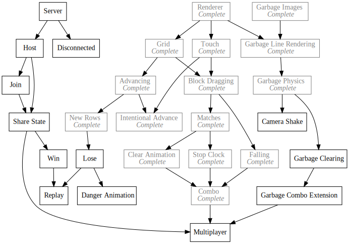
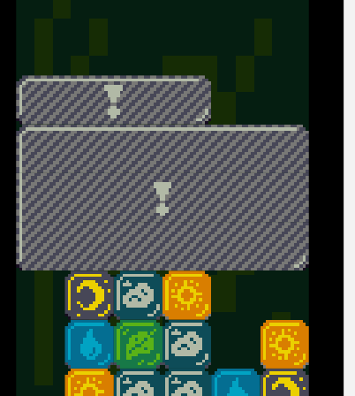

+++
title = "Day52 - Garbage Clearing"
description = "Add clearing garbage blocks when a match is made next to them"
date = 2019-03-30

[extra]
project = "ta"
+++

Today I implemented the garbage clearing mechanic. In Tetris Attack, whenever a match is made next to a garbage block, the garbage block will clear revealing each block underneath in order form bottom to top. After every block is revealed, they will be dropped onto the grid.

My initial version of this clear animation will be much simpler as it wont have
any drop animations on the blocks, and I haven't built a particle system yet,
but it will be playable.

## Break Detection

The first step is to decide when to break a garbage block. All that was needed
was to subscribe to the `MatchStarted` event, test if any of the match blocks
are adjacent to an overlapped slot, and start a timer ticker to track the
animation.


MatchStarted.Subscribe(matchedBlocks => {
  for (let garbage of garbageBlocks) {
    if (garbage.state == state.CLEARING) continue;
    for (let matchedBlock of matchedBlocks) {
      if (garbage.adjacentTo(matchedBlock.gridSlot)) {
        garbage.break();
        GarbageBroken.Publish({
          matchedBlocks,
          spawnedBlocks: garbage.spawnedBlocks
        });
        break;
      }
    }
  }
});


I created a new event to track when a garbage block is broken and made a break
method which creates the covered blocks and sets the timer.


break() {
  this.state = state.CLEARING;
  this.timer = 0;
  this.spawnedBlocks = [];

  for (let slot of this.overlappingSlots()) {
    this.spawnedBlocks.push({
      visible: false,
      block: new Block(slot)
    });
  }
}


Each covered block is added to a list called `spawnedBlocks` which contains
objects with the visibility of each spawned block and the block itself.

## Rendering Changes

Since a garbage block has two modes, normal and breaking, I changed the render
function on garbage blocks to call either `renderGarbage` or `renderBreaking`
depending on if the block is clearing or not.


render() {
  let blocksTopLeft = new Vector(
    gridCenter.x - gridDimensions.width / 2,
    gridCenter.y - gridDimensions.height / 2 + blockPixelAdvancement);
  let topLeft = blocksTopLeft.add(this.gridPosition.multiply(blockWidth).multiplyParts(new Vector(1, -1))).withZ(2);

  if (this.state === state.CLEARING) {
    this.renderBreaking(topLeft);
  } else {
    this.renderGarbage(topLeft);
  }
}


`renderGarbage` is the same as it was before. See yesterday's post for more
details. `renderBreaking` however will draw the spawned blocks instead of the
main garbage panel. If a spawned block isn't visible, then the clear texture is
rendered instead.


renderBreaking(topLeft) {
  for (let spawnedBlock of this.spawnedBlocks) {
    if (!spawnedBlock.visible) {
      spawnedBlock.block.render(garbageImages.Clear);
    } else {
      spawnedBlock.block.render();
    }
  }
}


## Animation

Finally I added a `handleBreaking` function which is called from `update` and
manages the clear animation. If the block state is `Clearing`, and the timer is
further than the initial clear delay (a constant value wait time before the
blocks start appearing), and if the timer modulo the block clear delay is 0,
then a block is chosen to turn visible.

If no more blocks are covered, then the final break timer is started by
recording the current timer value in a variable.


handleBreaking() {
  if (this.state === state.CLEARING) {
    if (this.timer > clearDelay) {
      if ((this.timer - clearDelay) % blockClearDelay == 0) {
        let anyHidden = false;
        for (let spawnedBlock of this.spawnedBlocks) {
          if (!spawnedBlock.visible) {
            spawnedBlock.visible = true;
            anyHidden = true;
            break;
          }
        }

        if (!anyHidden && !this.breakTimeStarted) {
          this.breakTimeStarted = this.timer;
        }
      }
    }


Lastly if the break time was recorded and the current time minus the break time
is greater than the `breakDelay` (another constant which describes how long to
wait after all blocks have been revealed), then the garbage block is deleted,
and the spawned blocks are added to the grid.


    if (this.breakTimeStarted &&
        this.timer - this.breakTimeStarted > breakDelay) {
      garbageBlocks.delete(this);
      for (let spawnedBlock of this.spawnedBlocks) {
        setBlock(spawnedBlock.block);
        spawnedBlock.block.state = state.WAITING;
      }
    }

    this.timer++;
  }
}


Thats it for an initial clear animation. As of today it looks like this:

There is still a bunch of work to do to clean things up (the code is somewhat
messy) but this will do for now! Next up is ensuring the combos are preserved
through garbage breaks, and that garbage breaks trigger other garbage breaks.

Till tomorrow!  
Kaylee
