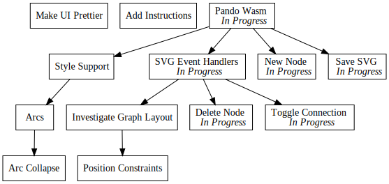

+++
title = "Day55 - Pando UI"
description = "Minimal ui for editing pando trees"
date = 2019-04-02

[extra]
project = "pando"
+++

Today I implemented a functional but barebones UI for Pando which supports
adding and removing nodes, toggling node dependencies, updating task status,
saving Pando and svg to file, and persisting todo tree in browser storage based
on url hash. In short I finished the tasks that were laid out
[here](http://02credits.com/blog/day53-pando-in-the-browser/) and did some extra
quality of life things on top.

## Operation Implementations

The graph operations were implemented in Rust. I split the code into a pure rust
implementation which operates over `Todo` lists directly and JavaScript exported
wrapper which handles parsing and regenerating the Pando code for persistence.

Two of the operations could be implemented as a transformation over a single
selected task by identifier. So to simplify things I pulled out a helper
function which takes a task identifier, list of tasks and an lambda over the
particular task with the task identifier which transforms the task in some way.


fn modify_task(task_identifier: &str, tasks: Vec<Todo>, operation: impl Fn(Todo) -> Option<Todo>) -> Vec<Todo> {
    tasks
        .into_iter()
        .filter_map(|todo| {
            if todo.identifier == task_identifier {
                operation(todo)
            } else {
                Some(todo)
            }
        }).collect()
}


Of note here: `impl Fn` was used as the type of the operation lambda so that it
could capture the variables and be called more than once. Unfortunately I did
not spend the time to understand why `impl` type was needed. In the future I
hope to dig in deeper.

I implemented the dependency toggle and task progress using `modify_task`.


pub fn toggle_dependency_operation(task_identifier: &str, dependency_identifier: &str, tasks: Vec<Todo>) -> Vec<Todo> {
    modify_task(task_identifier, tasks, |todo| {
        if todo.dependencies.iter().all(|dependency| dependency != dependency_identifier) {
            let mut new_dependencies = todo.dependencies.clone();
            new_dependencies.push(dependency_identifier.to_string());
            Some(Todo { dependencies: new_dependencies, ..todo })
        } else {
            let new_dependencies = todo.dependencies
                .into_iter()
                .filter(|dependency| dependency != dependency_identifier)
                .collect();
            Some(Todo { dependencies: new_dependencies, ..todo })
        }
    })
}

pub fn progress_task_operation(task_identifier: &str, tasks: Vec<Todo>) -> Vec<Todo> {
    modify_task(task_identifier, tasks, |todo| Some(Todo { status: todo.status.next(), ..todo }))
}


Unfortunately since the new task and delete task operations modify more than
just one selected identifier, I had to implement them without my helper like so:


pub fn new_task_operation(task_identifier: &str, mut tasks: Vec<Todo>) -> Vec<Todo> {
    tasks.push(Todo::new(TaskStatus::Waiting, task_identifier, Vec::new()));
    tasks
}

pub fn delete_task_operation(task_identifier: &str, tasks: Vec<Todo>) -> Vec<Todo> {
    tasks
        .into_iter()
        .filter_map(|todo| {
            if todo.identifier == task_identifier {
                None
            } else {
                let new_dependencies = todo.dependencies
                    .into_iter()
                    .filter(|dependency| dependency != task_identifier)
                    .collect();
                Some(Todo { dependencies: new_dependencies, ..todo })
            }
        }).collect()
}


## Operation Wrappers

With the implementations out of the way, I needed to write the wrapper functions
which take and return strings. Since each operation takes and returns `Todo`
lists, I wrote a helper which takes a Pando code string and an operation
function and returns the updated Pando code.


fn pando_operation(pando_code: &str, operation: impl Fn(Vec<Todo>) -> Vec<Todo>) -> String {
    generate_pando_file(operation(parse_pando(pando_code)))
}


I then used this helper to produce each of the JavaScript visible functions.


#[js_export]
pub fn newTask(task_identifier: &str, pando_code: &str) -> String {
    pando_operation(pando_code, |tasks| new_task_operation(task_identifier, tasks))
}

#[js_export]
pub fn deleteTask(task_identifier: &str, pando_code: &str) -> String {
    pando_operation(pando_code, |tasks| delete_task_operation(task_identifier, tasks))
}

#[js_export]
pub fn toggleDependency(task_identifier: &str, dependency_identifier: &str, pando_code: &str) -> String {
    pando_operation(pando_code, |tasks| toggle_dependency_operation(task_identifier, dependency_identifier, tasks))
}

#[js_export]
pub fn progressTask(task_identifier: &str, pando_code: &str) -> String {
    pando_operation(pando_code, |tasks| progress_task_operation(task_identifier, tasks))
}


Importantly I used `camelCase` names rather than `snake_case` as these names are
exposed to the JavaScript layer via rust bindgen.

## UI Implementation

I decided to keep things quick and prototype-y, so I built everything with
native JavaScript functions and without a UI library. This kept things quick and
easy, but once I decided to polish the tool up I will go back and reimplement it
using some modern UI library with clean style defaults etc.

On the UI side there were these tasks:
- Display SVG
- Display Code
- Persist Code
- Mouse Events
- Save Files

I will describe each in turn.

### Display SVG

Since I wanted the changes to update live, I needed to create a `div` to contain
the graph svg and keep track of what needs replaced on render.


let svgContainer = document.createElement("div");
let tmpNode = document.createElement("tmp");
svgContainer.appendChild(tmpNode);

async function renderGraph() {
  let compileResult = compile(code);
  if (compileResult.success) {
    let element = await viz.renderSVGElement(compileResult.dotCode);
    instrumentNodes(element);
    svgContainer.replaceChild(element, svgContainer.children[0]);
  } else {
    console.error(compileResult.reason);
  }
}

document.body.appendChild(svgContainer);


With this setup I can use the `replaceChild` function on html elements to swap out the rendered image graph.

### Display Code

Displaying the code used a similar trick but with the text content instead. I
also wanted the graph to re-render any time the code changes, so I created a
helper function for that as well.


let codeElement = document.createElement("pre");
codeElement.textContent = code;

function updateCode(newCode) {
  code = newCode;
  renderGraph();
  codeElement.textContent = code;

  if (window.location.hash) {
    window.localStorage.setItem(window.location.hash.substring(1), code);
  }
}


### Persist Code

In my `updateCode` function I also check the location hash to decide if the
updated code should be persisted in `localStorage`. The location hash is a user
manipulatable suffix of the browser URL which is usually used to specify where
the browser should scroll to. In my case I decided to hijack this feature to add
a way to specify the file name and storage name of a given todo tree.


function updateCode...
  if (window.location.hash) {
    window.localStorage.setItem(window.location.hash.substring(1), code);
  }
...
}


Similarly on startup I initialize the `code` variable with the localStorage
version if the hash exists and the stored version exists.


let code = "";

if (window.location.hash) {
  code = window.localStorage.getItem(window.location.hash.substring(1)) || "";
}


### Mouse Events

Mouse events are added to the svg graph via a function called `instrumentNodes`
which uses the `querySelector` functions to find the correct elements in the svg
tree and add event handlers to them.


function instrumentNodes(svgElement) {
  let dragFrom = null;
  for (let node of svgElement.querySelectorAll(".node")) {
    let identifier = node.querySelector("text").textContent.trim();
    node.addEventListener("mousedown", function (e) {
      if (e.which == 2) {
        e.preventDefault();
        updateCode(deleteTask(identifier, code));
      } else if (e.which == 1) {
        e.preventDefault();
        dragFrom = identifier;
      }
    });

    node.addEventListener("mouseup", function (e) {
      if (e.which == 1 && dragFrom != null) {
        if (identifier === dragFrom) {
          updateCode(progressTask(identifier, code));
        } else {
          updateCode(toggleDependency(identifier, dragFrom, code));
        }
      }
    });
  }
}


Luckily for me, GraphViz adds the "node" class to each node in the produced
graph image, so I was able to easily find the correct part. From there I
selected the first text element under the node to get the node identifier.

From there the functions were simple mouse event handlers. If the mouse button
is 2 which corresponds to the middle mouse button, then I delete the associated
task. If it is 1, then I store the task for later. On mouse up, I check if the
stored identifier exists and whether the currently clicked node matches. If it
does, I assume this is a progress operation and update the task status.
Otherwise I toggle the dependency link between the stored task and the current
one.

### Save Files

Lastly I wanted an easy way to save the svg and Pando code to files. For this I
used a `saveAs` polyfill to save the rendered image and code text to files which
match the current url hash in a keydown event handler which hooks and overrides
the Ctrl-S function.


document.addEventListener("keydown", async function (e) {
  if (e.keyCode == 83 && e.ctrlKey) {
    e.preventDefault();

    let fileName = "todo";
    if (window.location.hash) {
      fileName = window.location.hash.substring(1);
    }

    let compileResult = compile(code);
    if (compileResult.success) {
      let svgText = (await viz.renderSVGElement(compileResult.dotCode)).outerHTML;
      let imageBlob = new Blob([svgText], { type: "text/plain;charset=utf-8" });
      let imageName = fileName + ".svg";
      saveAs(imageBlob, imageName);
    }

    let codeBlob = new Blob([code], { type: "text/play;charset=utf-8" });
    let codeName = fileName + ".pando";
    saveAs(codeBlob, codeName);
  }
});


That about wraps it up. Huge progress today to the point where I think the tool
is basically V1 functional. I wouldn't want to suggest many people use it until
I add some instructions and a nicer user interface, but I am very pleased with
it for my personal use.

I will post the current version of Pando on the github page.

Till tomorrow,  
Keith
