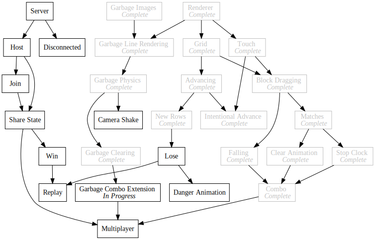
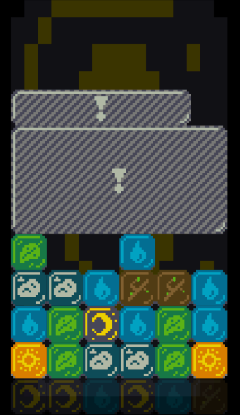
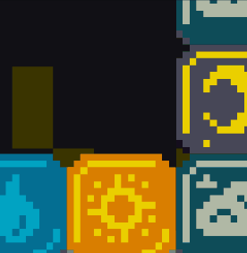

+++
title = "Day56 - Misc Combo Improvements"
description = "Refactored code to enable various improvements to combos"
date = 2019-04-03

[extra]
project = "ta"
+++

Today I spent some time cleaning up and extracting code out from the
`garbage.js` file into separate files. In particular I pulled all of the
function I wrote for [garbage
rendering](https://kaylees.dev/blog/day48-garbage-grid-rendering/) into the
`garbageRenderUtils.js` and all of the functions I wrote for [the clear
animation](https://kaylees.dev/blog/day52-garbage-clearing/) into
`clearAnimation.js` with it's own class. This made it easier to organize things
in my head and allowed me to make a number of improvements to the match and
combo system I have had on the todo list.

## Link Garbage Breaks

In the original game, garbage blocks would break each other if one was broken in
a chain. Not only did this make it easier to clear a big stack of blocks, but it
also gave the player more time to line up a combo with the falling match.
Luckily implementing this feature was pretty easy. I just modified the garbage
break logic I had already to add the garbage block slots to the triggering slots
and loop until no more garbage blocks are broken.


MatchStarted.Subscribe(matchedBlocks => {
  let triggeringSlots = [];
  for (let matchedBlock of matchedBlocks) {
    triggeringSlots.push(matchedBlock.gridSlot);
  }

  let garbageToBreak = new Set();

  let foundNewBrokenGarbage;
  do {
    foundNewBrokenGarbage = false;
    for (let garbage of garbageBlocks) {
      if (garbageToBreak.has(garbage)) continue;
      if (garbage.state == state.CLEARING) continue;
      for (let triggeringSlot of triggeringSlots) {
        if (garbage.adjacentTo(triggeringSlot)) {
          foundNewBrokenGarbage = true;
          garbageToBreak.add(garbage);
          triggeringSlots = triggeringSlots.concat(Array.from(garbage.overlappingSlots()));
          break;
        }
      }
    }
  } while (foundNewBrokenGarbage)

  if (garbageToBreak.size != 0) {
    breakBlocks(garbageToBreak, matchedBlocks);
  }
});


This has the added benefit of clearing all of the blocks at once instead of one
by one. To enable this I also modified the clear animation code to keep track of
multiple garbage blocks instead of just one.


constructor(triggeringBlocks, garbageBlocks) {
  this.timer = 0;
  this.triggeringBlocks = triggeringBlocks;
  this.garbageBlocks = garbageBlocks;
  this.spawnedBlocks = [];

  for (let garbage of garbageBlocks) {
    for (let slot of garbage.overlappingSlots()) {
      this.spawnedBlocks.push({
        visible: false,
        block: new Block(slot)
      });
    }
  }
}


## Extending Combos Through Garbage Breaks

When I wrote the initial version of garbage breaks I wrote a buggy attempt at
extending combos through them which subscribed to the `GarbageBroken` event and
added the new blocks to the `trackedBlocks` of a combo if any of the combo's
tracked blocks participated in the breaking of the garbage. This didn't work for
two reasons. First, it assumed that the combo already existed when the block was
broken, and second, the garbage break event was raised before the combo could
register to listen to it.

I fixed the first issue by adding a concept of matched blocks to combos and
moving combo creation to the start of a match instead of the end. 


MatchStarted.Subscribe(matchedBlocks => {
  let foundExistingCombo = false;

  for (let combo of combos) {
    if (matchedBlocks.some(matchedBlock => combo.trackedBlocks.has(matchedBlock))) {
      foundExistingCombo = true;
      combo.cascades++;
      ComboExtended.Publish(matchedBlocks, combo.cascades);
    }
  }

  if (!foundExistingCombo) {
    combos.add(new Combo(matchedBlocks));
  }
});


I also added a check that all of the matched blocks were cleared before dropping
a combo.


constructor(matchedBlocks) {
  this.cascades = 0;
  this.trackedBlocks = new Set();
  this.matchedBlocks = new Set();
  matchedBlocks.forEach(matchedBlock => this.matchedBlocks.add(matchedBlock));
}


The second problem was solved by adding a new event which gets raised on
animation creation instead of garbage break. This allowed the clear animation to
be established including the spawned blocks before the combo list is checked
against the match.


ClearAnimationStarted.Subscribe(({ triggeringBlocks, spawnedBlocks }) => {
  for (let combo of combos) {
    for (let block of triggeringBlocks) {
      if (combo.matchedBlocks.has(block)) {
        for (let spawnedBlock of spawnedBlocks) {
          combo.trackedBlocks.add(spawnedBlock.block);
        }
        break;
      }
    }
  }
});


Unfortunately I don't have a graphical indication that a combo was achieved
other than an extra stop clock delay, but I was able to verify that things were
working as expected using console output.

## Block Shadows

Unrelated to combo infrastructure I also added a shadow to the block's when
being manipulated as a simple but effective effect. The basic idea is that any
time a block is grown in size we can assume that said block is being raised
above the grid. In this case I can draw a shadow below the block by rendering
the block image without the scaling, offset by an amount proportional to the
scaling and with a black and transparent tint.


let heldDimensions = dimensions.multiply(this.scale);
let shadowOffset = (heldDimensions.width - dimensions.width);

if (shadowOffset >= 0.1) {
  image({
    imageUrl: texture || blockImages[this.type],
    position: center.add(new Vector(shadowOffset, -shadowOffset)).withZ(0),
    dimensions,
    tint: new Color(0, 0, 0, tint.a * 0.4)
  });
}


The resulting effect looks like this:

Its cheap but effective and adds some basic visual interest to the block manipulation.

Thats it for today. I think I made a bunch of progress toward the initial
multiplayer version and really improved the code organization for one of the
most complex parts of the game.

At this point I can confidently say that multiplayer is next. So next time I
work on the project I will probably work out the exact tasks that need done
server and animation wise to get a good experience going.

Till tomorrow!  
Kaylee
