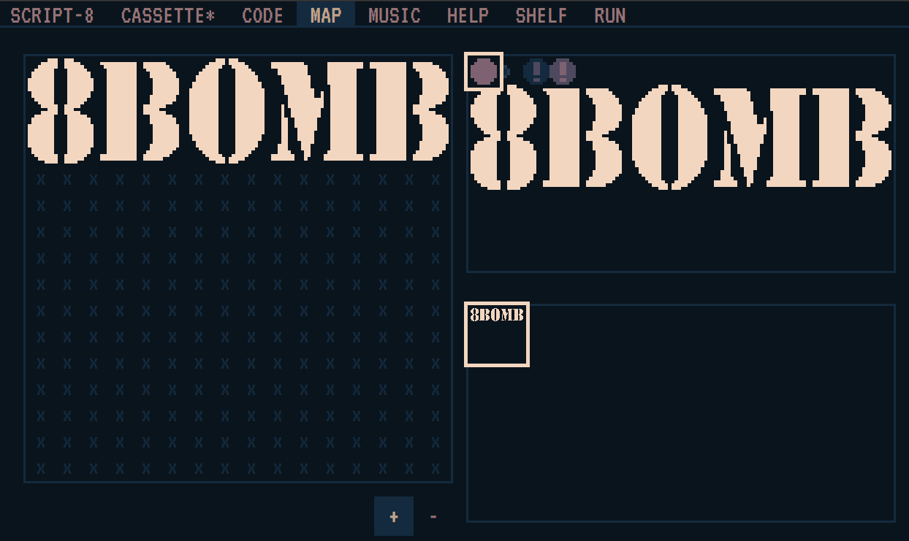
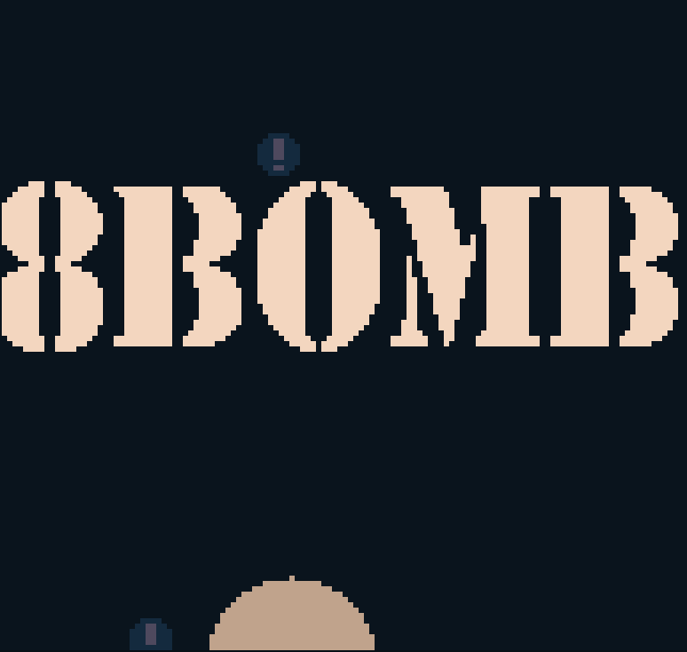

+++
title = "Day59 - 8Bomb Start Screen"
description = "Implemented 8Bomb Start Screen"
date = 2019-04-06

[extra]
project = "8bomb"
+++

Today I added the 8Bomb text logo I built yesterday as a starting page for 8Bomb
in SCRIPT8. Quick day today so I will jump right into it.

## Logo Drawing

Since yesterday I imported all of the title screen sprites into SCRIPT-8, I now
needed a way to draw them to the screen. For this purpose I chose to use the Map
functionality because it gives a clean and efficient way to draw a whole set of
tiles. After setting the appropriate tiles in the map screen, drawing the whole
map to the screen was as simple as calling the map function.


  map(0, 0);


Unfortunately due to a bug in the current implementation of map, the map cannot
be translated via the imput coordinates. To fix this I just added a call to
camera which sets the camera position to the current camera location plus an
offset so that the logo appears in the right place.


  camera(state.cameraX, state.cameraY + 110);
  map(0, 0);


Since the camera location is manipulated, I decided to move this code to the the
draw function proper so that the camera positioning logic wouldn't be effected.

## Bombs

To add some visual interest I also decided to increase the falling rate of bombs
when the start screen is on and add an explosion effect on the bottom of the
screen. However I don't want the bombs to be around when the player drops in, so
I needed a way to remove the bombs when the game actually starts.

I did this by adding a `Started` event which gets called when the player presses
a button for the first time. A flag is set on the state object indicating that
the player has started the game. I can then use this flag to modify spawn rates
and screen shake amounts.

When the game isn't yet started I spawn explosions at the bottom of the screen
to indicate that the bombs are blowing up as the fall down. This adds some
interest and gives an explanation for where the bombs went.


Update.Subscribe((state, input) => {
  let player = state.player;
  if (!state.started) {
    if (Math.random() < 0.1) {
      newExplosion(state, Math.random() * 128, -20);
    }
    
    if (input.left || input.right || input.up || input.down || input.a || input.b) {
      state.started = true;
      Started.Publish(state);
    }


I then use this new event in the bomb spawning code to decided how often to
spawn bombs and how much to shake the screen.


function spawnBombs({ bombs, score, player, started }) {
  let scaleFactor = 1.0;
  if (!started) scaleFactor = 20;
  if (Math.random() * 100 <= score / 800 + 0.25 * scaleFactor) {
    bombs.push(createPhysicsObject(Math.random() * 112 + 8, player.position.y - 300, 2));
  }
}

function newExplosion(state, x, y) {
  state.explosions.push({
    x,
    y,
    r: startingRadius,
    c: 0,
    delay: animationSpeed
  });

  let amount = shakeAmount;
  if (!state.started) amount = amount / 2;
  shakeCamera(state, amount);
}


I also delete all existing bombs on start so that the game is playable at the
beginning.


Started.Subscribe((state) => {
  for (let bomb of state.bombs) {
    newExplosion(state, bomb.position.x, bomb.position.y);
  }
  state.bombs = [];
});


And thats about it asside from adding a couple more cleanup and camera tweeks to
make the start screen pan down to the ground. The final result looks like this:

And thats it! At this point I think I can claim 8Bomb is done in the current
state. I never got to a panning background, but I don't think I would have been
able to pull something like that off with the limited palette and still look
nice. I'm proud of the progress I made on this little game and will do some
thinking about whether and what I should do next with it.

The game can be played
[here](https://script-8.github.io/?id=28ffa97d6a6a04a1d15bb191ed66322e).

Till tomorrow,  
Keith
