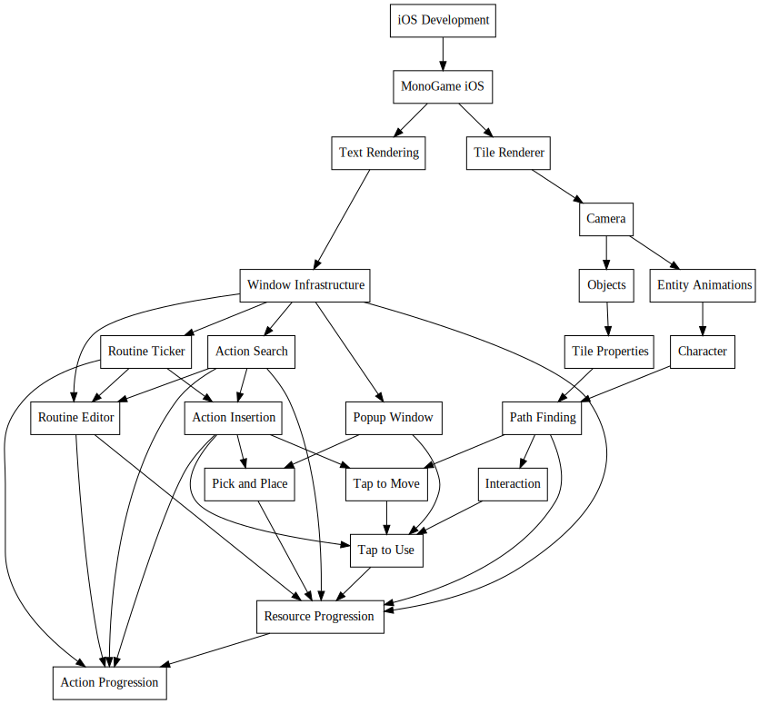

+++
title = "Day60 - Setting up Mac"
description = "Worked on installing software for iOS development"
date = 2019-04-07

[extra]
project = "robot"
+++

Today I worked on getting all of the software setup for running and debugging
Monogame on my iphone from my mac over the network in Visual Studio.

To get things working I needed to update my mac, update my visual studio,
install visual studio on the mac, install xcode, and figure out how to get the
correct certificates working. Unfortunately all of this took WAY longer than I
expected, and it is now 1:20am, so I've run out of time to push it further.
Hopefully tomorrow I will be able to finish setting up the dev environment and
get the Monogame starter project running on my phone hardware.

Although getting these moving parts working is a bit of a pain, the final
experience will be much better than I would get otherwise and allows me to build
xamarin or phone gap apps on iOS as well. I believe this is the right strategy,
but it will take some fiddling to get finished.

## Two Months Down

Blog wise this marks my 60th day doing daily posts! I think this month went a
little slower than the last, but I did finish up 8Bomb, make a TON of progress
toward my Tetris Attack Remake, and push my personal tooling for doing blogging
further.

Retrospective wise, I think I'm feeling the effects of daily posts for two
months. Its getting harder to motivate myself to get started. I think this is
the result of tackling bigger projects, and pushing myself a little too hard. So
in the later half of my daily blog posts I decided to go a bit easier and allow
myself a couple of rest days. 

I think this pattern works great because there will definitely be times when I
won't be up to posting, so I need to let myself rest during those times. At the
moment at least, I think I have a pretty good balance.

Project wise I think I'm in a good place as well. Finishing 8Bomb was a good
step as it reduces my list of active projects while still providing the feeling
of acomplishing something. In the future I may come back to 8Bomb and polish it
up more, but for now I think its good enough. I would like to add some more
visualy interesting aspects to the website, and one way I may do that is add
cards for my "finished projects" with animations showing and highlighting what
they do. The 8Bomb start screen would be a great place to start that.

Future wise, I am still commited to doing this crazyness long term. I think its
been fantastic for my productivity, and has forced me to practice writing in a
way I haven't ever before. I would also like to do some blogging about the
technology I work with in my day job with the PROSE team at microsoft. My team
is working on some fantastic stuff, so it would be great to build things around
that technology. I've been talking to folks on the team and I think I have found
a way to make that happen, but it might be a while yet.

Here's to another month!

Till tomorrow,  
Keith
