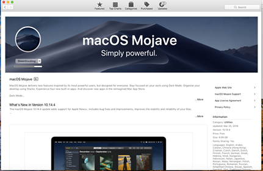
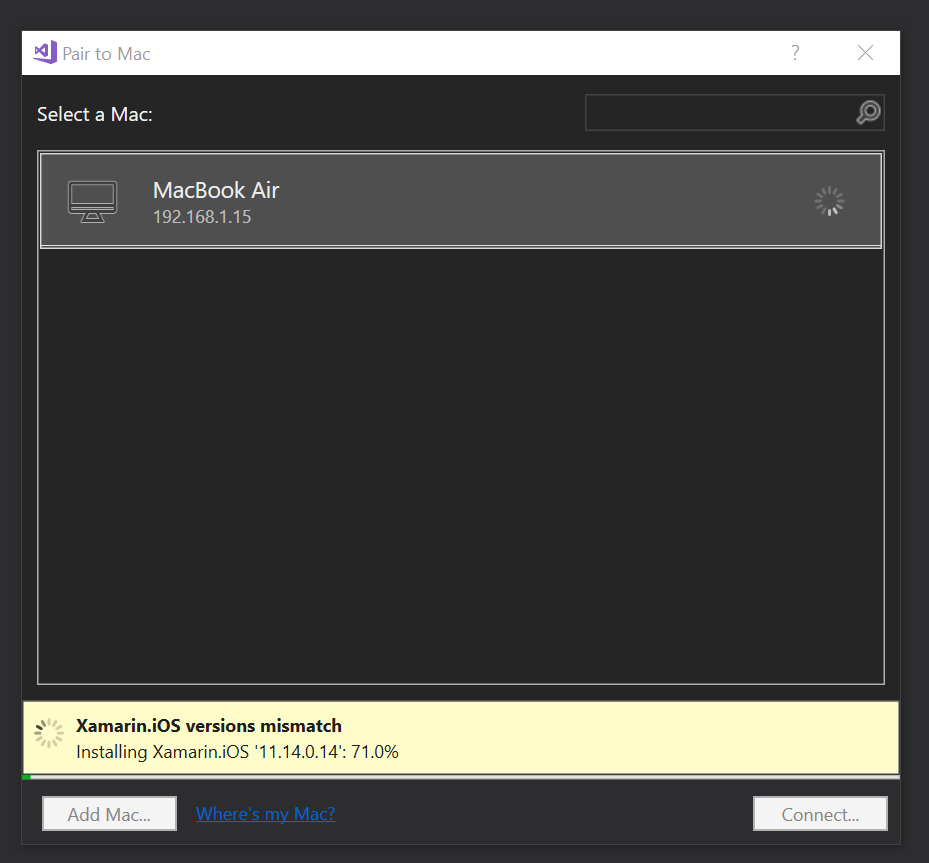
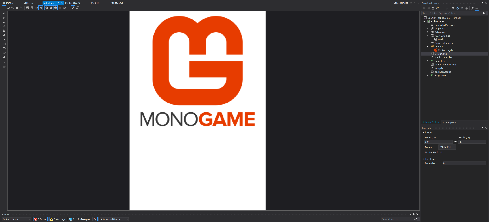
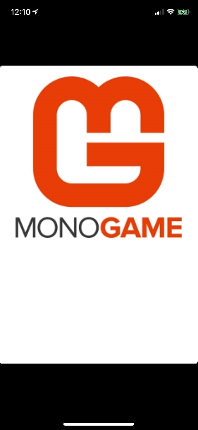

+++
title = "Day61 - Building IOS Apps in VS"
description = "Building remotely on Mac from Visual Studio working"
date = 2019-04-08

[extra]
project = "robot"
+++

Today I finished getting the iOS build system setup. Overall I'm pretty pleased
with the final setup. Crucially none of the communication over the network works
unless the Mac, xcode, and Visual Studio for Mac are on the most recent version.
Getting everything updated took a long time but I finally got my fiancé's
mac book air updated.

I needed to update and install a ton of dependencies on the Mac side, but some
of that was handled for me inside Visual Studio.

After all of the dependencies were fully installed, I needed to access the UDID
from my IPhone via ITunes on the Mac and setup a provisioning profile and
license. Several visits to stack overflow later, and I was able to get the
project building inside of Visual Studio over the network on the Mac.

Incidentally one of the fixes was to install the VS 2019 preview, so it was
refreshing to have things working on the latest bits.

Finally, I was greeted with the default start screen and cornflower blue
background of an empty monogame project.

I find much of this work frustrating because it always takes longer than I
expect it to. It never seems to be as easy as just start up the editor and get
rolling, but afterwards the development experience is much faster so I think its
worth it. 

Till tomorrow,  
Keith
