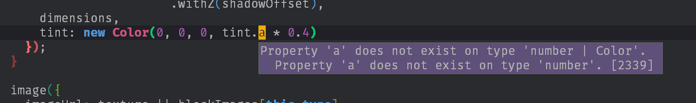

+++
title = "Day66 - Porting Tetris Attack to Typescript"
description = "Made significant progress toward porting my Tetris Attack clone to typescript"
date = 2019-04-16

[extra]
project = "ta"
+++

Today I spent some time porting many of the JavaScript files in the Tetris
Attack clone to Typescript in order to get a better editing experience and to
get some better type safety in my JavaScript code. I didn't finish the process
as I ran out of time, but I got far enough in to decided that it was the right
option because I already found a number of bugs just by annotating the types
everywhere.

## Process

Much of the process of porting to Typescript is just renaming the file extension
from `.js` to `.ts`. Since Typescript is a relatively unobtrusive layer on top
of standard JavaScript, much of the source remains unchanged. The only places I
made changes were adding annotations to function arguments, reworking enum
values, and moving class fields around.

Luckily the typescript environment I have setup in Spacemacs will tell me where
I went wrong.


class Match {
  constructor(matchBlocks) {
    this.blocks = matchBlocks; // Error: blocks does not exist on Match
    this.timer = 0; // Error: timer does not exist on Match

    for (let block of this.blocks) { // Error: blocks does not exist on Match
      block.state = state.MATCHED;
      dropBlock(block);
    }
  }

  update() {
    if (this.timer < clearDelay) { // Error: timer does not exist on Match
      this.timer++; // Error: timer does not exist on Match
    } else {


Here each of the lines I have commented had a simple red underline which when
hovered over with my cursor told me that the various properties did not exist on
the `Match` type. To fix this I simply added a field declaration at the top of
the class.


class Match {
  public blocks: Block[];
  public timer: number;

  constructor(matchBlocks: Block[]) {
    this.blocks = matchBlocks;
    this.timer = 0;

    for (let block of this.blocks) {
      block.state = state.MATCHED;
      dropBlock(block);
    }
  }

  update() {
    if (this.timer < clearDelay) {
      this.timer++;
    } else {


## Enums

I also took this porting as an opportunity to use the better enum data types in
Typescript over my hacky enum objects. The process was similarly simple, just
rewriting the old object types:


export const type = {
  WOOD: "Wood",
  ICE: "Ice",
  STONE: "Stone",
  LEAF: "Leaf",
  LAVA: "Lava",
  GOLD: "Gold",
  BANG: "Bang",
  GARBAGE: "Garbage"
};


Into the cleaner enum version:

export enum BlockType {
  Wood,
  Ice,
  Stone,
  Leaf,
  Lava,
  Gold,
  Bang,
  Garbage
}


## Static Fields

The Color and Vector types all have static properties on the class function
which are set dynamically in the original source:


export class Color {
  constructor(r, g, b, a = 1) {
    this.r = r;
    this.g = g;
    this.b = b;
    this.a = a;
  }
}

Color.white = new Color(1, 1, 1, 1);
Color.gray = new Color(0.5, 0.5, 0.5, 1);
Color.black = new Color(0, 0, 0, 1);
Color.clear = new Color(0, 0, 0, 0);


Swapping to Typescript required moving those static properties to field
declarations within the class itself:


export class Color {
  static white = new Color(1, 1, 1, 1);
  static gray = new Color(0.5, 0.5, 0.5, 1);
  static black = new Color(0, 0, 0, 1);
  static clear = new Color(0, 0, 0, 0);

  public r: number;
  public g: number;
  public b: number;
  public a: number;

  constructor(r: number, g: number, b: number, a = 1) {
    this.r = r;
    this.g = g;
    this.b = b;
    this.a = a;
  }
}


## Type Bug Fixes

In the process of porting over I discovered a couple of bugs which were caught
by the type checker. The first showed up as a weird error message:

Jumping to the definition of `tint` (using the typescript jump to definition
support) brought me to this variable declaration:


let tint = this.calculateColor(position.y);


Which when jumping to the calculate color function reveals this definition:


calculateColor(centerY) {
  if (this.state === BlockState.Matched) {
    return new Color(1.5, 1.5, 1.5, 1);
  } else if (this.state === BlockState.Clearing) {
    let percentageDone = this.clearTimer / clearingTime;
    return new Color(1, 1, 1, 1 - percentageDone);
  } else if (this.state === BlockState.Cleared) {
    return Color.clear;
  } else if (this.state === BlockState.Spawning) {
    let gridBottom = gridCenter.y - gridDimensions.height / 2;
    let blockBottom = centerY - blockWidth / 2;
    let distanceFromBottom = blockBottom - gridBottom;

    if (distanceFromBottom >= 0) {
      if (this.state === BlockState.Spawning) {
        this.state = BlockState.Waiting;
      }
      return 1;
    }
    if (distanceFromBottom < -blockWidth) return 0;

    return new Color(1, 1, 1, (distanceFromBottom + blockWidth) / (blockWidth * 2));
  } else {
    return Color.white;
  }
}


This combined with the error message pointed out that for some branches of the
`calculateColor` function I was returning a `Color` object, and for others I
returned a number. It would have been a long while till I caught that bug
without Typescript, so I consider this a huge win.

## Browser Typescript

Typescript not only helps me by guaranteeing that my code is consistent. It also
has a large library of built in browser types which match the standards
definitions. When porting the touch functionality to Typescript, I discovered
that the `touchId` property I was tracking on the pointer events was incorrect
compared to the standards. Since the `PointerEvent` object is in the list of
already defined types, I found out my error after annotating the
`handlePointerEvent` function.


function handlePointerEvent(e: PointerEvent) {
  if (!touchDown || touchId == e.pointerId) {
    touchId = e.pointerId;
    touchPosition = new Vector(e.clientX, screenSize.height - e.clientY);
    touchDown = e.pressure > 0;
  }
}


## Import Weirdness

The only downside so far in porting is that Typescript is less tolerant to the
trickery which Webpack plays to import things other than source files.

At the top of the `webgl.ts` file I previous had these imports which pulled in
the shader code from the shader files at build time.


import vert from './shaders/vert.glsl';
import frag from './shaders/frag.glsl';


Unfortunately Typescript complains here because it doesn't have a definition for
the vert.glsl and frag.glsl shader files. To get around this I used the built in
nodejs require function instead which has no such type constraints.


const vert: string = require('./shaders/vert.glsl');
const frag: string = require('./shaders/frag.glsl');


## Summary

Overall I find the process of porting to Typescript pretty satisfying because it
gives me a stronger confidence that my code does what I think it does. More
often than not I find myself wishing Typescript would support more complex and
expressive types instead of feeling like the type system is holding me back.
That this tool set also gives me better completion information is just a cherry
on top.

Till tomorrow,  
Keith
