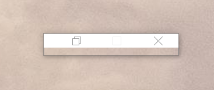
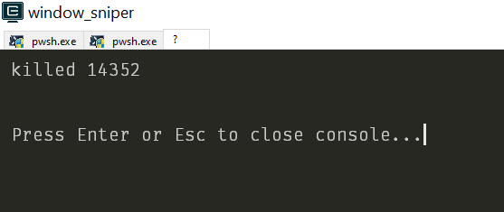

+++
title = "Day67 - Window Sniper"
description = "Simple utility for force killing windows"
date = 2019-04-17
+++

Today I took a short detour in rust land to build a satisfying utility for
killing windows processes by clicking on the associated window. For the
impatient, the finished tool can be found
[here](https://github.com/Kethku/WindowSniper/releases).

## The Culprit

After coming home from work and logging into my machine I found a mysterious
window floating on top of my desktop without a name, and not responding to any
clicks of the close button. 

This cannot be. Processes do what I want them to do, not what they decide seems
reasonable to them. Punishment for such crimes will not be an instantaneous
sweet release to oblivion that comes from a task termination in Task Manager.
No, for such transgressions we need to set an example. For this we must fashion
a weapon which will crush rebellious denizens of my computer into submission.

My glorious method for process domination was be constructed from 3 parts:

- Aiming Device
- Termination Method
- Example Communicator

Since my utility needed to manage the minions of my machine, I built it using
Rust because it lets me safely access unmanaged code performantly and cleanly.

## Aiming

I'm going to be honest. I don't know much about writing native code and about
working with Windows APIs. Luckily much of the hard work has been done for me in
the form of the `winapi-rs` project which wraps all of the Windows APIs in
simple Rust functions.

Some short Googling later, and I found the `GetKeyState` API for checking the
mouse button status, and `GetCursorPos` for finding the position of the cursor.
Unfortunately though, all of the winapi functions are `unsafe` because they may
do crazy nasty things at any time. To keep myself sane I decided to write a
slightly higher level wrapper around the functions I needed.


fn mouse_down(button: c_int) -> bool {
    unsafe {
        GetKeyState(button) & 0x100 != 0
    }
}

pub fn mouse_left_down() -> bool {
    mouse_down(VK_LBUTTON)
}

pub fn mouse_right_down() -> bool {
    mouse_down(VK_RBUTTON)
}


`mouse_down` takes a button to query, and calls the `GetKeyState` Windows API
which in turn returns a set of flags the third of which indicates if the button
is currently held down. I then wrap `mouse_down` in `mouse_left_down` and
`mouse_right_down` functions which pass the correct constant in for the left and
right mouse buttons respectively.

use winapi_wrappers::{mouse_left_down, mouse_right_down};

fn main() -> () {
    loop {
        if mouse_right_down() {
            break;
        }

        if mouse_left_down() {
            println!("Sniper Shot!");
            break;
        }
    }
}


Since I only implemented polling functions for the mouse button state, the main
function consists of a single loop which continuously checks the mouse status
until either of the mouse buttons is pressed. Then once a button was pressed I
needed to get the mouse position.


pub struct Position {
    pub x: i32,
    pub y: i32
}

pub fn mouse_position() -> Position {
    let mut cursor_position = POINT { x: 0, y: 0 };

    unsafe {
        GetCursorPos(&mut cursor_position);
    }

    Position {
        x: cursor_position.x,
        y: cursor_position.y
    }
}


`GetCursorPos` was slightly more complicated because instead of getting a return
value directly, the Windows API sets values on the structure pointed at by a
passed in pointer. To make matters slightly more complicated as well, the
`winapi-rs` wrapper has a weird `POINT` struct with a bad name which I decided
to replace with my own.

## Termination

With the aiming functionality finished, I then needed to actually kill a
process. In windows this is done with the process identifier or PID.
Conveniently the PID is retrievable from a given window by retrieving the window
handle from a position, and retrieving the calling PID from the handle.


pub fn pid_from_position(pos: Position) -> u32 {
    let mut pid: u32 = 0;

    unsafe {
        let handle = WindowFromPoint(POINT { x: pos.x, y: pos.y });
        GetWindowThreadProcessId(handle, &mut pid);
    }

    pid
}


Finally once we have a PID for the window we want to kill, we need a termination
function. Again in Windows this must be done in two steps, first you have to get
the process handle via `OpenProcess`, and then you have to kill the process by
passing the handle to `TerminateProcess`.


pub fn terminate_pid(pid: u32) {
    unsafe {
        let handle = OpenProcess(PROCESS_ALL_ACCESS, 1, pid);
        TerminateProcess(handle, 0);
    }
}


To integrate the kill functionality into the weapon I just modify the `main`
function to retrieve the mouse position, get the process id under the mouse, and
kill the process.


fn main() -> () {
    loop {
        if mouse_right_down() {
            break;
        }

        if mouse_left_down() {
            let cursor_pos = mouse_position();
            let pid = pid_from_position(cursor_pos);
            terminate_pid(pid);
            println!("killed {}", pid);
            break;
        }
    }
}


And thats it for the actual functionality. The state as is isn't nearly good
enough of an effect to make an example of the unruly process in question. For
that we need some sound.

## Example Communication

Sound has two parts: storing it, and playing it. For storing I would really like
to embed the sounds directly in the final executable so that I can pass around
(and store) just one file. Luckily there is a rust crate called `RustEmbed`
which allows storing and retrieving embedded binary files exactly in the way
that I needed.

So I downloaded gun cocking and shooting sound effects and added them to a
sounds folder in the root of the project. And then created an Assets type
definition which gets filled in by the library with functions for retrieving
binary resources.


#[derive(RustEmbed)]
#[folder = "sounds/"]
struct Asset;


Once stored in this way I am able to retrieve the binary vector like so:

let bytes = Vec::from(Asset::get(path).unwrap());


For playing the stored sound effect, I turned to a crate called `Rodio` which
allows parsing and playing of sound files in background threads. The process is
to loaded the sound effect into a decoder and call `play_raw` passing the
decoder object to start the sound. To make things cleaner I built a helper
function that does all of the type fiddling to load the sound.


fn load_sound(path: &str) -> Decoder<Cursor<Vec<u8>>> {
    let bytes = Vec::from(Asset::get(path).unwrap());
    let cursor = Cursor::new(bytes);
    rodio::Decoder::new(cursor).unwrap()
}


Then I load the two sound effects, initialize the sound device and play the
sound to cock the gun on startup and shoot when the mouse has been clicked and
the process terminated.


fn main() -> () {
    let cocking = load_sound("cocking.wav");
    let shoot = load_sound("shoot.wav");

    let device = rodio::default_output_device().unwrap();

    rodio::play_raw(&device, cocking.convert_samples());
    loop {
        if mouse_right_down() {
            break;
        }

        if mouse_left_down() {
            let cursor_pos = mouse_position();
            let pid = pid_from_position(cursor_pos);
            terminate_pid(pid);
            println!("killed {}", pid);
            rodio::play_raw(&device, shoot.convert_samples());
            sleep(Duration::from_millis(1000));
            break;
        }
    }
}


Note: I also wait for a second after the shoot sound effect is triggered so that
the process doesn't finish before the sound has a chance to play.

And with that my weapon for process management is complete.

## Testing it Out

Running the app and clicking on our rebellious friend presented me with a
satisfying firing sound and this image:

And theres more where that came from. Let all who enter my digital domain know
that I rule with an iron fist.

## Source and Binaries

I uploaded the tool to github [here](https://github.com/Kethku/WindowSniper) and
the release executable can be found
[here](https://github.com/Kethku/WindowSniper/releases). I don't know if I will
work on this project further, but it was a fun one off that taught me a bunch
about manipulating windows APIs and quelling rebellion. Fun all around.

Till tomorrow,  
Keith
