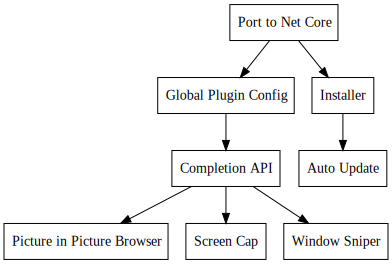

+++
title = "Day69 - Popup Tool Bar"
description = "Prep work for a new utility bar project"
date = 2019-04-19

[extra]
project = "traffic-control"
+++

Today I revived an old project to build a summonable command bar utility. The
basic idea is to build an app which is summonable via a key binding which
presents a command bar at the top of whatever window I am looking at. 

Then when I type I get autocomplete results for a list of simple utilities.
Initially I will just integrate my window sniper but I could imagine including a
number of utilities such as a picture in picture browser window, a web search
tool, and a simple calculater just to name a few.

The current version of the utility looks like this:

The window is slightly transparent and shows completion results underneath the
text bar and automatically updates these results as you type. I spent today
working on the initial work to revive the tool by porting it to .net core and
tearing out the non functional bits. I will write up this work more once I have
finished it fully. After the app is up and running again I will look into
designing a plugin api so that any application can hook into the completions and
command list.

I had a long day today at work and am feeling pretty drained so I'm going to
leave it at that for today.

Till tomorrow,  
Keith
