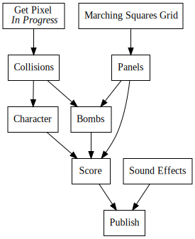
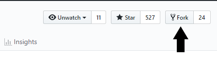
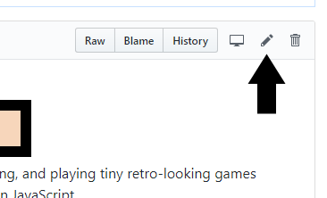

+++
title = "Day7 - Contributing to Open Source"
description = "Starting another bomb survival demake"
date = 2019-02-13

[extra]
project = "8bomb"
+++

Today I'm taking a break on Pando and introducing a new project. But first some
background. When I was in high school my friends and I spent a lot of time
working on various small games. They ranged from a super simple pong game when
we were first starting, to eventually a remake of a Little Big Planet game
called [Bomb Survival](https://www.youtube.com/watch?v=BU2eKs40oFQ) for the
windows phone 7. At the time the windows phone had just come out and every
employee at Microsoft was given the option to get one for an extreme discount
(it may even have been free) so we had a good time making something we
considered fun for our new phones. Some guy online made a [YouTube
review](https://www.youtube.com/watch?v=dNZ1gO0PIIU) for those who are
interested.

These days I use the project as a toy to implement whenever I find a new game
engine to play with. The mechanics are just complicated enough to be interesting
while still being easy enough to build without much infrastructure. An example
of one of my implementations can be found on the
[Pico-8](https://www.lexaloffle.com/bbs/?tid=3546) forums.

Fast forward to a couple weeks ago when I learned about
[SCRIPT-8](https://script-8.github.io/) a fantasy console in the same vein as
Pico-8 but written in JavaScript and containing a fascinating editor with time
travel and easy game sharing. The project seems not to have gotten a lot of love
online yet, so I decided to try my hand at building a game with it. Naturally I
decided to port my old standard Bomb Survival game to the platform.

There was a hiccup however. The physics engine architecture I have found to work
most naturally for a resource constrained destructible terrain game is a pixel
based system. I will go into further detail about how to implement such a system
later. Suffice it to say that we need some way to query the engine for what color
a given pixel is.

Unfortunately SCRIPT-8 doesn't currently have an API to do this. So for today's
daily post I delved into the source code for SCRIPT-8 and made a PR to add the
functions I needed. Along the way I will highlight some things I've learned
about how to effectively work with open source projects.

## First Contact

The first step was to create an issue on the GitHub page broaching the idea of
some pixel API changes. I tried hard to communicate clearly exactly what I was
thinking of changing, why I wanted to change it, and that I was completely
willing to build and own the feature. That last piece is crucial for small
projects with a friendly main developer. Gabriel, the author of SCRIPT-8 showed
that he was very willing to merge PR's from people other than himself, so
offering to contribute was very likely to open doors. The issue I created can be
found [here](https://github.com/script-8/script-8.github.io/issues/187).

### Useful Tip #1: Ask First

It is better to ask first then to potentially waste time building something the
maintainers don't want.

Sure enough an hour or so after I made the issue Gabriel responded agreeing that
the feature was a good idea and gave me a pointer to where to get started.
*We're in*

## GitHub Process

Second step to getting code merged even before writing a single line of code is
to fork the repository. Most GitHub projects will not give push access to random
people on the internet. Instead the path to getting a change in starts by
forking the repo which creates a new copy of the project on your account. You
then make your changes there and make a PR or Pull Request which the original
project owners can then either accept, make comments on, or reject. Forking can
be done easily on GitHub by clicking the Fork button in the top right corner of
the project page.

After forking its generally a good idea to look for instructions for how to get
a development build of the project working on your machine. Many projects have
these instructions in the root level README however some hide them in the GitHub
wiki or docs. In the case of SCRIPT-8 I found them at the bottom of the
[README](https://github.com/script-8/script-8.github.io/blob/f037aaf6baae69724ed3e190413b09c4d65f766b/README.md).

## Stumbles

Unfortunately after cloning, installing the correct dependencies, and running
`yarn iframe-start` as per the instructions, I was greeted with this unhelpful
error:


yarn run v1.13.0
$ npm-run-all -p iframe-start-js iframe-watch-css
$ cd src/iframe; react-scripts start
$ cd src/iframe; stylus src/css/Iframe.styl -o src/css -w
The system cannot find the path specified.
The system cannot find the path specified.
error Command failed with exit code 1.
info Visit https://yarnpkg.com/en/docs/cli/run for documentation about this command.
error Command failed with exit code 1.
info Visit https://yarnpkg.com/en/docs/cli/run for documentation about this command.
ERROR: "iframe-start-js" exited with 1.
error Command failed with exit code 1.
info Visit https://yarnpkg.com/en/docs/cli/run for documentation about this command.


Pretty cryptic... So I did some initial googling. After nothing obvious turned
up I then did the important next step of searching the project for similar
keywords. 

### Useful Tip #2: Search the Project

This serves two purposes. First it ensures that nobody else has run into this
problem and potentially found a fix. And second it gets me familiar with the
types of questions being asked in the issues section. Some projects feel
strongly about what goes into issues, so making sure there are similar issue
reports is a good strategy. I can't count the number of times I have been able
to figure out a problem by searching in the discussions in GitHub issues. Side
note: I frequently find this strategy useful as a user as well not just for
programming problems.

After not finding similar problems in the issues, and ensuring other people have
asked similar questions with friendly responses, I created an
[issue](https://github.com/script-8/script-8.github.io/issues/188). Crucially I
included what machine I'm running on (this was the important factor in the end),
the commands I used, and as much of the error info as possible. This gives the
maintainers the highest chance of taking you seriously. If you don't provide
enough details, maintainers can often blow you off.

Like clockwork, Gabriel responded an hour later suggesting I install `stylus`. I
did as suggested, but still ran into the same issue. Counter intuitively I took
his quick response as a good sign even though it was wrong in the end because it
indicated Gabriel is very invested in the project and willing to provide useful
suggestions. In the past I have tried contributing to projects with less helpful
maintainers and been disappointed or turned away. Friendly maintainers make all
the difference.

After turning over the easy stones for some quick fixes I started to push a bit
further and debug myself. After some fooling around and searching I eventually
landed on this [stack overflow
page](https://stackoverflow.com/questions/39190164/npm-the-system-cannot-find-the-path-specified).
3 answers down gave me the [crucial hint](https://stackoverflow.com/a/45869685).
Apparently [npm](https://www.npmjs.com/), the package manager for javascript
doesn't handle windows consoles very well when trying to use `package.json`
scripts. The solution was to configure npm to use a bash implementation on
windows instead of the default of cmd.exe. The core of the issue is that cmd
couldn't figure out where the npm installed the dependencies for the build
process however bash was used correctly and the path was hooked up properly.

### Useful Tip #3: Use the Google Luke
 
Google foo is invaluable. Maintaining cross platform compatibility in a project
is extremely hard. Especially if the maintainer only uses or tests on one
platform themselves. Encouragingly there are more JavaScript developers on earth
than any other kind. So Google is saturated with a near infinite set of monkey
developers sticking wrenches where they don't belong. More often than not
somebody has stuck a wrench where you have and figured out how to pull it out.

Immediately after figuring out the solution, I documented it in the issue and
closed it. Gabriel commented a while later asking me to add a comment to the
README describing the pitfall.

## Quick Single Change PR

I lied a little above when I said the first step to making a change in an open
source project is to fork it. The wonderful folks at GitHub have built quicker
way if the change is simple enough. In the repository explorer, if you click on
a file there is an edit button.

Clicking it will open up an in browser text editor for you to make small
changes.

Making the changes, adding a title, and a description will do the intermediate
steps of forking the project if it isn't already on your account, creating a new
branch with your change in it, and making a Pull Request. I wouldn't recommend
this for big functional changes since there isn't a clean way to test the change
without cloning and such, however for documentation changes this strategy is
invaluable.

The PR containing the documentation change can be found
[here](https://github.com/script-8/script-8.github.io/pull/191)

## When in Rome Do As the Romans Do

With that issue out of the way and successfully building the dev server, I began the
important process of understanding the project's coding style. The [first pull
request](https://github.com/vors/ZLocation/pull/21) I ever tried to make on
GitHub was a minor disaster because I naively thought that I knew how to format
things better than the maintainer. The maintainer kindly pointed out my mistake
and linked to some contributing guidelines, but at that point I was too
embarrased to continue. 

### Useful Tip #4: Don't Force Your Style on the Maintainers

I wont make that mistake again, so now any time I consider making a change in a
project I scan files trying to understand their patterns and formatting style.
Programmers feel strongly about coding style. They are much more likely to merge
a PR if the code feels like something they would have written.

In the case of SCRIPT-8, the author tends to omit semicolons (brave), use `let`
for variable declarations (awesome), and use es6 module style (even more
awesome). I tried to keep these things in mind while making my changes.

## Finishing it Up

With all that out of the way, the last part was to actually complete and test
the changes. This part took relatively little time since the actual changes were
pretty small. I used the hint Gabriel gave in my first issue to figure out where
to make the change and emulated the pattern in that part of the code to add my
own functions to the API. After testing (and fixing my stupid bugs) I then
decided to build a demo to show off the changes and make sure everything was
working.


let x = 20;
let y = 0;
let vx = 1;
let vy = 1;

clear()

draw = () => {
  for (let i = 0; i < 100; i++) {
    setPixel(x, y, getPixel(x, y) + 1)
    x = x + vx
    y = y + vy
  
    if (x >= 127) {
      vx = -1
    }
    if (y >= 127)  {
      vy = -1
    }
  
    if (x <= 0) {
      vx = 1
    }
    if (y <= 0) {
      vy = 1
    }
  
    if (random(0, 100) < 5) x += 1
    if (random(0, 100) < 5) x -= 1
    if (random(0, 100) < 5) y += 1
    if (random(0, 100) < 5) y -= 1
  }
}


After a short while running the above demo yields this image:

Lastly I looked up and updated the documentation to show the new API.

### Useful Tip #5: Do the Chores for Them

Nobody likes doing chores, and god knows project maintainers have many, so
wherever possible, make their life easier. Updating documentation for public
facing changes is a good way to gain good will from the project maintainer.

And that was that! The PR containing the actual changes can be found
[here](https://github.com/script-8/script-8.github.io/pull/190). 
Currently I'm waiting for Gabriel to wake up and take a look at my PRs. I hope
he finds them adequate, but I'm sure we can resolve any issues if they come up.

Hopefully this summary of my thought process when contributing to a project is
useful to someone. Its the sort of thing I wish I had when I first tried.

## What's Next

The Bomb Survival Demake project has to wait until the PR gets merged and the
new version goes live, so I will probably be back to working on Pando next time.

This marks the completion of my first week of EveryDays!!! I still haven't found
the right balance of post length, but it is encouraging that I tend to lean
toward too much rather than not enough content. Heres to hoping the next week
goes just as well. Maybe this time with fewer post-midnight publishing
timestamps.

Till tomorrow,  
Kaylee
