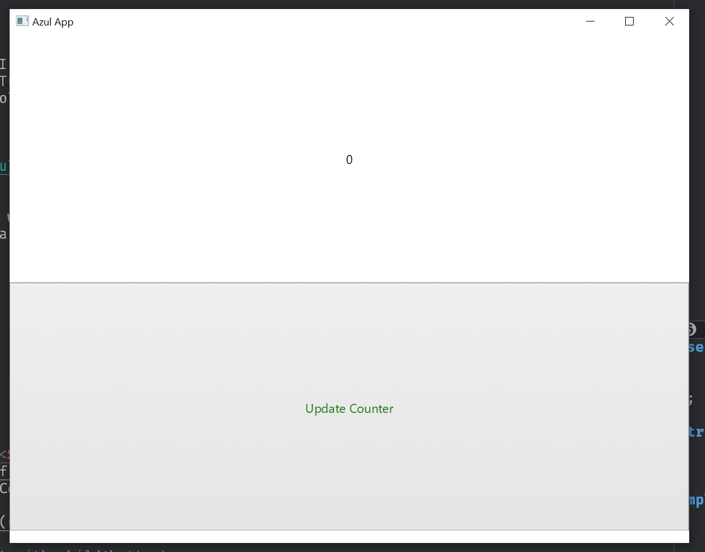

+++
title = "Day71 - Azul Experimentation"
description = "Getting Azul building and running on windows"
date = 2019-04-22
+++

Recently I have been interested in the various UI frameworks out there for doing
graphical interface development in Rust. I have some ideas for a number of
projects where I would want to build a UI but not have to run an entire browser
stack. Currently there are a few frameworks which have gone further than just
experimentation and I would like to try them out. Today I tried out `Azul` and ran
into some speed bumps with building it.

Azul is a framework built on top of Mozilla's `webrender` library which is the
basis for their experimental Servo browser. Azul promises to provide a data
first strategy to user interfaces by splitting the data manipulation from the UI
render logic. The basic idea is similar to React or other virtual dom frameworks
on the web side where a render function is given the current state, and the
updates to the window state are calculated as the diff between to dom trees.

In the past when I have attempted to build an app with Azul I have run into
various build tool issues. Today I decided to knuckle down and figure out the
problems. In the process I found two problems. First, my MSBuild install was
incorrect. Second, I was installing via an old version and the docs did not
match the version on Cargo.

## VsVariables

When building c++ applications on windows, there are generally two options.
Either you can go the linux-y route and install a posix emulation layer to do
your building such as mingw or msys, or you can go the MS route and use Visual
Studio tooling. I've done both because there are projects that only support one
or the other, but if given the choice I tend to go the MS route just because its
what I understand.

To get the tooling setup in the commandline though you need to run one of Visual
Studio's setup scripts to get the environment right. Up until today I've done
this by following the advice found
[here](https://stackoverflow.com/a/2124759/2103220) to get this working
Powershell. 


function vsVars
{
  pushd "C:\Program Files (x86)\Microsoft Visual Studio\2017\Community\Common7\Tools"
  cmd /c "VsDevCmd.bat&set" |
    foreach {
      if ($_ -match "=") {
        $v = $_.split("="); set-item -force -path "ENV:\$($v[0])"  -value "$($v[1])"
      }
    }
  popd
  Write-Host "`nVisual Studio 2017 Command Prompt variables set." -ForegroundColor Yellow
}


This works great so long as you are just using MSBuild and such for
c# or normal projects. If however your application requires building for a
certain target, then you will run into errors.

As it turns out, `serde-derive` is such a project. When built as a dependency
for Azul (not quite sure why only Azul...), the compile step for `serde-derive`
would fail for me complaining about an architecture mismatch.

After a bunch of digging and installing of dependencies I eventually discovered
that there used to be two scripts, one for x86 and one for amd64, but in VS 2017
they got merged and hidden behind a script parameter. When I tried to add the
parameter to my function I couldn't figure out how to get it working. 

So I backed up and did some searching about installing vs vars in Powershell.
This investigation brought me to the incredible [Powershell Community
Extensions](https://github.com/Pscx/Pscx) which contains a
`import-VisualStudioVars` command. Some simple digging later and I was able to
run the function with an argument to specify what architecture.


Import-VisualStudioVars 2017 -Architecture amd64


The last stumbling block on this side was that this command depends on a module
called VSSetup. After installing it as well I was able to run the above command
and get past the failing `serde-derive` build.

## Trying it out

The version issue issue was on me, just because I was used to installing cargo
packages to the latest version pushed to Cargo. Turns out the instructions
suggest installing directly from git using the following syntax:


[dependencies]
azul = { git = "https://github.com/maps4print/azul" }


So after updating the version and building hello world while importing Azul, I
decided to try the readme demo which implements a simple counter.


use azul::{
    prelude::*,
    widgets::{button::Button, label::Label}
};

struct DataModel {
    counter: usize
}

impl Layout for DataModel {
    fn layout(&self, _: LayoutInfo<Self>) -> Dom<Self> {
        let label = Label::new(format!("{}", self.counter)).dom();
        let button = Button::with_label("Update Counter")
            .dom()
            .with_callback(On::MouseUp, Callback(update_counter));

        Dom::new(NodeType::Div).with_child(label).with_child(button)
    }
}

fn update_counter(
    app_state: &mut AppState<DataModel>,
    _event: &mut CallbackInfo<DataModel>
) -> UpdateScreen {
    app_state.data.modify(|state| state.counter += 1);
    Redraw
}

fn main() {
    let mut app = App::new(DataModel { counter: 0 }, AppConfig::default()).unwrap();
    let window = app.create_window(WindowCreateOptions::default(), css::native()).unwrap();
    app.run(window).unwrap();
}


After adding this to `main.rs` and running `cargo run` I was presented with this:

## Thoughts

Given that I haven't had the time to try things out, I don't have a ton of
thoughts as of yet, but some things did stand out to me.

First, it strikes me as weird that this project seems to be trying to emulate
browser controls structures/react patterns. I had hoped to have something a bit
more principled. This combined with the kinda sorta css styling leaves a bad
taste in my mouth.

Second, documentation was kinda poor. I couldn't find api docs anywhere (maybe I
missed them) and frequently found myself digging into the source to find the
information I needed.

Third, performance was great, but still is a browser backbone. Resizing the
window is jittery similar to a WPF application, but I think it could be better.

Overall I think its a promising platform but is a bit rough around the edges. I
will definitely turn to it when I don't want to worry about the exact details of
the interface appearance, but at the moment I may turn to an electron app with
wasm Rust or imgui instead.

I hope to use one of these UI libraries as a replacement for the current WPF
backed Traffic Control and hopefully some day as a Xi front end. Unfortunately
the lack of docs/configuration support and the performance concerns mean that I
probably won't be looking to Azul for these projects.

Till tomorrow,  
Keith
