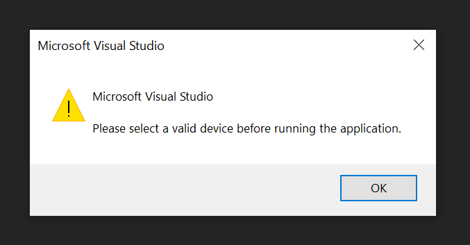
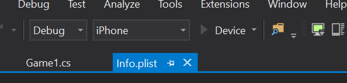
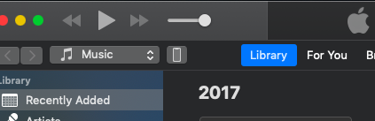
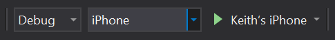
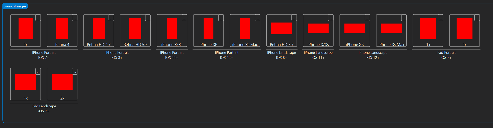
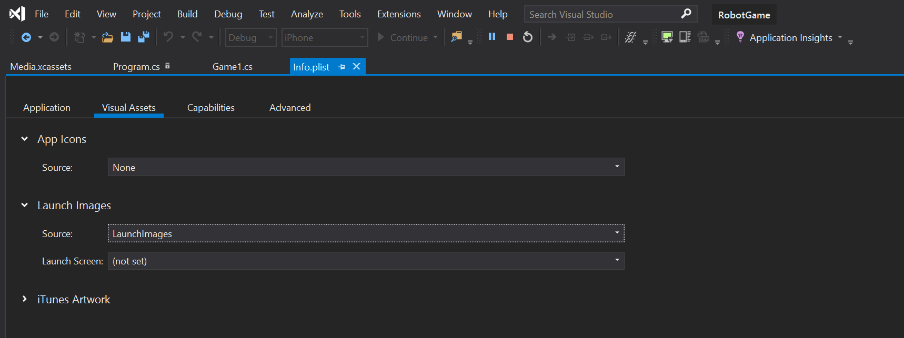
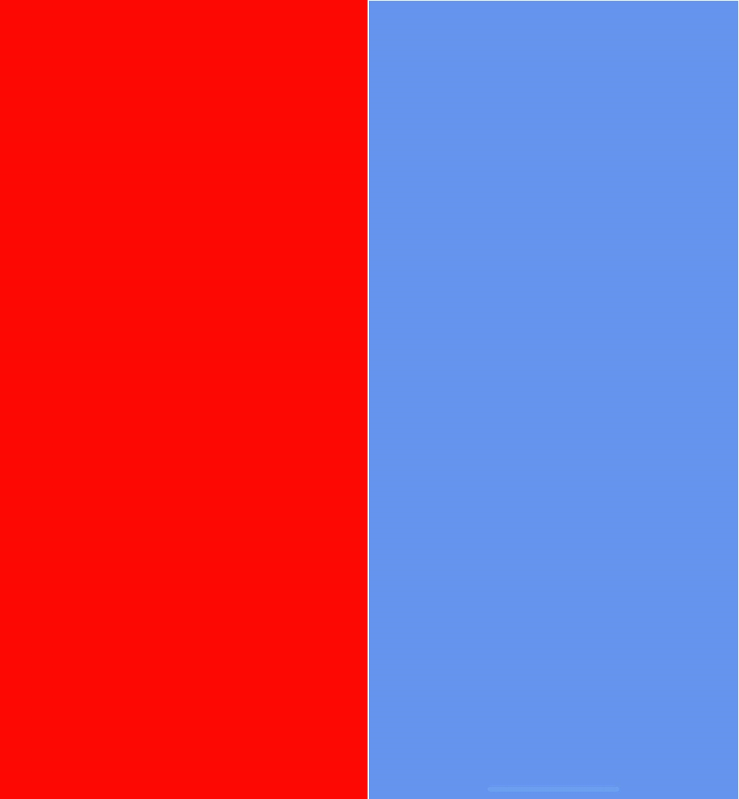

+++
title = "Day73 - Visual Studio iOS Debug Debugging"
description = "Working out the kinks in the Visual Studio remote iOS debugging"
date = 2019-04-26

[extra]
project = "robot"
+++

Today I spent my time getting rid of black bars on the top and bottom of the
screen of my Monogame app. Along the way I also figured out some gotchas when
remote debugging an iOS app from within Visual Studio.

## Gotcha Number 1

The first issue I ran into was that debugging the app in VS while connected
brought up a "Please Select Valid Device" error.

At first I thought there was a version mismatch between my VS install, and the
version of XCode and VS on the mac. An hour of wasted time later with everything
updated and still nothing working I took a step back and looked up some
tutorials. At this point I noticed that all of the tutorials showed the debug
button with the actual device name rather than the generic "device".

Some further investigation later, and I figured out how to guarantee VS
recognizes the correct debug target. It turns out my device wasn't properly
connected to the Mac. I discovered that iTunes is a reliable way to figure out
whether the connection is successful. There is a device button which only shows
up in iTunes when an iPhone is connected.

Once that icon shows up, and VS is properly connected, the device name will
change to the name of whatever device is connected. At this point debugging
should usually succeed.

## Gotcha Number 2

VS has a feature that enables automatic provisioning of devices. Normally this
works fine, but a number of times during my fiddling about VS would get stuck on
the automatic provisioning step. In practice I found the only easy way to
prevent this was to restart both VS and the Mac. After restart, I was able to
provision and debug properly.

## Gotcha Number 3

When debugging and running the default Monogame iOS application there are giant
black bars above and below the screen.

Again a bunch of frustrating stumbling around later, and I ran into [this Stack
Overflow
post](https://stackoverflow.com/questions/12395200/how-to-develop-or-migrate-apps-for-iphone-5-screen-resolution)
pointing me to the startup image as how iOS decides what resolution to render
at. Apparently if the app doesn't have all of the intro sizes, then the app will
render at the most compatible resolution.

Luckily fixing this issue was pretty easy. VS has an editor for iOS app Asset
Catalogs and has a default category called Launch Images. I created red images
of all 15 of the required sizes just as temporary assets for a quick fix.

Then in the `Info.plist` editor I set the Launch Images property to point to
Launch Images instead of None.

Then rebuilding and debugging on the device I was presented with a nice full
screen red launch image and blue default game.

## Summary

Much of this work is pretty frustrating because it just involves stumbling about
googling things until I can figure out what works. Writing them down here means
I will always have it as a resource though, so I wont have to do this work
again. Its actually kind of satisfying to understand all the quirks of a system
because now I can get on with the actually interesting work.

Till tomorrow,  
Kaylee
