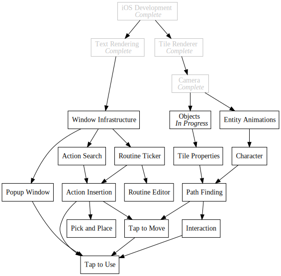

+++
title = "Day79 - Nyx8 Colors and Wall Sprite"
description = "Swapped colors out for a different color scheme and made a new wall texture"
date = 2019-05-10

[extra]
project = "robot"
+++

Super quick day today. I spent it swapping the colors that I had been using for
dev art out for the palette used by SCRIPT-8 called Nyx8. I found the old
palette to be pretty, but caused me problems because it didn't have enough
shades to play with in a single gradient. Nyx8 on the other hand is just one big
gradient, and as an added benefit, I have used it before, so I'm pretty familiar
with how it works.

The updated tiles are as follows:

I created a new texture for use as a wall to enable some visual barriers when I
get to implementing pathfinding. I also updated the colors utility class to have
a single array lookup with each of the palette colors for easy programatic use.


public class Colors {
    public readonly IReadOnlyList<Color> Lookup = new[] {
        new Color(8, 20, 30),
        new Color(15, 42, 63),
        new Color(32, 57, 63),
        new Color(78, 73, 95),
        new Color(129, 98, 113),
        new Color(153, 117, 119),
        new Color(195, 163, 138),
        new Color(246, 214, 189)
    };
}


Here is a full render with all the textures and such:

Frustratingly my current method for rendering sprites into the isometric grid
occasionally has small artifacts around the edges because the texture doesn't
line up perfectly. I have yet to come up with a solution for this but I suspect
it may require me to implement my own sprite rendering system instead of reusing
the SpriteBatch. Unclear for now. 

Small post today as I am super slow when it comes to doing dev art. Hopefully I
have finished the necessary blockers at this point though so that I can move on
to pathfinding for real next time.

Till tomorrow,  
Keith
