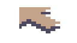
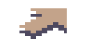
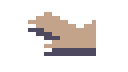
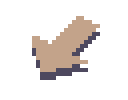
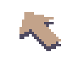
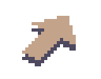
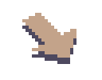

+++
title = "Day82 - Refactored Entity Rendering and Arrow Sprites"
description = "Changed entity rendering to use a grid and drew arrow textures"
date = 2019-05-17

[extra]
project = "robot"
+++

Today and yesterday I spent some time doing miscellaneous tasks to get ready for
path finding. I refactored the entity rendering and storage code to use a two
dimensional grid for easier lookup, I allowed multiple drawables to draw using
the same sort order context, and I drew arrow sprites to make a pretty animation
once the pathfinding code is done.

## Entity Refactor

Up until now I have stored the entities to be drawn on the terrain in a list
which I loop over and render one by one. This works great if I don't care about
looking up a particular entity at a given location, but falls down once location
actually matters. To get around this I refactored to use the same data structure
and layout as the map tiles: An array of arrays indexed by x and y coordinate.

First step was to initialize the arrays in the same place I initialized the
terrain map.


TileMap = new (Tiles, int)[heightMap.Length - 1][];
EntityMap = new Tiles?[heightMap.Length - 1][];
for (int x = 0; x < TileMap.Length; x++) {
    TileMap[x] = new (Tiles, int)[heightMap[x].Length - 1];
    EntityMap[x] = new Tiles?[heightMap[x].Length - 1];
    for (int y = 0; y < TileMap[x].Length; y++) {
        ...
    }
}


I then modify the entity creation code to check the entity location for an
existing entity before storing it in the array.


for (int i = 0; i < 10; i++) {
  int x = random.Next(Width - 1);
  int y = random.Next(Height - 1);

  if (TileMap[x][y].tile == Tiles.Flat && EntityMap[x][y] == null) {
      Tiles tile = random.Next(2) == 1 ? Tiles.Tree : Tiles.Wall;
      EntityMap[x][y] = tile;
  }
}

while (true) {
  int x = random.Next(Width - 1);
  int y = random.Next(Height - 1);
  if (TileMap[x][y].tile == Tiles.Flat && EntityMap[x][y] == null) {
      EntityMap[x][y] = Tiles.Ball;
      BallPosition = new Vector2(x, y);
      break;
  }
}


Finally I slightly modified the map rendering code to just render the entity at
each location if it exists.


for (int x = 0; x < mapManager.TileMap.Length; x++) {
    var mapColumn = mapManager.TileMap[x];
    var entityColumn = mapManager.EntityMap[x];
    for (int y = 0; y < mapColumn.Length; y++) {
        (Tiles tile, int height) = mapColumn[y];
        Vector3 position = new Vector3(x, y, height);
        DrawTile(tile, position);
        Tiles? entityTile = entityColumn[y];
        if (entityTile != null) {
            DrawTile(entityTile.Value, position, 2);
        }
    }
}


## Layer Merging

In anticipation for rendering entity paths, I worked on enabling merging of tile
renders between drawables. In the current system, each drawable is rendered
using it's own draw call from the SpriteBatch. This lets me draw each drawable
on a separate layer. Unfortunately this requires all elements drawn together to
be drawn by the same drawable. To fix this I grouped drawables by their
`DrawOrder` and only created a draw call per grouping instead of per drawable.
This should let me draw paths using a dedicated path finding module keeping
concerns separate.


foreach (IGrouping<int, IDrawable> drawablesLayer in drawables.GroupBy(drawable => drawable.DrawOrder)) {
    spriteBatch.Begin(samplerState: SamplerState.PointClamp, sortMode: SpriteSortMode.FrontToBack);
    foreach (IDrawable drawable in drawablesLayer) {
        drawable.Draw(gameTime);
    }
    spriteBatch.End();
}


## Arrows

I spent the rest of my time drawing arrow sprites. I drew each of the cardinal
directions as well as up and down each of the diagonal slopes. I decided to
disable walking sideways along slopes and walking down or up the vertical slope
since the animation would be tricky.

Cardinal Flat Arrows:

Slope Arrows:

Thats it for today. I'm hoping that at this point I have finished all of the
prerequisites for pathfinding so I can finally do it next time. We'll see.

Till tomorrow,  
Kaylee
