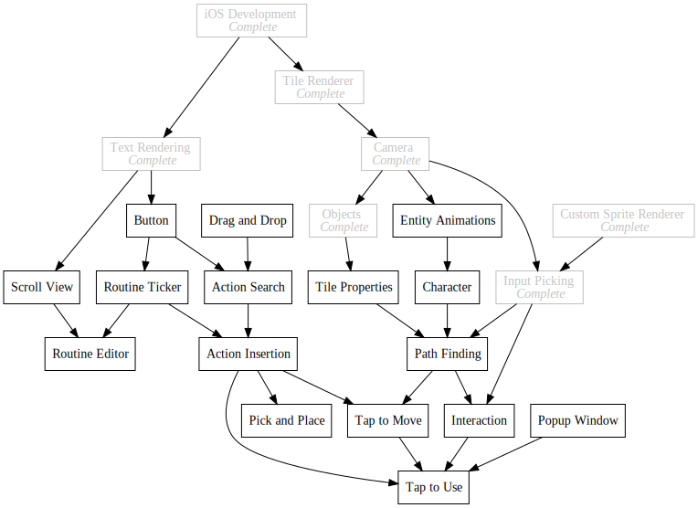
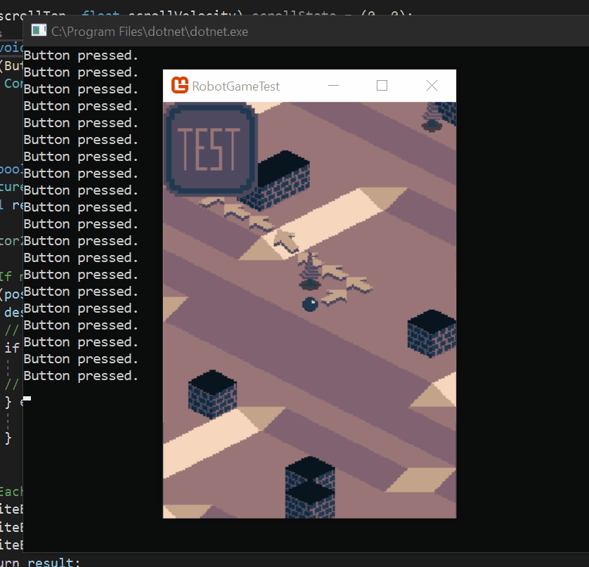
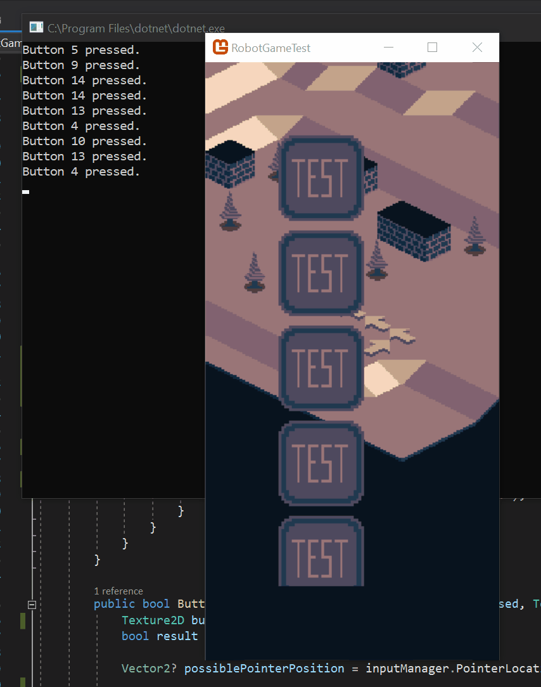

+++
title = "Day84 - Immediate Mode GUI Take 1"
description = "My first attempt at an immediate mode gui system"
date = 2019-06-02

[extra]
project = "robot"
+++

Recently I have been thinking about and working on a gui library for my game.
Since Monogame doesn't have any real gui library functionality, and I need my
game to be as portable as possible, I have to come up with a custom solution
from scratch. In my research about common strategies for custom gui, I came
across Imgui frameworks which are a family of gui toolkits which take an
immediate mode approach.

The basic idea is that instead of building an object hierarchy which is
preserved between frames, you call specialized functions in a stateless way
which draw parts of the UI on demand. This makes reasoning about the system much
simpler since it's pretty much just an imperative algorithm. It incidentally
makes it easier to build as well since you don't need a whole object hierarchy
of classes.

I have completed two controls as my first attempt to get a better understanding
of the design space: A button, and a scroll view. These test some key parts of
the problem space, namely UI control picking and physics based scrolling, while
still being simple enough to implement quickly.

## Button

I decided to implement the button as a function which takes a desired position
rectangle, a pressed textured, and an unpressed texture and returns a boolean
indicating whether the button has just been clicked.


public bool Button(Rectangle destination, Texture2D unpressed, Texture2D pressed) {
    Texture2D buttonTexture = unpressed;
    bool result = false;

    Vector2? possiblePointerPosition = inputManager.PointerLocation;

    // If mouse position exists, is within the current cut location, and within the bounds of the button
    if (possiblePointerPosition.HasValue && graphicsDevice.ScissorRectangle.Contains(possiblePointerPosition.Value) && 
        destination.Contains(possiblePointerPosition.Value - inputOffset))  {
        // Pointer down should change the button texture to pressed
        if (inputManager.PointerDown) {
            buttonTexture = pressed;
        // If the button is released within bounds of the button, then return a value of true
        } else if (inputManager.PointerReleased) {
            result = true;
        }
    }

    // Each button must be rendered with it's own draw call so that scissor and graphics settings apply properly
    spriteBatch.Begin(samplerState: SamplerState.PointClamp, rasterizerState: new RasterizerState() { ScissorTestEnable = true });
    spriteBatch.Draw(buttonTexture, destination, Color.White);
    spriteBatch.End();
    return result;
}


The function is pretty simple, I check if the mouse is on screen, within the
clipping bounds (I'll explain this in the scroll view), and within the bounds of
the button. If it is and the mouse is currently held down, I draw the Pressed
texture, and if it has just been released, I return true. Finally I use the
spritebatch to draw the correct texture at the desired location.

Since this function returns a boolean, using it is incredibly simple. I wrap the
function call in an if statement which gets called if the button was just
clicked.


public void Draw(GameTime gameTime) {
    if (Button(new Rectangle(0, 0, 90, 90), buttonUnpressed, buttonPressed)) {
        Console.WriteLine($"Button pressed.");
    }
}


Which yields this gif:

## Scroll View

Building the scroll view is a bit more complicated since it must have a period
of time when it effects gui calls and then undo afterward. To achieve this I use
the `IDisposable` interface to build scroll view blocks with the `using`
statement. The basic idea is to create a special purpose disposable object which
when disposed does some arbitrary cleanup code.


public class AnonymousDisposable : IDisposable {
    private Action onDisposed;

    public AnonymousDisposable(Action onDisposed) {
        this.onDisposed = onDisposed;
    }

    public void Dispose() {
        onDisposed?.Invoke();
        onDisposed = null;
    }
}


I then use this pattern in the scroll view function to return state to normal
after the scroll view is finished.


public IDisposable VerticalScrollView(Rectangle scrollArea, float scrollHeight, ref (float scrollTop, float scrollVelocity) state) {
    // Either reduce the velocity by friction, or set the velocity to the mouse velocity to keep the scroll view attached to the mouse
    float velocity = state.scrollVelocity;
    if (inputManager.PreviousLocation.HasValue && inputManager.PressedLocation.HasValue && scrollArea.Contains(inputManager.PressedLocation.Value)) {
        velocity = inputManager.PointerLocation.Value.Y - inputManager.PreviousLocation.Value.Y;
    } else {
        velocity = velocity * 0.9f;
    }

    // Keep the scroll position bounded
    float scrollTop = state.scrollTop - velocity;
    if (scrollTop < 0) scrollTop = 0;
    if (scrollTop >= scrollHeight - scrollArea.Height) scrollTop = scrollHeight - scrollArea.Height;
    state = (scrollTop, velocity);

    // Store the old viewport and scissor rectangle
    Viewport oldViewport = graphicsDevice.Viewport;
    graphicsDevice.Viewport = new Viewport(new Rectangle(scrollArea.X, (int)(scrollArea.Y - state.scrollTop), scrollArea.Width, (int)scrollHeight));
    Rectangle oldScissor = graphicsDevice.ScissorRectangle;
    graphicsDevice.ScissorRectangle = scrollArea;

    // Calculate the viewport offset to enable correct mouse picking
    Vector2 offset = new Vector2(graphicsDevice.Viewport.X, graphicsDevice.Viewport.Y);
    inputOffset += offset;

    // Retore the old viewport and scissor rectangle back to the original settings
    return new AnonymousDisposable(() => {
        graphicsDevice.Viewport = oldViewport;
        graphicsDevice.ScissorRectangle = oldScissor;
        inputOffset -= offset;
    });
}


The scroll view doesn't actually draw anything itself, but instead sets
properties on the graphics device which translates any objects drawn and clips
them to the scroll view bounds. The other important piece is that none of these
functions can store any state directly, so when I need to preserve information
between frames, I have to take the state as reference arguments.

In particular, the `Viewport` is used to translate any subsequent draw calls
with the scroll offset, and the `ScissorRectangle` is used to clip the draw
calls to the scroll bounds.

The scroll view starts out by updating the passed in velocity state, I then keep
the scroll position bounded properly, and store the current graphics card state
while setting the `Viewport` and `ScissorRectangle`. Finally I return an anonymous
disposable which resets the graphics card state on dispose.

Using the scroll view is pretty simple, I call `VerticalScrollView` as the
argument to a `using` statement and then call other gui functions inside as
though they are being drawn on a new canvas. The scroll view then handles all of
the clipping and translating for me.


(float scrollTop, float scrollVelocity) scrollState = (0, 0);
public void Draw(GameTime gameTime) {
    var scrollArea = new Rectangle((int)(game.PixelWidth * 0.25), (int)(game.PixelWidth * 0.25), (int)(game.PixelWidth * 0.5), (int)(game.PixelHeight - game.PixelWidth * 0.5));

    int buttonCount = 20;
    using (VerticalScrollView(scrollArea, 100 * buttonCount - 10, ref scrollState)) {
        for (int i = 0; i < buttonCount; i++) {
            if (Button(new Rectangle(0, i * 100, 90, 90), buttonUnpressed, buttonPressed)) {
                Console.WriteLine($"Button {i + 1} pressed.");
            }
        }
    }
}


Here you can see the state variable passed in as a reference, and the usage of a
using statement to specify what gui calls should be grouped in the scroll view.
The resulting gui looks like this:

## Thoughts

Immediate mode gui wise, I have mixed feelings, I think for simple stuff this
pattern works great, and lets me get good results rapidly. However for more
complex things such as drag and drop interfaces and the like, things could get
much more difficult and the limitations will get more severe. Forcing all gui
patterns into simple language features may get harder, and in keeping the
interface ergonomic may impossible.

Already, I had to make some compromises such as requiring the entire scroll view
height to be passed to the scroll view function instead of somehow calculating
it ahead of time. To combat these issues I think I will rework these to build a
list of "draw calls" in the gui functions which get stored in a queue, and then
add a Draw function which renders all of the draw calls to the screen. This
should allow me to play some more complicated tricks to keep the ergonomics
clean and give me more flexibility longer term.

As far as the blog goes, I've been struggling to do daily posts as evidenced by
my hiatus. I've had a lull in motivation which has made things harder and when
combined with ongoing planning and work for my upcoming wedding (!!!) its gotten
pretty difficult. I'm going to still try to get posts out on a regular basis,
but things might continue to be bumpy till after my wedding and honeymoon.

Till next time,
Keith
