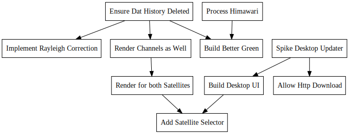

+++
title = "Day86 - Live Satellite Feed"
description = "Using Azure Server to Process Satellite Data"
date = 2019-10-19

[extra]
project = "rusty-marble"
+++

# A cosmic rabbit hole

A new project today. Well not actually new, I've been working on it for about a week or two, but new enough! About a
week or so ago I saw [this tweet](https://twitter.com/tylerhall/status/1181343024900722688) pointing to a Mac app which
updates your desktop background to the current view from one of the three current true color satellites: GOES-East,
GOES-West, and Himawari. Much to my disappointment the app does not currently have a windows version.

Further after some more looking and research, I discovered that the imagery used by the app is the so called GeoColor
images developed by the Cooperative Institute for Research in the Atmosphere (CIRA) and the Regional and Mesoscale
Meteorology Branch (RAMMB).

This imagery was developed primarily for weather forecasting purposes, so during the night when the earth is hardly
visible in the normal spectrums, the system draws a precomputed "night lights" view with infrared data to display
clouds. In my opinion this leaves a lot to be desired as the cloud data looks extra artificial and the purple is pretty
unrealistic. On top of that country and state lines are overlayed both during the day and night ruining the illusion of
realistic satellite imagery further.

Luckily I discovered that the raw data from the satellites are uploaded every 10 minutes or so to an AWS S3 bucket
[here](https://registry.opendata.aws/noaa-goes/). This data contains all of the raw imagery from the satellite imager.
This adds some extra complication however as the imager does not combine the data into normal image formats, but instead
publishes the data as netcdf files which I'm told is a common research format. To make matters worse, neither of the
current GOES satellites (16 and 17) have true color capability. They have imagers for the red and blue wavelengths, but
do not have a green channel. Instead they have a near infrared channel called "veggie" which is supposed to reflect
highly in chlorophyll.

The GeoColor images get around this limitation by using a precomputed lookup from all of the common channels in the GOES
and Himawari satellite (the Japanese geosynchronous satellite) which does have a visible green light channel. For my
purposes I used a [simple
hack](https://github.com/Kethku/RustyMarble/blob/302d80b393288dd8143c6bcaf94d778b0402518f/src/main.rs#L119) which
linearly combines the red blue and veggies channels into a fake green channel that does good enough. As shown below, the
images are pretty stunning.

# Azure

Although I now had a clean method for converting the raw data into pretty images, I wasn't out of the woods yet. I now
faced the problem of how to get the data to my machine, and convert it without hitting my data caps from Comcast. Turns
out each of the raw data bundles is about 300mb in size, so if I were to download the full data bundle every 10 minutes
for the entire month, I would blow through my data cap from that alone. Luckily, being an employee at Microsoft, I am
given a certain amount of Azure server credit and after a quick googl-I mean bing search I discovered that Azure servers
don't have a data download limit.

With this information in hand I set about creating a simple server which would download the most recent AWS data,
process it into an image, and rehost that image as a DAT archive so that others could download it without breaking the
bank. As of today the dat address is dat://3663c8db9286a28139c54918443d83e807817064129b74af938937e221f1ad13/current.jpg.
The code I am currently running on the server can be found in the [github repo](https://github.com/Kethku/RustyMarble).

# Next Steps

Its pretty functional at the moment, but there's still a bunch to do. I would like to build a desktop app which auto
fetches the most recent image from the dat archive and sets it as the desktop background. Further, I would like to play
around with the post processing some more. It would be interesting to build in Rayleigh scattering correction to make
the colors more accurate, or even do a similar color lookup to what the Geocolor images use. I have also contacted the
original author of the Downlink app that started me down this rabbit hole with the hope that maybe he would find the
images I am producing useful.

In general I believe I have been successful with my original goal. Now its time to just push it the rest of the way.

Till tomorrow!

Keith

