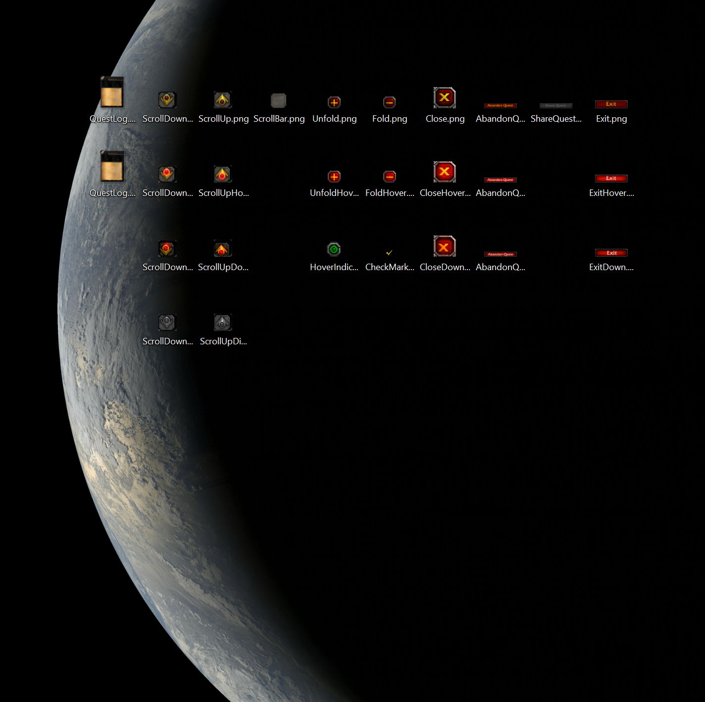

+++
title = "Day87 - Desktop Updater"
description = "The terrifying power of JS"
date = 2019-10-20

[extra]
project = "rusty-marble"
+++

Today I worked on the desktop updater script which will take a url to an image and an update frequency and set the image
from that url as your desktop background at the specified frequency. To achieve this, I used JavaScript. Not because I'm
overly fond of the language, but because it meant I could take advantage of it's secret super power.

## The Secret Power of JavaScript

I think its easy to see JS as a language that is only used when you absolutely have to deploy some app to the web. Its a
necessary evil, but is the path of least resistance inside a browser. I would like to suggest that this is not the only
reason to use JS. JS has more users than any other language and as a result it has more coverage than any other
language. This leads to some very strange effects. Give me a simple task and I can show you a package which does that
task to a fault.

As an example, a desktop updater script which takes a URL to an image, parses a frequency written in natural language,
and sets it to the desktop background is possible in every language. However I would be hard pressed to find a language
which could do it simpler and more understandably than Javascript with npm packages.


const juration = require('juration');
const http = require('http');
const fs = require('fs');
const wallpaper = require('wallpaper');

const argv = require('yargs')
  .option('url', {
    alias: 'u',
    type: 'string',
    description: 'Url to fetch an image from'
  })
  .option('frequency', {
    alias: 'f',
    type: 'string',
    description: 'The frequency with which to fetch the image'
  })
  .demandOption(['url', 'frequency'])
  .argv;

let duration = juration.parse(argv.frequency) * 1000;

console.log("Updating every " + duration / 1000 + " seconds");

function downloadAndUpdate() {
  const file = fs.createWriteStream("file.jpg");
  http.get(argv.url, function(response) {
    response.pipe(file);
    file.on('finish', function() {
      file.close(function () {
        wallpaper.set('file.jpg');
      });
    })
  });
}

downloadAndUpdate();

setInterval(downloadAndUpdate, duration);


The entire script is above. I use 3 external packages and 2 node modules.

1. Juration: which parses natural text descriptions of time spans
2. wallpaper: which sets the desktop background to a given image
3. yargs: which parses command arguments with a fluent api
4. fs: which manages writing files
5. http: which fetches data from the internet

With these packages doing the heavy lifting, JS is free to act as a flexible glue to move data around and write to the
console. JavaScript's main super power is write once, run everywhere. Its secret power is the package system. It took
what might have taken me all day and turned it into a simple 20 minute exercise.

## The Script

I'm using this script to pull from my Azure server which processes GOES satellite data into real color and real time
images. When I use
[http://rustymarble.eastus.cloudapp.azure.com:8080/current.jpg](http://rustymarble.eastus.cloudapp.azure.com:8080/current.jpg)
as the url passed to the script and write "10 min" as the frequency argument, it pulls the satellite data automatically
so that I always have a live view of the planet.

(You can see image assets I pulled from the WoW quest log on my desktop. Some day soon I may turn it into a project.
We'll see)

Till tomorrow,  
Keith
