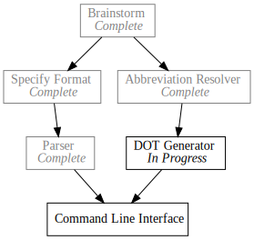

+++
title = "Day9 - Pando Generator"
description = "Generating DOT files"
date = 2019-02-15

[extra]
project = "pando"
+++

Todo I finished the generator code in Pando for the DOT files. Don't have a lot
of time today, so I will just jump right into the changes.

Code generation is much simpler than parsing, but in general a similar approach
works well. I build up generators for the individual components of the file
format and compose them into larger and larger parts.

## Node Definitions

The smallest portion of the file DOT file format is the formatting information
for each node in the graph. In our case I have 3 formats, one for each of the
task statuses I support.


pub fn generate_task_formatting(task: &Todo) -> String {
    match task.status {
        TaskStatus::Completed =>
            format!("<{}   <i>Complete</i>>, color=\"gray\"", task.identifier),
        TaskStatus::InProgress =>
            format!("<{}   <i>In Progress</i>>", task.identifier),
        TaskStatus::Waiting =>
            format!("<{}>", task.identifier)
    }
}


I use the `format!` macro to provide the unchanging structure, and fill in the
name for each of the status options. I then wrap the formatting into a full
statement like so:


pub fn generate_task_definition(task: &Todo) -> String {
    format!("{}[label={}];", generate_identifier_variable(&task.identifier), generate_task_formatting(task))
}


Each node definition has an identifier and the formatting. I create the
identifier by removing the spaces from the task name.


pub fn generate_identifier_variable(identifier: &String) -> String {
    identifier.replace(" ", "")
}


Note even though this is a very small method, I still pulled it out in case the
identifier variable needed to change for whatever reason. By pulling this code
into it's own section I am able to change all of the instances in one place.

Finally we can build the entire definition list like so:


pub fn generate_definitions(tasks: &Vec<Todo>) -> String {
    let definition_entries: Vec<String> = tasks
        .iter()
        .map(generate_task_definition)
        .collect();
    definition_entries.join("\n  ")
}


I needed to use an intermediate variable with a type declaration so that
`collect` would know what type to collect into. Then the job becomes joining the
lines together and adding some indentation for cleanliness.

## Dependencies

Most of the hard work was finished yesterday with the abbreviation resolution.
All that is left is to simply render the data structure out. I start with a
utility for rendering a list of dependencies with optional braces if there are
more than one.


pub fn generate_dependency_list(deps: Vec<String>) -> Option<String> {
    let dep_variables: Vec<String> = deps
        .iter()
        .map(generate_identifier_variable)
        .collect();

    match dep_variables.len() {
        0 => None,
        1 => Some(dep_variables.first().unwrap().to_string()),
        _ => Some(format!("{{ {} }}", dep_variables.join(" ")))
    }
}


Again, I had to use an intermediate variable to help `collect` along. I also
convert each of the identifier strings in the input list to variable formats. A
simple match on the length of the input list does the trick and I use an option
to communicate back up the call stack when to write the line or not.


pub fn generate_dependencies(tasks: &Vec<Todo>) -> Option<String> {
    let dependent_task_lookup = resolve_dependent_tasks(&tasks)?;
    let entries: Vec<String> = tasks.iter().filter_map(|task| {
        let dependent_tasks = dependent_task_lookup[&task.identifier].clone();
        let task_variable = generate_identifier_variable(&task.identifier);
        generate_dependency_list(dependent_tasks)
            .map(|deps| format!("{} -> {};", task_variable, deps))
    }).collect();

    Some(entries.join("\n  "))
}


To wrap up the dependencies I build the dependent task lookup from the
abbreviation resolver, and use `filter_map` to only output the entries with have
dependent tasks. Finally I join the lines similar to the definition generator.

An option is still returned at this point in case the abbreviation resolver
finds an error.

## Putting it All Together

Connecting each of the pieces is just a matter of writing the surrounding goo
for the DOT format, and filling in the definitions and dependencies.


pub fn generate_dot_file(tasks: Vec<Todo>) -> Option<String> {
    let definitions = generate_definitions(&tasks);
    let dependencies = generate_dependencies(&tasks)?;

    Some(format!(
"digraph {{
  node [shape=record, splines=\"curve\"];
  {}

  {}
}}", definitions, dependencies))
}


As shown by the test, the code works as expected and generate the DOT format
outlined in [day4](../day4-pando/).


#[test]
fn generator_dot_file_works() {
    let generated = generate_dot_file(vec![
        Todo::new(TaskStatus::Completed, "Brainstorm", vec![]),
        Todo::new(TaskStatus::InProgress, "Specify Format", vec!["B"]),
        Todo::new(TaskStatus::Waiting, "Implement Parser", vec!["SF"]),
        Todo::new(TaskStatus::Waiting, "DOT Generator", vec!["B"]),
        Todo::new(TaskStatus::Waiting, "Command Line", vec!["IP", "DG"])
    ]);

    let expected = Some("digraph {
  node [shape=record, splines=\"curve\"];
  Brainstorm[label=<Brainstorm   <i>Complete</i>>, color=\"gray\"];
  SpecifyFormat[label=<Specify Format   <i>In Progress</i>>];
  ImplementParser[label=<Implement Parser>];
  DOTGenerator[label=<DOT Generator>];
  CommandLine[label=<Command Line>];

  Brainstorm -> { SpecifyFormat DOTGenerator };
  SpecifyFormat -> ImplementParser;
  ImplementParser -> CommandLine;
  DOTGenerator -> CommandLine;
}".to_string());

    assert_eq!(generated, expected);
}


Using `format!` for code generation greatly simplifies things and makes the code
structure very intuitive. I did find myself wishing for a more full featured
string interpolation feature, but this worked in a pinch.

All that's left for Pando V1 is to connect all of the pieces and build a
command line interface. Almost there!

Till tomorrow,  
Keith
