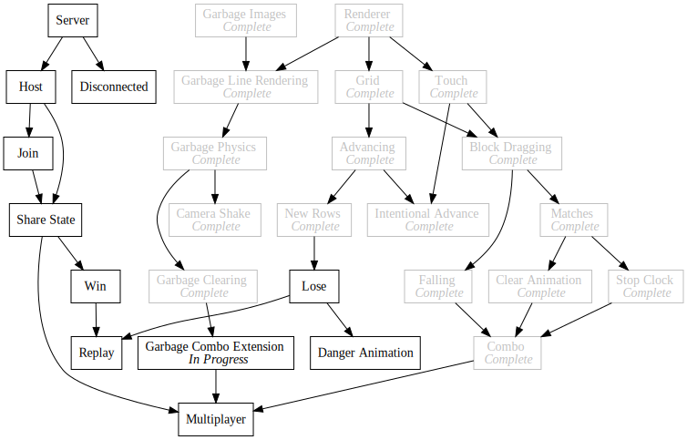
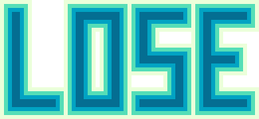

+++
title = "Day91 - Lose Screen Progress"
description = "Spent too long on a lose screen graphic"
date = 2019-10-24

[extra]
project = "ta"
+++

Today I spent way too much time building a win and lose screen graphic for the tetris attack remake:

Luckily I also spent a slightly less amount of time working on some infrastructure to enable screens in the game engine
I have written for the TA clone. My approach is inspired by the one described by the youtube channel [Lazy
Devs](https://www.youtube.com/channel/UCdT68dsulMFouI2InvXWM5w/videos). In their roguelike tutorial they switch screens
by swapping out the draw and update functions. I think this is an awesome premise and is not far from my event based
update and draw systems already.


import * as baseScreen from "./events";
import * as playScreen from "./play";

interface IScreen {
  Update: EventManager<[number]>;
  Draw: EventManager<[number]>;
}

export let currentScreen: IScreen = playScreen;

let frames = 0;
function loop() {
  frames++;

  baseScreen.Update.Publish(frames);
  currentScreen.Update.Publish(frames);
  currentScreen.Draw.Publish(frames);
  baseScreen.Draw.Publish(frames);
  window.requestAnimationFrame(loop);
}

async function start()  {
  await Promise.all(baseScreen.Setup.Publish());
  playScreen.Setup.Publish();
  window.requestAnimationFrame(loop);
}
start();


I define a Screen interface which is any object with Update and Draw events, which I then call in the animation loop. I
use a base screen to handle events which should run regardless of which screen is set to the current screen. Then I can
swap out the current screen to change the render and update code.

My first test of this is only partially done, but will eventually be used as the game over screen to show the user
whether they Won or Lost.


import { EventManager } from "./eventManager";
import { Vector } from "./math";
import { screenSize } from "./renderer/webgl";
import { image } from "./renderer/graphics";
import { Lose, LoseWidthOverHeight, Win, WinWidthOverHeight } from "./renderer/images";

import { Draw as gameDraw } from "./play/events";

let imageToDraw: string;
let widthOverHeight: number;

export const Draw = new EventManager<[number]>();
export const Update = new EventManager<[number]>();

export function Init(lose: boolean) {
  if (lose) {
    imageToDraw = Lose;
    widthOverHeight = LoseWidthOverHeight;
  } else {
    imageToDraw = Win;
    widthOverHeight = WinWidthOverHeight;
  }
}

Draw.Subscribe(gameDraw.Publish.bind(gameDraw));

Draw.Subscribe(() => {
  let width = screenSize.width * 0.75;
  image({
    imageUrl: imageToDraw,
    position: screenSize.divide(2),
    dimensions: new Vector(width, width / widthOverHeight)
  });
});


Here is the entire code. Importantly it renders it's own image to the screen but also subscribes to the draw call for
the play screen so that the board state is rendered behind the win graphic. I'm hopefull that tricks like this will keep
things simple while still being flexible enough to play tricks like above to make it look nice and be cohesive.

Thats it for today. Got a lot done, but its super late, so I'll try to finish the game over experience in the next day
or two.

Till tomorrow,  
Kaylee
