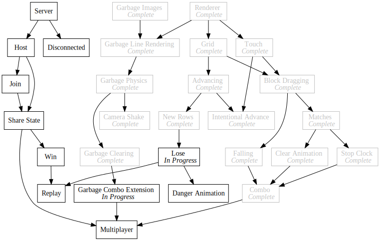

+++
title = "Day92 - Lose Screen"
description = "Danger animation and lose screen"
date = 2019-10-25

[extra]
project = "ta"
+++

Today I worked on the game over screen in my Tetris Attack clone. I built upon the work I layed out yesterday to enable
multiple screens, and I created a danger animation for blocks about to move off the top of the screen. The screen
management code was largely covered yesterday, so today I will talk about the danger animation I built.

## The Flicker

The flickering block effect is simply a manipulation of the tint of each block in columns which are about to move off
the screen. I build this effect by adding a Sin wave based on the current frame count to the tint color. By fiddling
with the scale of the frame count value, I can effect the speed of the flicker, and by multiplying the result by some
value, I can configure the brightness differenctial from the darkest level to the brightest.


  calculateColor(centerY: number, frame: number, dangerColumns: Set<number>) {
    if (this.state === BlockState.Matched) {
      return new Color(1.5, 1.5, 1.5, 1);
      ...
      ...
      ...
    } else if (isInLosingPosition() && dangerColumns.has(this.gridSlot.x)) {
      return Color.gray;
    } else if (dangerColumns.has(this.gridSlot.x)) {
      let gray = 1 + Math.sin(frame / 5) / 4;
      return new Color(gray, gray, gray);
    } else {
      return Color.white;
    }
  }


The added bits are the 3 last clauses of the if else statement in my calculate color function for blocks. I calculate
the danger columns by looping over every block and checking the y position. This gets passed to every block render
function and by extension every calculate color function.

Since the frame value increments every frame (obviously) I can divide it by some constant value to get a smoother number
which slowly increases. Also since the Sin function moves from negative one to positive one, I can tell that 
`Sin(frame / 5) / 4` will go from -0.25 to 0.25 and adding 1 will result in 0.75 to 1.25 which is right where I want it. 
This means the animation will move smoothly from slightly darker to slightly brighter than normal.

If however any of the columns are in the losing position which means the final count down timer has started, I render
all danger columns as darker than normal. This alerts the player that they are about to lose unless they do something
quickly.

## Next Up

Its very late (again :/) so I'm gonna leave it at that. I have mixed feelings about this strategy for game screens. I'm
concidering introducing react to enable more UI first components and the like and ease interface design. I haven't
decided though as normal web controls are pretty hard to theme to match the pixel art. We'll see.

In any case the game is shaping up. The biggest feature next is to add multiplayer support. I have a bunch of
interesting ideas kicking around, so I'm eager to get going.

Till tomorrow,  
Keith
