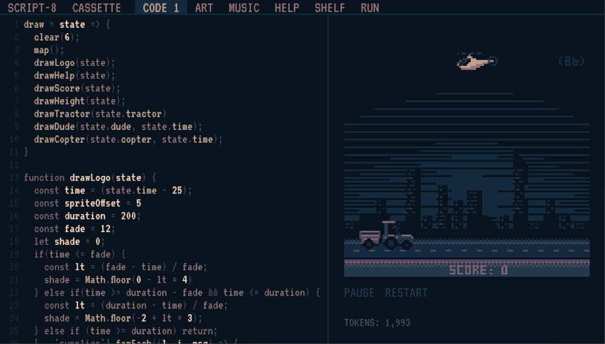

+++
title = "Day95 - Script-8 Learnable Programming"
description = "Adding code hover functionality to script-8"
date = 2019-10-29
+++

The past two days I have been working on a feature for Script-8 that I've been super excited about for a couple of
months now. I got really close yesterday, and decided to push the code further rather than right a blog post for the
day, so today's post counts for two. Some background first, [Script-8](https://script-8.github.io/) is a fantasy console
in the same vein as Pico-8 but uses Javascipt as the programming language and with a strong focus on dynamic and
interactive programming.  All changes are live as you write them, and there are existing features in the app for easily
interacting with your source code and visualizing your program easily through sliders and time travel. I highly
recommend checking it out, and [I](../day7-bomb-survival-demake/) [have](../day11-marching-squares/)
[witten](../day16-script8-pull-requests/) [about](../day20-script-8-crisis/)
[it](../day26-script-8-performance-improvements/) [before](../day30-script-8-framebuffer-renderer/).

The particular feature I have been working on allows for even more powerful visualization of what a given peice of code
actually does. I added code injection which hooks into any function under the mouse and highlights any graphics that
function is responsible for.

As you can see, the graphics brightens visibly for each draw call under the mouse. This makes reading through someone's
code much easier, and allows for simpler debugging of your own code. The above gif highlights this well. The awesome
graphics in Thykka's Supplies game look as though they are just rendered as a single map call, but hovering over the
draw calls individually shows that the sky coloring is actually a mixture of transparent pixels in the map and the
clear color. This wouldn't be obvious without puzzling through the code.

The idea for the feature (as well as much of the coolest features in SCRIPT-8) comes from the brilliant Bret Victor and
his presentations on [Inventing on Principle](https://vimeo.com/36579366) and [Learnable
Programming](http://worrydream.com/LearnableProgramming/). Both are awesome, and I plan on dipping back into their ideas
for future Script-8 features.

## How

I've created a PR with the change which is open and waiting on review and I have tried my best to comment the code as
well as possible. So I will attempt to summarize the comments into a linear story here.

The high level system parses the code in the current tab, looks for CallExpressions which overlap the mouse position,
picks the smallest one under the mouse, and rewrites the expression to set a highlight flag to true before the call, and
reset the highlight flag back to false after the call is finished. This highlight flag is then inspected during the draw
code and the pixel colors are modified accordingly.

## Parse

To do the parsing I lean heavily on the fantastic [Acorn.js](https://github.com/acornjs/acorn) which is a Javascript
parser written in Javascript. It supports modern JS flawlessly and provides a concise and convenient API for selecting a
given type of abstract syntax tree node.


let smallestNode = null
let smallestSize = Infinity
try {
  // Use Acorn to walk over the parsed code looking for each call expression. If the mouse is currently inside
  // the call expression text bounds, and is smaller than the previously smallest node, then store it away
  walk(parse(tab.text, {locations: true}), {
    // Call expression is used because it is pretty consistent.
    // https://github.com/estree/estree/blob/master/es5.md#callexpression
    CallExpression(node) {
      // If the mouse is in bounds, then continue to checking node size
      if (!mousePos.outside &&
          mousePos.line + 1 >= node.loc.start.line &&
          mousePos.line + 1 <= node.loc.end.line &&
          mousePos.ch >= node.loc.start.column &&
          mousePos.ch <= node.loc.end.column) {
        let nodeSize = node.end - node.start
        if (!smallestNode || nodeSize < smallestSize) {
          smallestNode = node
          smallestSize = nodeSize
        }
      }
    }
  })
} catch { }


I pass the current code tab text into the parse command to get back a root node, and then I use Acorn's walk
functionality to loop over all of the CallExpressions. I then check the current mouse text position to see if it is
inside the bounds of the given node, and keep the smallest one that I find. This node is then stored in redux for use
elsewhere.

## Rewrite

Then before sending the code to the game engine to run, I rewrite the CallExpression under the mouse by wrapping it in a
closure, and passing the closure to a helper function which manages the highlight flag. The code here is pretty well
commented, so I will let it do the talking.


// This takes a tab and returns the code from that tab. It also looks at the call expression under the mouse (if one
// exists) and wraps it in the `_script8.injectHighlight` function to setup higlighting. Decorate is taken as an
// argument so that places which do not need decorated code can preserve the code as written by the user.
const decorateTabCode = (tab, decorate) => {
  if (tab.callUnderMouse && tab.text && decorate) {
    // Say the user has written the following code:
    //
    //     drawTitle = () => {
    //       print(64, 64, "Crazy Awesome Game!")
    //       return true
    //     }
    //
    //     if (drawTitle()) { ... do something ... }
    //         ^^^^^^^^^^^
    // With the mouse hovering over the drawTitle call. In this case, the `callUnderMouse` for the current tab would be
    // a callExpression node with a `callee` of the drawTitle Identifier, and an empty arguments list. We can hook into
    // this call by wrapping it in a lambda and passing it to a function which sets the highlight flag before and after
    // making the drawTitle call. In our case we have stored a special `injectHighlight` function in the _script8
    // global variable which is unaccessible by the user. The resulting code for that line looks like this:
    //
    //     if (_script8.injectHighlight(() => drawTitle())) { ... do something ... }
    //
    // Since `injectHighlight` stores and passes on the return value fom the lambda, the wrapped expression can be used
    // in any place the original expression was used. But we get the added benefit of knowing when the command started
    // and when it ended
    let node = tab.callUnderMouse
    let before = tab.text.slice(0, node.start)
    let nodeCode = tab.text.slice(node.start, node.end)
    let after = tab.text.slice(node.end)
    return `${before}_script8.injectHighlight(() => ${nodeCode})${after}`
  }
  return tab.text
};


The injectHighlight function exists in a special global function which is available to the engine, but banned for user
consumption. This makes it the perfect place to place the internal engine specifics. The function itself, sets the
global highlight flag, runs the passed function storing the result in a variable, unsets the global highlight flag, and
returns the stored result. This means that the wrapped expression can be used in the same places as the original
expression as it returns the same values and exists on the same line (which is important to preseve error line numbers).


// This function is used in the hover highlight functionality. It is stored on the user inaccessible _script8 global
// variable and takes as argument a lambda wrapping some user expression. The flag `shouldHighlight` is then set to true
// while the passed in code is running and returned to false when it finishes. `shouldHighlight` is used to modify
// colors while true to indicate to the user how a given function call effects the drawing on the screen
export let shouldHighlight = false
export const injectHighlight = (code) => {
  shouldHighlight  = true
  let result = code()
  shouldHighlight = false
  return result
}


## Highlighting

From here I just modified the color lookup code to take the `shouldHighlight` flag into account and brighten/darken
colors accordingly. Since every draw call depends on the color lookup functions to draw the correct color, I only needed
to hook in in this one place, and everything worked properly.


int(i) {
  let index = i % intLookup.length;
  // `shouldHighlight` is injected in the use code when the current call is under the mouse. If it is true, all colors
  // drawn are brightened by 2 steps if they can be, or darkened by two steps if they are already too bright
  if (shouldHighlight) {
    if (index > 2) index = clamp(+index - 2, 0, 7)
    else index += 2
  }
  return intLookup[index]
}


Thats it! For a relatively complicated feature, I think the overall solution is pretty elegant! Acorn does all the hard
work, and hints at some ways I could add more interesting features in the future. Some I am concidering are:

1. Storing the draw function text coordinates with the draw call itself so that the user could click on the game screen
   and jump to the location of the draw call that last drew in that pixel.
2. Recording argument index under the mouse and exposing it as an API to allow users to build their own specialized
   debug code and to allow the draw calls to render what each parameter does.
3. Sample variable state over the course of runtime to inform the slider feature what bounds to set the slider at.
   Currently it just uses integer values, but it would be cool to enable the feature in more circumstances for more
   precise values

I've enjoyed working on the Script-8 projects, and am excited about how useable and unique the editor experience has
become. Hopefully the trend continues.

Till tomorrow,  
Kaylee
