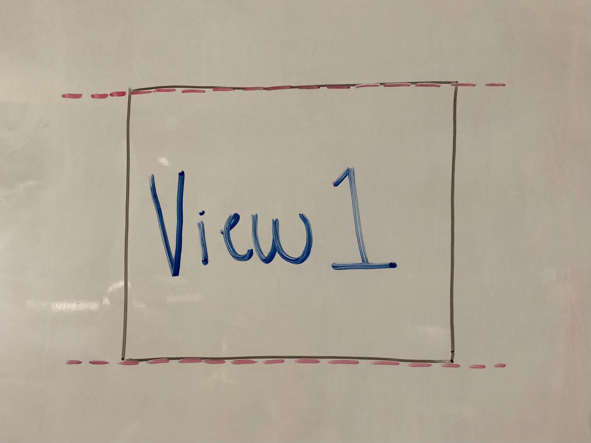
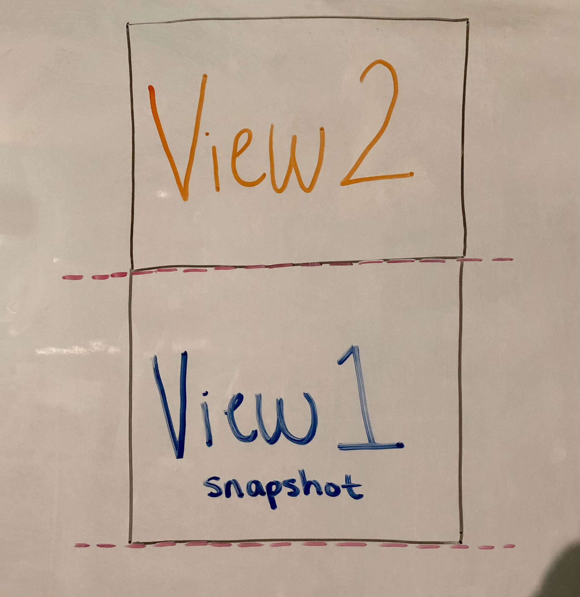
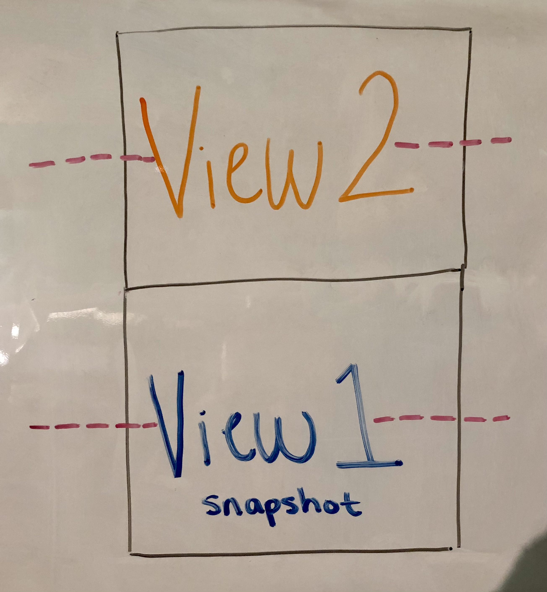
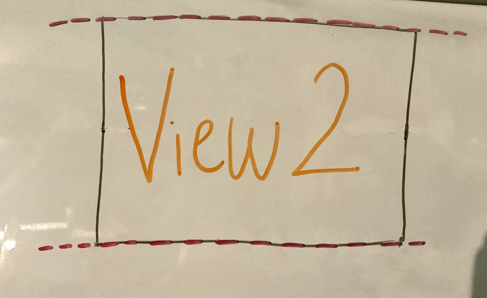

+++
title = "Day96 - Neovide Smooth Scrolling"
description = "Details about a smooth scrolling implementation for neovim GUIs"
date = 2021-01-09

[extra]
project = "neovide"
+++

With the advent of multigrid support in Neovide, I've unlocked the ability to implement a number of fancy new eye candy
features including blurred floating window backgrounds, animated window transitions, and smooth scrolling. Some folks on
twitter have asked for some details about how I implemented the scrolling, and after struggling to describe it
in tweets, I decided to just write a blog post instead.

## Basic Multigrid GUI

Neovim communicates with the attached GUI using a msgpack-rpc protocol and with the multigrid extension enabled, draw commands
are sent to each vim window separately. A basic implementation of a GUI for this setup would store a draw surface for
each window and update that draw surface with render commands as they come in. This way the entire grid of text doesn't
have to be re-rendered every time it needs to be updated.

As an added benefit, because the renderer knows where each window is being drawn, and which windows are floating windows
on top, we can implement a better version of the built in window transparency which blurs the background of a floating 
window. I think this adds the same visual flare without the added difficulty when reading.

Neovide tries to animate any changes it can using a quick exponential animation curve. This was introduced with the
cursor animation where each corner of the cursor is animated to the new location, but is now used for scrolling and
window position changes as well. So any time I talk about animating the scroll position, it is done by tracking the
current position, the desired destination, and a timer to track how far along the animation curve it is. This same
effect can be approximated by moving a certain percentage of the way to the destination each frame, however Neovide uses a
linear interpolation function instead to make sure that the animations are not framerate dependent.

## Scroll Event

The first thing I thought of for rendering scroll animations was to use the "grid_scroll" draw command and try to
animate that. Unfortunately grid scroll is meant specifically to be used as a performance improvement when translating
large portions of text on a grid around. This means that in circumstances where the screen is actually being scrolled,
we may not get a "grid_scroll" event, and occasionally this same operation may be used when the user isn't actually
scrolling a buffer. In either case this would create animations when not expected. The documentation for the event states
"This is semantically unrelated to editor scrolling, rather this is an optimized way to 'copy these screen cells'."

## Viewport Event

The multigrid ui extension does have an event which tells the front end when the scroll "viewport" has moved: 
[the win_viewport event](https://github.com/neovim/neovim/blob/master/runtime/doc/ui.txt#L595-L599). This gives the
current scroll position for a given window and is updated anytime that scroll position changes. This is the key to Neovide's 
smooth scrolling implementation. 

### Step 1

Normal redraw events are handled just the same as initially, except rather than drawing the scroll contents directly to
the screen, the scroll contents are drawn to a surface in gpu memory so that it might be copied later on.

### Step 2

Then when a viewport event has been received which changes the current scroll position, a snapshot of the render surface is 
taken (labeled View 1 snapshot) and new render events are drawn on top of the old in the draw surface (labeled View 2). This 
takes advantage of the fact that scroll position events occur before the new scroll viewport contents have been recieved.
Note that the visible portion of the buffer (shown by dashed red lines) hasn't changed, so the window doesn't show anything 
new yet as the View 2 is out of view.

### Step 3

The position of the scroll is now animated to the new location. During the animation, both the new view 2 and the old
snapshot of view 1 are rendered to the screen. However the snapshot is rendered underneath as the two may overlap. The
scroll position continues to animate into place until it reaches the current viewport position reported by the viewport
event.

### Step 4

Once the scroll animation has finished, the snapshot is deleted and rendering goes on like before until the next
viewport event.

## Details

The above pattern can be repeated many times taking multiple snapshots and rendering them all over each other. This way
the gui can handle rapid scrolling and viewport changes. I found that keeping a queue of 5 snapshots was enough to
handle most rendering without taking up too much memory especially since in the normal case, there aren't any snapshots
being rendered while the window is not actively scrolling.

That's it! No changes in upstream Neovim were required and the experience is buttery smooth. I'm very pleased with the
result as this seems to be a constant request for Neovim GUIs. Hopefully this post will help other front ends implement
a similar feature.
