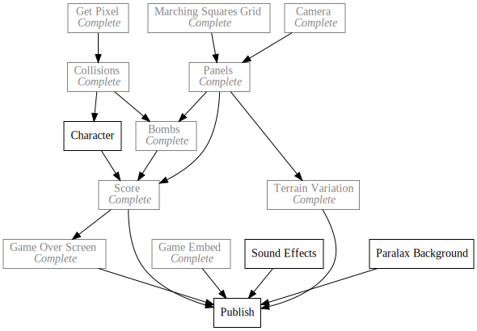

+++
title = "8Bomb"
description = "Another Bomb Survival Demake"
date = 2019-02-13

[extra]
project_name = "8bomb"
+++

8Bomb is a remake in [SCRIPT-8](https://script-8.github.io/) of a [game I built
in highschool](https://www.youtube.com/watch?v=dNZ1gO0PIIU) based on a silly
[Little Big Planet minigame](https://www.youtube.com/watch?v=BU2eKs40oFQ) my
friends and I liked.

Along the way I plan on building a simplified destructible terrain renderer and
a verlet integration based physics engine. I hope to do a fair amount of polish
on the project and use it as a forcing function for building games on the
engine. Any friction or missing features I find, I hope to contribute pull
requests to fix myself. If I find the simplified version satisfying I may try to
wrap it up in a phone game or something related in the future. We'll see where
it takes me!

  <iframe src="https://kethku.github.io/8Bomb/"></iframe>

